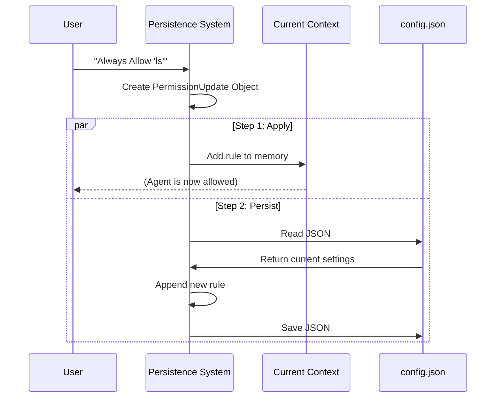

# Chapter 6: Configuration Persistence

Welcome to the final chapter of the `permissions` project tutorial!

In the previous chapter, [Filesystem Security & Sandboxing](05_filesystem_security___sandboxing.md), we secured the physical boundaries of where the agent can write files. We created a safe environment.

However, there is still one major annoyance: **Memory Loss**.

Imagine you tell the agent, "Always allow me to run `npm test`." The agent agrees. But then you restart the agent, and it asks you again. And again. It feels like the movie *Groundhog Day*.

In this chapter, we will build the **Configuration Persistence** system. This acts like a stenographer who records your decisions into permanent files, so the agent remembers them forever.

## The Problem: The "Forgetful" Agent

By default, computer programs store data in **RAM** (Random Access Memory). RAM is fast, but it is volatile. When you close the program, the data vanishes.

If the agent only updates its permissions in RAM:
1.  **User:** "Always allow `git status`."
2.  **Agent:** "Okay!" (Updates RAM).
3.  **User:** *Restarts Computer.*
4.  **Agent:** "Can I run `git status`?"
5.  **User:** (Sighs).

We need a system to move these decisions from RAM to the **Hard Drive** (JSON files).

## 1. The Three Scopes (Destinations)

Where should we save a rule? Not all rules are the same. We define three "Destinations" or scopes for permissions.

Think of them like different types of notebooks:

| Destination | Analogy | Description |
| :--- | :--- | :--- |
| **Session** | **Sticky Note** | Temporary. Applies only to *this* conversation. Throw it away when done. |
| **Project** | **Office Whiteboard** | Shared. Applies to everyone working in this specific folder. Saved in `projectSettings`. |
| **User (Global)** | **Personal Diary** | Private. Applies to *you* specifically, on every project you ever open. Saved in `userSettings`. |

Here is how we define this in the code (simplified from `PermissionUpdateSchema.ts`):

```typescript
// File: PermissionUpdateSchema.ts (Simplified)

export type PermissionUpdateDestination =
  | 'session'          // Gone when you restart
  | 'projectSettings'  // Saved in the current folder's config
  | 'userSettings'     // Saved in your global home directory
```

**Why does this matter?**
If you allow a dangerous tool in your **Global** settings, you might accidentally allow it in a sensitive work project. Scope ensures safety.

## 2. The `PermissionUpdate` Object

To change a permission, we don't just hack the file directly. We create a formal request object. This is like filling out a form for the HR department.

A `PermissionUpdate` object contains everything the system needs to know.

```typescript
// Example of a PermissionUpdate object

const update = {
  type: 'addRules',           // What are we doing?
  rules: ['Bash(ls)'],        // The content (from Chapter 2)
  behavior: 'allow',          // Allow or Deny?
  destination: 'userSettings' // Where do we file this?
}
```

This standardization makes it easy to handle adding, removing, or replacing rules using the same pipeline.

## 3. The Two-Step Process

When a user says "Always allow this," the system performs two distinct steps:

1.  **Apply (Fast):** Update the agent's current memory immediately so it stops asking *now*.
2.  **Persist (Slow):** Open the JSON file on the disk, write the new rule, and save it.

This ensures the agent feels responsive but the data is safe.



## 4. Implementation: Updating Memory

The function `applyPermissionUpdate` handles the first step (RAM). It takes the current state (Context) and the Update, and calculates the *new* state.

It uses a concept called **Immutability**. We don't change the old object; we create a fresh copy with the changes.

```typescript
// File: PermissionUpdate.ts (Simplified)

export function applyPermissionUpdate(context, update) {
  if (update.type === 'addRules') {
    // 1. Get the list where this rule belongs (e.g., global allow list)
    const currentList = context.alwaysAllowRules[update.destination] || []

    // 2. Add the new rules to the list
    const newList = [...currentList, ...update.rules]

    // 3. Return a new Context with the updated list
    return {
      ...context,
      alwaysAllowRules: { ...context.alwaysAllowRules, [update.destination]: newList }
    }
  }
  return context
}
```

**Explanation:**
This function is pure logic. It doesn't touch the hard drive. It just says: "If I *were* to add this rule, here is what the agent's brain would look like."

## 5. Implementation: Writing to Disk

The function `persistPermissionUpdate` handles the second step (Disk). It actually edits the configuration files.

First, it checks if persistence is even possible. You can't save a "Session" rule to disk because, by definition, session rules are temporary.

```typescript
// File: PermissionUpdate.ts (Simplified)

export function supportsPersistence(destination) {
  // We only write to disk if it's NOT a session rule
  return destination !== 'session'
}
```

Then, it performs the write operation:

```typescript
// File: PermissionUpdate.ts (Simplified)

export function persistPermissionUpdate(update) {
  // 1. Check if we should save this
  if (!supportsPersistence(update.destination)) return

  // 2. If we are adding rules...
  if (update.type === 'addRules') {
    
    // 3. Call the settings manager to write to the file
    addPermissionRulesToSettings({
        ruleValues: update.rules,
        ruleBehavior: update.behavior
      }, 
      update.destination // e.g., 'userSettings'
    )
  }
}
```

**Note:** The actual writing to JSON is handled by a helper (`addPermissionRulesToSettings`) which deals with file locking and formatting, so we don't corrupt the user's config file.

## 6. Removing Rules

Persistence isn't just about adding rules; it's also about cleaning up.

If you decide `Bash` is too dangerous, you might want to remove a previously saved "Always Allow" rule.

The logic is almost identical, but instead of pushing to an array, we filter the array.

```typescript
// File: PermissionUpdate.ts (Simplified Logic)

case 'removeRules': {
  // Get existing rules from the file
  const existingRules = getSettingsForSource(update.destination)

  // Keep only the rules that DO NOT match the one we are removing
  const filteredRules = existingRules.filter(
    rule => rule !== update.rules[0]
  )

  // Save the smaller list back to the file
  updateSettingsForSource(update.destination, filteredRules)
}
```

## Summary & Series Conclusion

In this final chapter, we learned how to give the agent long-term memory.
1.  **Destinations:** We learned the difference between Session (temporary), Project, and User (Global) storage.
2.  **The Update Object:** We saw how requests are standardized.
3.  **Apply vs. Persist:** We separated the immediate memory update from the slower file writing process.

---

### Tutorial Complete! 🎓

Congratulations! You have navigated the entire architecture of the `permissions` system.

Let's recap your journey:
1.  **[Chapter 1](01_permission_modes___state.md):** You learned how **Modes** (like Auto vs. Default) set the agent's attitude.
2.  **[Chapter 2](02_the_rule_system.md):** You learned how **Rules** act as specific laws (Allow/Deny).
3.  **[Chapter 3](03_permission_enforcement_engine.md):** You saw the **Engine** acting as the judge, enforcing those laws.
4.  **[Chapter 4](04_auto_mode_classifier__yolo_.md):** You met the **AI Classifier**, the smart security guard for Auto Mode.
5.  **[Chapter 5](05_filesystem_security___sandboxing.md):** You explored the **Sandbox** that keeps files safe.
6.  **Chapter 6:** You built the **Memory** so the agent remembers your choices.

You now possess the knowledge to contribute to, debug, or extend the security model of this agent. Happy coding!

---

Generated by [Code IQ](https://github.com/adityasoni99/Code-IQ)