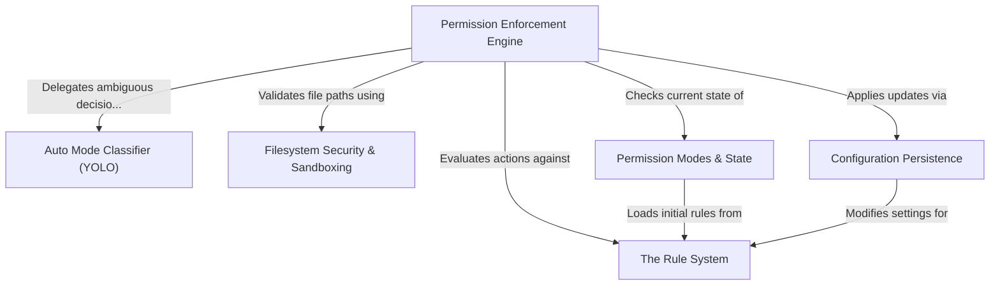

# Tutorial: permissions

This project implements a robust **permission enforcement system** for an AI agent, acting as the central gatekeeper for all tool executions. It evaluates actions against a hierarchy of security checks: explicit **static rules**, the agent's current **operating mode** (e.g., *Auto* vs. *Plan*), and strict **filesystem sandboxing**. When executed in autonomous modes, it leverages an **AI classifier** to judge the safety of ambiguous commands based on conversation context.

## Chapters

1. [Permission Modes & State](01_permission_modes___state.md)
2. [The Rule System](02_the_rule_system.md)
3. [Permission Enforcement Engine](03_permission_enforcement_engine.md)
4. [Auto Mode Classifier (YOLO)](04_auto_mode_classifier__yolo_.md)
5. [Filesystem Security & Sandboxing](05_filesystem_security___sandboxing.md)
6. [Configuration Persistence](06_configuration_persistence.md)

---

Generated by [Code IQ](https://github.com/adityasoni99/Code-IQ)