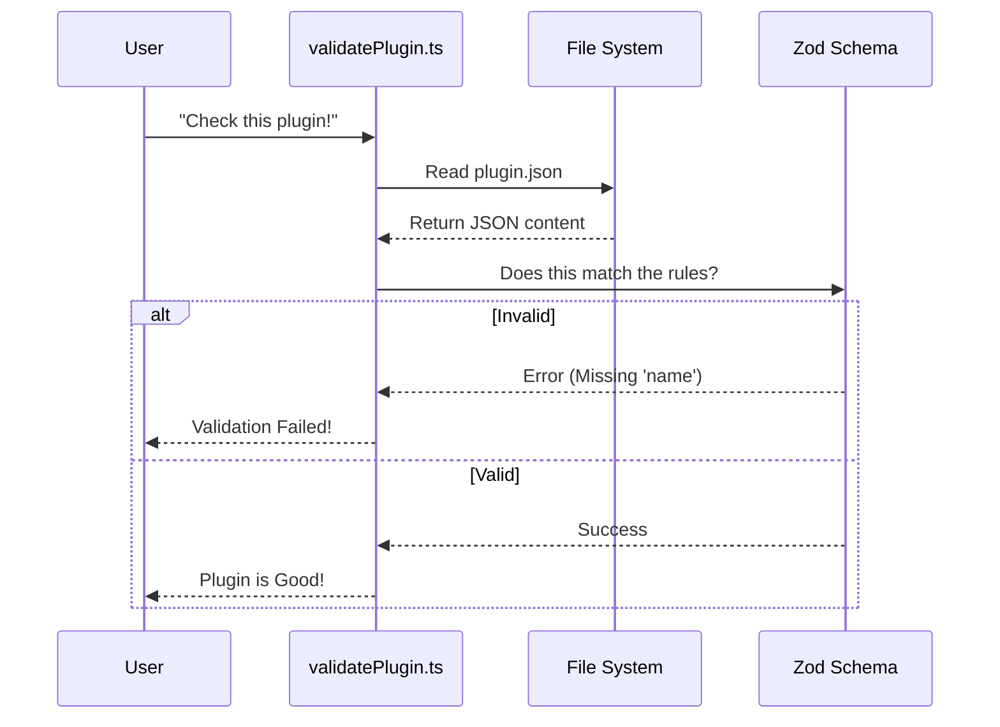

# Chapter 1: Plugin Identity & Schema

Welcome to the **Plugins** project tutorial!

Imagine you are building a house. You can't just start nailing wood together randomly; you need a **blueprint**. Similarly, if you want to travel to another country, you need a **passport** to prove who you are and where you come from.

In the Claude Code plugin system, we use these same concepts:
1.  **The Blueprint (`plugin.json`)**: A file that describes what the plugin does.
2.  **The Passport (Identity)**: A unique name, often tied to a marketplace (`name@marketplace`).
3.  **The Border Control (Schema)**: Strict rules that reject "fake" or broken plugins before they enter the system.

This chapter explains how a plugin introduces itself to the system and how we ensure it is valid.

---

## 1. The Blueprint: `plugin.json`

Every plugin must have a manifest file named `plugin.json`. This is the contract between the plugin author and Claude Code. It tells the system: "Here is my name, my version, and the tools I provide."

Here is a minimal example of what this file looks like:

```json
{
  "name": "weather-checker",
  "version": "1.0.0",
  "description": "Checks the weather in your city",
  "commands": ["./commands"]
}
```

Without this file, a folder is just a folder. With this file, it becomes a **Plugin**.

### The Rules of the Blueprint
We don't just "hope" the developer writes this JSON correctly. We use a library called **Zod** to define a **Schema**. A schema is a strict checklist.

If `name` is missing? **Rejected.**
If `version` is a number instead of a string? **Rejected.**

Here is a simplified look at how the schema is defined in the code:

```typescript
// schemas.ts
import { z } from 'zod/v4'

export const PluginManifestSchema = z.object({
  name: z.string().min(1), // Name is required and must be a string
  version: z.string().optional(),
  description: z.string().optional(),
  // ... other fields like commands, skills, etc.
});
```

**Beginner Explanation:**
*   `z.object({...})`: Expects a JSON object `{}`.
*   `z.string()`: The value inside *must* be text (not a number or list).
*   `.optional()`: It's okay if this field is missing.

---

## 2. The Identity: `name@marketplace`

In a global system, two people might make a plugin named "calculator." How do we tell them apart?

We use a compound identity system: **Plugin Name** + **Marketplace Name**.

*   `calculator@official` (The official calculator)
*   `calculator@bob` (Bob's calculator)

This string is the plugin's "Passport ID."

### Parsing the Identity
When the system receives a string like `"my-plugin@anthropic"`, it needs to split it up to understand where to look.

```typescript
// pluginIdentifier.ts

export function parsePluginIdentifier(plugin: string) {
  // Check if there is an '@' symbol
  if (plugin.includes('@')) {
    const parts = plugin.split('@');
    // Return the name (before @) and marketplace (after @)
    return { name: parts[0], marketplace: parts[1] };
  }
  // If no '@', it's just a local name
  return { name: plugin };
}
```

**How to use it:**
Input: `"weather@google"`
Output: `{ name: "weather", marketplace: "google" }`

This simple logic ensures that every plugin has a clear origin.

---

## 3. The Border Control: Validation

Before Claude Code loads a plugin, it must pass through "Border Control." This is handled by `validatePlugin.ts`.

This process ensures safety. It prevents the system from crashing due to typos in `plugin.json` or malicious attempts to break out of folders (e.g., using `../` to access system files).

### The Validation Flow

Here is what happens when you try to load a plugin:



### Under the Hood: The Code

Let's look at how `validatePlugin.ts` actually performs this check.

**Step 1: Read the file**
First, we try to find and read the file from the disk.

```typescript
// validatePlugin.ts (Simplified)
import { readFile } from 'fs/promises'

// We read the file as a text string
const content = await readFile(filePath, { encoding: 'utf-8' });

// We try to turn that text into a JSON object
const parsed = JSON.parse(content);
```

**Step 2: Security Checks (The "Frisk")**
Before checking the structure, we check for suspicious paths. A plugin shouldn't try to look at parent directories using `..`.

```typescript
// validatePlugin.ts (Simplified)
function checkPathTraversal(pathStr: string, errors: any[]) {
  // If the path contains "..", flag it!
  if (pathStr.includes('..')) {
    errors.push({ 
      message: `Path contains ".." which is a security risk: ${pathStr}` 
    });
  }
}
```

**Step 3: Schema Validation (The "Scanner")**
Finally, we pass the data to the Zod schema we defined earlier.

```typescript
// validatePlugin.ts
import { PluginManifestSchema } from './schemas.js'

// .strict() means "Don't allow extra fields I don't know about"
const result = PluginManifestSchema().strict().safeParse(parsed);

if (!result.success) {
  // If validation fails, we collect the errors to show the user
  errors.push(...formatZodErrors(result.error));
}
```

If `result.success` is true, the plugin is accepted, and the system can proceed to load it.

---

## Summary

In this chapter, we learned that a Plugin is not just code; it is a contract.

1.  **Identity**: Plugins are identified by `name@marketplace`.
2.  **Schema**: The `plugin.json` file describes the plugin.
3.  **Validation**: We use Zod schemas to reject bad or dangerous plugins before they load.

Now that we know *what* a plugin is and how to identify it, we need to find out where these plugins come from. Where do "marketplaces" live?

[Next Chapter: Marketplace Manager](02_marketplace_manager.md)

---

Generated by [Code IQ](https://github.com/adityasoni99/Code-IQ)