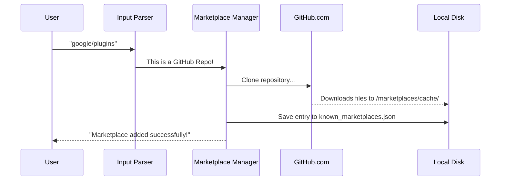

# Chapter 2: Marketplace Manager

Welcome back! 

In [Chapter 1: Plugin Identity & Schema](01_plugin_identity___schema.md), we learned that every plugin needs a "passport" (Identity) and a "blueprint" (Schema). We know *what* a plugin is.

Now, we need to answer: **Where do we find them?**

Imagine you want to buy apples. You don't usually drive to an apple orchard; you go to a **Grocery Store**. The store handles the logistics of getting apples from the farm to the shelf.

In our system, the **Marketplace Manager** is that Grocery Store manager. It connects to the outside world, fetches catalogs of plugins, and organizes them so the rest of the system can easily browse them.

---

## 1. The Concept: Procurement & Caching

The Marketplace Manager solves a messy problem: plugins live in many different places.
1.  **GitHub Repositories** (The most common source).
2.  **Web URLs** (A static `marketplace.json` file hosted online).
3.  **Local Folders** (When you are developing a plugin on your laptop).

We don't want the user to type complex `git clone` commands every time they want a tool. The Marketplace Manager abstracts this away.

### Key Responsibilities
1.  **Parsing**: Figure out if the user typed a URL, a GitHub name, or a file path.
2.  **Fetching**: Download the catalog (using Git or HTTP) into a hidden local folder.
3.  **Registry**: Write down the location of this downloaded catalog in a file called `known_marketplaces.json`.

---

## 2. The Registry: `known_marketplaces.json`

This file is the "Phone Book" of the system. It lists every store we know about and where we keep its catalog on the computer.

It is located at `~/.claude/plugins/known_marketplaces.json`.

**Example Content:**
```json
{
  "official": {
    "source": { "source": "github", "repo": "anthropics/plugins" },
    "installLocation": "/Users/me/.claude/plugins/marketplaces/official",
    "lastUpdated": "2024-01-15T10:30:00Z"
  }
}
```

**Beginner Explanation:**
*   **Key (`official`)**: The simplified name we use to refer to this marketplace.
*   **Source**: Where it came from (the "farm").
*   **InstallLocation**: Where we saved the copy on your hard drive (the "shelf").

---

## 3. How It Works: The Flow

Let's visualize what happens when a user wants to add a new marketplace.

**Scenario:** The user types `claude marketplace add google/plugins`.



The user only sees the first and last step. The Manager handles the complexity in the middle.

---

## 4. Under the Hood: The Code

Let's look at the three main steps in the code: **Parsing**, **Caching**, and **Saving**.

### Step 1: Parsing Input (`parseMarketplaceInput.ts`)

When a user types a string, we need to guess what it is. Is it a website? A GitHub repo? A folder?

```typescript
// parseMarketplaceInput.ts (Simplified)

export async function parseMarketplaceInput(input: string) {
  // 1. Check if it looks like a website
  if (input.startsWith('http')) return { source: 'url', url: input };

  // 2. Check if it looks like "owner/repo" (GitHub shorthand)
  if (!input.startsWith('@') && input.includes('/')) {
    return { source: 'github', repo: input };
  }
  
  // 3. Otherwise, check if it's a local folder...
  return null;
}
```
**Explanation:** This function acts like a triage nurse. It looks at the structure of the text to decide how to handle it.

### Step 2: Fetching & Caching (`marketplaceManager.ts`)

Once we know the source, we need to get the files. This is where we abstract away `git`.

```typescript
// marketplaceManager.ts (Simplified)

async function cacheMarketplaceFromGit(gitUrl, cachePath) {
  // If the folder already exists, just update it
  if (exists(cachePath)) {
    await gitPull(cachePath); // Run "git pull"
  } else {
    // Otherwise, download it fresh
    await gitClone(gitUrl, cachePath); // Run "git clone"
  }
}
```
**Explanation:**
*   We check if we already have this marketplace.
*   If yes, we just update it (`git pull`).
*   If no, we download it from scratch (`git clone`).
*   This ensures the user always has the latest tools without re-downloading everything every time.

### Step 3: Validating the Source

We don't blindly trust the download. We check if the downloaded folder actually contains a valid marketplace structure.

```typescript
// marketplaceManager.ts

// Read the downloaded file
const content = await readFile(join(cachePath, 'marketplace.json'));
const data = JSON.parse(content);

// Ensure the name matches what we expect
if (!data.name) {
  throw new Error("This is not a valid marketplace!");
}
```

### Step 4: The Reconciler (`reconciler.ts`)

Sometimes, a user might define marketplaces in a settings file instead of adding them manually. The **Reconciler** ensures that what is in the settings file actually exists on the disk.

```typescript
// reconciler.ts (Simplified)

export async function reconcileMarketplaces(declaredSettings) {
  // Loop through every marketplace the user WANTS
  for (const item of declaredSettings) {
    // If we don't have it on disk yet...
    if (!existsOnDisk(item.name)) {
      // ... go fetch it immediately!
      await addMarketplaceSource(item.source);
    }
  }
}
```
**Explanation:** This is an "Self-Healing" mechanism. If you delete your cache folder by accident, the Reconciler notices it's missing and downloads it again automatically.

---

## Summary

In this chapter, we learned how the **Marketplace Manager** acts as the procurement department for our plugin system.

1.  **Input Parsing**: Converts vague text (like `owner/repo`) into specific instructions.
2.  **Abstraction**: Hides the complexity of `git clone` and HTTP requests.
3.  **Registry**: Maintains `known_marketplaces.json` so we know where our catalogs are stored.
4.  **Caching**: Keeps local copies so the system is fast and works offline.

Now that we have identified the plugin (Chapter 1) and downloaded the catalog of available plugins (Chapter 2), we need a way to actually **install** a specific plugin into our environment.

[Next Chapter: Installation Orchestrator](03_installation_orchestrator.md)

---

Generated by [Code IQ](https://github.com/adityasoni99/Code-IQ)