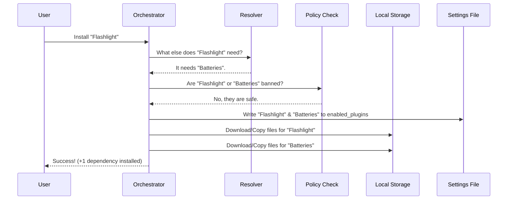

# Chapter 3: Installation Orchestrator

Welcome back!

In [Chapter 2: Marketplace Manager](02_marketplace_manager.md), we learned how to find the "Grocery Store" (the marketplace) and browse its catalog. We know what plugins are available.

Now, we need to actually **buy** (install) them.

This might sound simple—just copy files, right? But what if you buy a flashlight (Plugin A), but it requires batteries (Plugin B)? What if your company has banned Plugin B for security reasons?

This is where the **Installation Orchestrator** comes in. It is your personal **Shopping Assistant**. It ensures that when you ask for a tool, you get everything you need, nothing you're forbidden from having, and it sets everything up correctly.

---

## 1. The Concept: The Smart Checkout

The Installation Orchestrator is a workflow engine. It doesn't just "download" files; it coordinates a safe installation process.

**The 4-Step Workflow:**
1.  **Resolution**: "You want the Flashlight? You also need Batteries." (Dependency Resolution)
2.  **Policy Check**: "Is the user allowed to own Batteries?" (Security)
3.  **Materialization**: "Go to the shelf, grab the items, and put them in your bag." (Caching & Fetching)
4.  **Registration**: "Update your inventory list so you know you own them." (Settings Update)

---

## 2. Step 1: Finding Dependencies

In the code, plugins can depend on other plugins. If we didn't handle this, your plugin would crash immediately because it's missing parts.

We use a tool called `dependencyResolver.ts` to figure this out.

### The Problem
*   User asks for: `react-helper`
*   `react-helper` needs: `node-tools`
*   `node-tools` needs: `file-system-access`

The Orchestrator must find the whole chain before installing anything.

### The Logic (Simplified)

```typescript
// dependencyResolver.ts
export async function resolveDependencyClosure(rootId, lookup) {
  const closure = []; // The final list to install
  
  // 1. Start with the plugin the user asked for
  // 2. Look at its 'dependencies' list
  // 3. Repeat for every dependency found (Recursion)
  // 4. If we find a cycle (A needs B, B needs A), STOP!
  
  return { ok: true, closure }; 
}
```
**Beginner Explanation:**
This function creates a "Closure"—a fancy word for "The complete list of everything you need." If `Plugin A` needs `Plugin B`, the closure is `[A, B]`.

---

## 3. Step 2: The Security Guard (Policy)

Before we download anything, we check the rules. In an enterprise environment, administrators might block certain plugins.

We use `pluginPolicy.ts` to act as the Bouncer.

```typescript
// pluginPolicy.ts
import { getSettingsForSource } from '../settings/settings.js'

export function isPluginBlockedByPolicy(pluginId: string): boolean {
  // Check the 'managed-settings.json' file
  const policy = getSettingsForSource('policySettings');
  
  // If the admin set this plugin to 'false', it is blocked.
  return policy?.enabledPlugins?.[pluginId] === false;
}
```

**Beginner Explanation:**
If the Orchestrator sees that *any* plugin in the chain (even a dependency) is blocked, it cancels the entire installation. It refuses to install a "safe" plugin if it drags in a "dangerous" dependency.

---

## 4. The Orchestration Flow

How do these pieces fit together? Let's visualize the `installResolvedPlugin` function, which is the heart of this chapter.



---

## 5. Under the Hood: The Code

The heavy lifting happens in `pluginInstallationHelpers.ts`. This file combines resolution, policy, and file copying into one smooth operation.

### The Master Function

Here is a simplified view of `installResolvedPlugin`:

```typescript
// pluginInstallationHelpers.ts

export async function installResolvedPlugin({ pluginId, entry }) {
  // 1. Security First: Is the main plugin blocked?
  if (isPluginBlockedByPolicy(pluginId)) {
    return { ok: false, reason: 'blocked-by-policy' };
  }

  // 2. Calculate the Shopping List (Closure)
  const resolution = await resolveDependencyClosure(pluginId, ...);
  
  // 3. Check if any *dependencies* are blocked
  for (const id of resolution.closure) {
    if (isPluginBlockedByPolicy(id)) return { ok: false, error: '...' };
  }

  // ... proceed to install ...
}
```

### The Materialization (Caching)

Once we know the list is safe, we need to put the files on the disk. We don't run the plugin directly from the marketplace folder; we copy it to a specific **Versioned Cache**.

This ensures that if the marketplace changes tomorrow, our installed version stays stable.

```typescript
// pluginInstallationHelpers.ts (Simplified)

// Loop through every plugin in the list
for (const id of resolution.closure) {
  
  // "Materialize" it: Download/Copy to ~/.claude/plugins/cache/v1/...
  await cacheAndRegisterPlugin(id, entry);
}
```

**Why copy it?**
1.  **Stability**: We lock the version.
2.  **Speed**: We create a "Zip Cache" (a compressed file) so loading it next time is instant.

### The Zip Cache

You might notice references to `zipCache` in the code.

```typescript
// pluginInstallationHelpers.ts
if (isPluginZipCacheEnabled()) {
  // Convert the folder to a .zip file
  await convertDirectoryToZipInPlace(finalPath, zipPath);
}
```

This is an optimization. Instead of thousands of tiny files, the system bundles the plugin into one `.zip` file. This is much faster for the computer to move around.

---

## 6. Headless Installation (Servers)

Sometimes, there is no human user (e.g., a server running Claude Code). We call this "Headless Mode."

The logic is similar, but instead of asking a user for permission, it looks at a settings file and makes the disk match the settings automatically.

```typescript
// headlessPluginInstall.ts

export async function installPluginsForHeadless() {
  // 1. Look at the settings file (The Desired State)
  // 2. Look at the disk (The Current State)
  // 3. Make them match!
  
  await reconcileMarketplaces(...);
}
```

This ensures that if you deploy Claude Code to 100 servers, they all install the exact same plugins automatically.

---

## Summary

In this chapter, we learned that installing a plugin is a coordinated dance.

1.  **Dependency Resolver**: Finds all the missing pieces required to make a plugin work.
2.  **Policy Checker**: Ensures no banned software enters the system.
3.  **Materialization**: Copies and freezes the plugin files into a specific versioned folder (or Zip file).
4.  **Orchestrator**: The manager that runs these steps in order.

Now that the files are safely stored on the disk, the system needs a way to remember exactly *what* is installed, *where* it is, and *which version* it is. We need a permanent record.

[Next Chapter: Installation Registry](04_installation_registry.md)

---

Generated by [Code IQ](https://github.com/adityasoni99/Code-IQ)