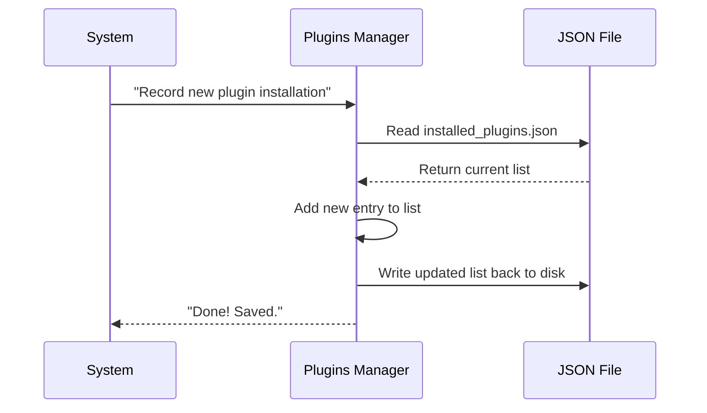

# Chapter 4: Installation Registry

Welcome back!

In [Chapter 3: Installation Orchestrator](03_installation_orchestrator.md), we acted as a "Shopping Assistant," gathering all the necessary dependencies and downloading files.

However, just having files on a hard drive isn't enough. Imagine a library where books are thrown randomly into a pile. You wouldn't know what you have, where it is, or if you have the latest edition.

We need a Librarian. In our system, this is the **Installation Registry**.

The Registry is the source of truth for **what exists physically on your computer**. It manages the inventory list (`installed_plugins.json`) so the system never has to guess where a plugin lives.

---

## 1. The Concept: Installation vs. Enablement

This is the most important concept in this chapter. There is a difference between "having" a tool and "using" it.

1.  **Installation (The Registry)**: "This plugin exists on the hard drive."
    *   *Managed by:* `installedPluginsManager.ts`
    *   *Stored in:* `installed_plugins.json`
2.  **Enablement (The Settings)**: "This plugin is active for my current project."
    *   *Managed by:* Settings files (User or Project settings)
    *   *Stored in:* `claude.json` or `settings.json`

**Why separate them?**
Imagine you are working on 5 different coding projects. You don't want to download the "Calculator" plugin 5 separate times.
*   **The Registry** downloads it *once* to a central cache.
*   **The Projects** simply reference that one copy.

---

## 2. The Inventory: `installed_plugins.json`

The Registry maintains a JSON file that acts as the "Master Inventory List." It is usually located at `~/.claude/plugins/installed_plugins.json`.

Here is what it looks like (simplified):

```json
{
  "version": 2,
  "plugins": {
    "weather-checker@official": [
      {
        "scope": "user",
        "version": "1.0.0",
        "installPath": "/Users/me/.claude/plugins/cache/official/weather-checker/1.0.0",
        "installedAt": "2023-10-27T10:00:00Z"
      }
    ]
  }
}
```

**Beginner Explanation:**
*   **Key**: The ID (`weather-checker@official`).
*   **Scope**: Who installed it? (`user` means it's global, `project` means it's local to one folder).
*   **InstallPath**: The exact folder where the code lives.

---

## 3. How to Use It

The rest of the system asks the Registry questions to avoid searching the hard drive manually.

### Scenario A: "Do we have this plugin?"

Before downloading a plugin, the Orchestrator asks the Registry if we already have it.

```typescript
// installedPluginsManager.ts (Simplified)

export function isPluginInstalled(pluginId: string): boolean {
  // 1. Load the big JSON file
  const data = loadInstalledPluginsV2();
  
  // 2. Check if the ID exists in the list
  const installations = data.plugins[pluginId];
  
  // 3. Return true if we found it
  return installations && installations.length > 0;
}
```

### Scenario B: "Where are the files?"

When the system needs to run the plugin, it asks for the path.

```typescript
// installedPluginsManager.ts (Simplified)

export function getPluginPath(pluginId: string) {
  const data = loadInstalledPluginsV2();
  
  // Get the first valid installation entry
  const entry = data.plugins[pluginId][0];
  
  return entry.installPath; 
  // Returns: "/Users/me/.claude/plugins/cache/..."
}
```

---

## 4. Internal Implementation: The Manager

How does the Registry manage this file safely? We use the `installedPluginsManager.ts` module.

### The Flow: Reading and Writing

When we modify the registry, we don't want to corrupt the file.



### The Code: Adding an Installation

Here is how the code actually writes to the inventory list. Note how we handle the "V2" format, which allows lists of installations.

```typescript
// installedPluginsManager.ts (Simplified)

export function addPluginInstallation(pluginId, scope, installPath, metadata) {
  // 1. Load current data
  const data = loadInstalledPluginsFromDisk();

  // 2. Create the new entry object
  const newEntry = {
    scope: scope,
    installPath: installPath,
    version: metadata.version,
    installedAt: new Date().toISOString()
  };

  // 3. Update the list for this specific plugin ID
  const list = data.plugins[pluginId] || [];
  list.push(newEntry);
  data.plugins[pluginId] = list;

  // 4. Save to disk
  saveInstalledPluginsV2(data);
}
```

---

## 5. Directory Structure & Versioning

The Registry doesn't just track *any* folder. It enforces a strict structure for where files live. This is handled by `pluginDirectories.ts` and `pluginVersioning.ts`.

### The Folder Structure

We organize plugins by **Marketplace** -> **Plugin Name** -> **Version**.

```text
~/.claude/plugins/
├── installed_plugins.json       <-- The Inventory List
└── cache/                       <-- The Physical Storage
    └── official/                <-- Marketplace
        └── weather-checker/     <-- Plugin Name
            ├── 1.0.0/           <-- Version 1 Code
            └── 1.0.1/           <-- Version 2 Code
```

This structure allows us to have Version 1.0.0 and Version 1.0.1 installed at the same time!

### Calculating Versions

How do we know a folder is "1.0.0"? Ideally, the `plugin.json` tells us. If not, we might use a Git Commit Hash.

```typescript
// pluginVersioning.ts (Simplified)

export async function calculatePluginVersion(manifest, installPath) {
  // 1. Prefer explicit version in plugin.json
  if (manifest.version) {
    return manifest.version;
  }

  // 2. Fallback: Use Git Commit Hash (e.g., "a1b2c3d")
  const sha = await getGitCommitSha(installPath);
  if (sha) {
    return sha.substring(0, 12);
  }

  return 'unknown';
}
```

---

## 6. Migration (V1 to V2)

You might see references to "V1" and "V2" in the code.

*   **V1 (Legacy)**: Could only track one location per plugin.
*   **V2 (Current)**: Can track multiple locations (e.g., a global install AND a local project install).

The Registry automatically upgrades old files to the new format when the system starts.

```typescript
// installedPluginsManager.ts (Simplified)

export function migrateToSinglePluginFile() {
  // If we find an old V1 file...
  if (isV1Format(file)) {
    // ...convert it to the new structure...
    const v2Data = convertV1ToV2(file);
    // ...and save it back.
    saveInstalledPluginsV2(v2Data);
  }
}
```

This ensures that users never lose their installed plugins when the software updates.

---

## Summary

In this chapter, we learned about the **Installation Registry**, the librarian of our system.

1.  **Inventory**: It keeps a master list (`installed_plugins.json`) of everything on the disk.
2.  **Separation**: It separates "Installation" (physical files) from "Enablement" (user settings).
3.  **Structure**: It organizes files into versioned folders (`.../plugin/version/`).
4.  **Management**: It provides an API to add, remove, and find plugins.

Now we have the plugin identity, we've downloaded it, and we've registered it in our inventory. The files are ready. But files don't *do* anything on their own. We need to load them into memory and connect them to the AI.

[Next Chapter: Component Integration Layers](05_component_integration_layers.md)

---

Generated by [Code IQ](https://github.com/adityasoni99/Code-IQ)