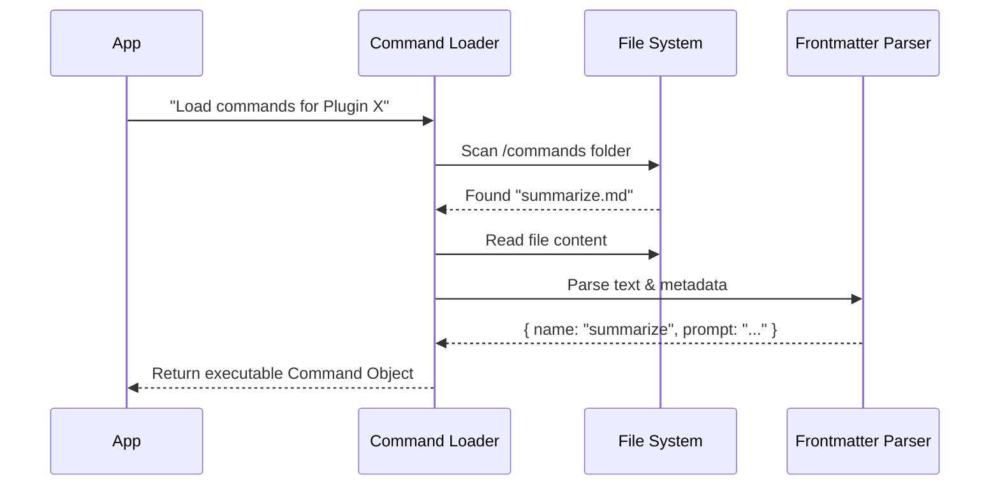

# Chapter 5: Component Integration Layers

Welcome back!

In [Chapter 4: Installation Registry](04_installation_registry.md), we organized our "library." We know exactly which plugins are installed and where their files are stored on the hard drive.

However, having a file on a disk doesn't make it work. A text file containing a prompt doesn't magically appear in your chat. A Python script doesn't automatically start running as a server.

We need to **load** these files into the system's memory.

This is the job of the **Component Integration Layers**. Think of them as **Translators**. They go into the plugin folders, read the specific files (Commands, Agents, Servers), and translate them into a format the running application understands.

---

## 1. The Problem: "Dead" Files

Right now, our plugin is just a folder with files like this:

```text
/my-plugin/
├── plugin.json
├── commands/
│   └── summarize.md   <-- A text file
└── server/
    └── index.js       <-- A script
```

The core system doesn't know how to "run" a `.md` file. It needs a JavaScript object with a `run()` function.

The Integration Layers solve this by:
1.  **Scanning** the directories.
2.  **Parsing** the raw text or configuration.
3.  **Constructing** live objects that the app can use.

---

## 2. The Four Pillars of Integration

Plugins in this system usually provide four types of capabilities. We have a specific "Loader" for each one.

### A. Commands (`loadPluginCommands.ts`)
*   **Input:** Markdown files (`.md`).
*   **What it does:** Reads the text and "Frontmatter" (metadata at the top of the file).
*   **Output:** A `Command` object that appears in your slash-commands list (e.g., `/summarize`).

### B. Agents (`loadPluginAgents.ts`)
*   **Input:** Markdown files representing personas.
*   **What it does:** Similar to commands, but defines workflow logic and "memory."
*   **Output:** An `Agent` object that determines how the AI behaves.

### C. MCP Servers (`mcpPluginIntegration.ts`)
*   **Input:** A configuration (usually in `plugin.json` or `.mcp.json`).
*   **What it does:** Tells the system how to start a background tool (like a database connector).
*   **Output:** A running process that the AI can talk to.

### D. LSP Servers (`lspPluginIntegration.ts`)
*   **Input:** Configuration for language intelligence.
*   **What it does:** Connects to language servers (like Python or TypeScript analyzers).
*   **Output:** Real-time code error checking and auto-complete features.

---

## 3. How It Works: The Flow

Let's look at how the system loads a **Command** as an example.



The `App` never touches the disk directly. It trusts the `Loader` to handle the messy file operations.

---

## 4. Under the Hood: Loading Commands

Let's look at `loadPluginCommands.ts`. This file is responsible for turning Markdown into functionality.

### Step 1: Scanning the Directory
First, we look for all `.md` files in the plugin's command directory.

```typescript
// loadPluginCommands.ts (Simplified)
async function collectMarkdownFiles(dirPath) {
  const files = [];
  // Walk through the folder
  await walkPluginMarkdown(dirPath, async (fullPath) => {
    // Read the file content
    const content = await fs.readFile(fullPath, 'utf-8');
    files.push({ filePath: fullPath, content });
  });
  return files;
}
```
**Explanation:** We use a helper to walk through folders (handling subdirectories) and read every text file we find into memory.

### Step 2: Creating the Command Object
Now we turn that text into a Command. We look for "Frontmatter" (the stuff between `---` at the top of a file) to get settings like the command description.

```typescript
// loadPluginCommands.ts (Simplified)
function createPluginCommand(file) {
  // Parse the metadata (YAML) and the body
  const { frontmatter, content } = parseFrontmatter(file.content);

  return {
    name: frontmatter.name,        // e.g. "summarize"
    description: frontmatter.description,
    // The function that runs when user types /summarize
    getPromptForCommand: async () => {
      return [{ type: 'text', text: content }];
    }
  };
}
```
**Explanation:**
*   We extract the `name` from the file header.
*   We create a function `getPromptForCommand` that simply returns the text content of the file.

---

## 5. Under the Hood: MCP Servers & Variables

Loading servers is different. We aren't reading text prompts; we are reading **configurations**. A major challenge here is knowing *where* files are.

If a plugin says "Run `./server.js`", the system needs to know the full path (e.g., `/Users/me/.claude/plugins/.../server.js`).

### Dynamic Variable Substitution
We use a special placeholder called `${CLAUDE_PLUGIN_ROOT}`. The integration layer automatically replaces this with the actual folder path.

```typescript
// mcpPluginIntegration.ts (Simplified)

export function resolvePluginMcpEnvironment(config, plugin) {
  const resolved = { ...config };
  
  // Create a list of variables to swap
  const variables = {
    CLAUDE_PLUGIN_ROOT: plugin.path, // The real path on disk!
    CLAUDE_PLUGIN_DATA: getPluginDataDir(plugin.source)
  };

  // Swap the variables in the command string
  if (resolved.command) {
    resolved.command = substitutePluginVariables(
      resolved.command, 
      variables
    );
  }
  
  return resolved;
}
```

**Usage Example:**
*   **Plugin Config:** `"command": "node ${CLAUDE_PLUGIN_ROOT}/dist/index.js"`
*   **Result after Loader:** `"command": "node /Users/alice/.claude/plugins/cache/official/my-plugin/1.0.0/dist/index.js"`

This ensures the plugin works no matter where it is installed on your computer.

---

## 6. Safety: The "Jail" Check

A malicious plugin might try to read files outside its folder (e.g., `../../passwords.txt`). The integration layers include safety checks.

In `lspPluginIntegration.ts`, we validate paths:

```typescript
// lspPluginIntegration.ts (Simplified)
function validatePathWithinPlugin(pluginPath, relativePath) {
  const resolved = resolve(pluginPath, relativePath);
  
  // Check if the file is strictly inside the plugin folder
  if (!resolved.startsWith(pluginPath)) {
    return null; // Blocked!
  }
  
  return resolved;
}
```
**Explanation:** If a plugin tries to reference a file that isn't inside its own directory, the loader returns `null`, effectively blocking the attempt.

---

## Summary

In this chapter, we learned that **Component Integration Layers** bring plugins to life.

1.  **Translators**: They convert static files (Markdown, JSON) into runtime objects (Commands, Server Configs).
2.  **Specialization**: We have different loaders for Commands, Agents, MCP Servers, and LSP Servers.
3.  **Context Awareness**: They inject dynamic variables like `${CLAUDE_PLUGIN_ROOT}` so plugins can find their own files.
4.  **Safety**: They ensure plugins only access files within their allowed boundaries.

At this point, our plugin system is fully functional! We have identified plugins, downloaded them, registered them, and loaded them into memory.

However, plugins often need **custom settings** (like API keys) and they need to store this data safely.

[Next Chapter: Configuration & Secrets Storage](06_configuration___secrets_storage.md)

---

Generated by [Code IQ](https://github.com/adityasoni99/Code-IQ)