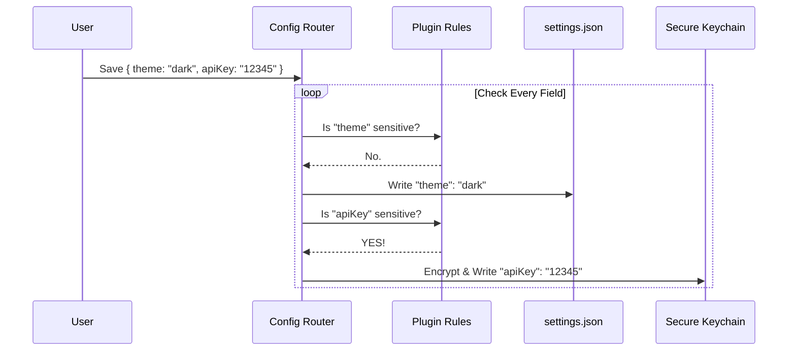

# Chapter 6: Configuration & Secrets Storage

Welcome to the final chapter of our beginner tutorial!

In [Chapter 5: Component Integration Layers](05_component_integration_layers.md), we successfully loaded our plugin code into memory. We have commands, agents, and servers ready to run.

However, software rarely runs on "empty."
*   A Weather plugin needs an **API Key** to talk to the weather service.
*   A Database plugin needs a **Username** and **Password**.
*   A UI plugin might need a **Theme Preference** (Dark/Light).

We can't just write these passwords into a text file—that's a security risk! We need a safe place to put them.

This chapter covers **Configuration & Secrets Storage**, the system's secure vault.

---

## 1. The Problem: The "Post-it Note" Risk

Imagine you have a safe.
1.  **Public Info:** You might tape a note to the *outside* saying "This safe belongs to Bob." It's okay if people see that.
2.  **Private Info:** You would never tape the *combination* to the outside. You memorize it or store it somewhere secure.

In software:
*   **Public Info** (Theme: Dark) can go in a standard `settings.json` file.
*   **Private Info** (API Key: `sk-12345`) must go into the operating system's **Keychain** (a secure, encrypted database managed by Windows/macOS/Linux).

The Challenge: The plugin doesn't want to worry about this. It just wants the data. Our system must handle the splitting automatically.

---

## 2. The Solution: The "Traffic Cop"

We use a "Traffic Cop" logic when saving settings.

When a user provides configuration, we look at the **Schema** (the rules defined by the plugin).
*   If the rule says `sensitive: false`, the data goes to the readable text file.
*   If the rule says `sensitive: true`, the data is routed to the secure vault.

### The User Experience
To the plugin developer, it looks like one list of options. To the user, it looks like one form. But under the hood, the data lives in two very different homes.

---

## 3. How It Works: The Flow

Let's visualize what happens when a user saves their settings for a plugin.



When the plugin *runs*, we do the reverse: we fetch from both places and merge them into one object.

---

## 4. Internal Implementation: The Code

The heavy lifting is done in `pluginOptionsStorage.ts`.

### Step 1: Saving the Data (`savePluginOptions`)

This function acts as the Traffic Cop. It takes the values and the schema, splits them up, and saves them.

```typescript
// pluginOptionsStorage.ts (Simplified)

export function savePluginOptions(pluginId, values, schema) {
  const nonSensitive = {};
  const sensitive = {};

  // 1. Sort the data based on the 'sensitive' flag
  for (const [key, value] of Object.entries(values)) {
    if (schema[key]?.sensitive === true) {
      sensitive[key] = String(value);
    } else {
      nonSensitive[key] = value;
    }
  }
  
  // 2. Send sensitive data to the Vault (Keychain)
  getSecureStorage().update(pluginId, sensitive);

  // 3. Send public data to the Text File
  updateSettingsForSource('userSettings', nonSensitive);
}
```
**Beginner Explanation:**
We create two empty buckets (`sensitive` and `nonSensitive`). We loop through the user's input, check the rules, and throw the data into the correct bucket. Then we send the buckets to their respective storage locations.

### Step 2: Loading the Data (`loadPluginOptions`)

When the plugin needs the data, we have to put Humpty Dumpty back together again.

```typescript
// pluginOptionsStorage.ts (Simplified)

export const loadPluginOptions = (pluginId) => {
  // 1. Get the public data from the text file
  const settings = getSettings_DEPRECATED();
  const publicData = settings.pluginConfigs?.[pluginId]?.options || {};

  // 2. Get the secret data from the Vault
  const storage = getSecureStorage();
  const secretData = storage.read()?.pluginSecrets?.[pluginId] || {};

  // 3. Merge them into one object
  return { ...publicData, ...secretData };
};
```
**Beginner Explanation:**
*   `{ ...publicData, ...secretData }`: This is a JavaScript spread operator. It smashes the two objects together into one.
*   The plugin receives `{ theme: "dark", apiKey: "12345" }` and doesn't know (or care) that they came from different places.

---

## 5. Variable Substitution: The Magic Trick

Plugins often use configuration files that need these values *injected* into them.

For example, a plugin might have a command:
`"curl https://api.weather.com?key=${user_config.api_key}"`

The system must swap `${user_config.api_key}` with the real password right before running the command.

### The Code (`substituteUserConfigVariables`)

```typescript
// pluginOptionsStorage.ts (Simplified)

export function substituteUserConfigVariables(text, userConfig) {
  // Find patterns that look like ${user_config.SOMETHING}
  return text.replace(/\$\{user_config\.([^}]+)\}/g, (match, key) => {
    
    // Look up the value in our merged config object
    const value = userConfig[key];
    
    // If missing, stop everything!
    if (value === undefined) throw new Error(`Missing config: ${key}`);
    
    return String(value);
  });
}
```

**Beginner Explanation:**
This uses a "Regular Expression" (Regex) to hunt for the pattern. It's like "Find and Replace" in a word processor, but automated. It finds the placeholder and overwrites it with the actual secret.

---

## 6. Safety Check: Scrubbing

What happens if a developer changes a setting from `sensitive: false` to `sensitive: true` in an update?

The system includes a **Scrubbing** mechanism.
1.  If we write a value to the **Secure Vault**, we immediately check the **Text File**.
2.  If that value exists in the text file (from an old version), we delete it.

This ensures that secrets don't accidentally get left behind in unencrypted files.

---

## Tutorial Summary

Congratulations! You have completed the 6-chapter journey through the architecture of the **Plugins** project.

Let's recap the full lifecycle of a plugin:

1.  **[Identity](01_plugin_identity___schema.md):** We defined what a plugin is (`name@marketplace`) and validated its `plugin.json`.
2.  **[Marketplace](02_marketplace_manager.md):** We found the "store" and downloaded the catalog.
3.  **[Orchestrator](03_installation_orchestrator.md):** We resolved dependencies and checked security policies.
4.  **[Registry](04_installation_registry.md):** We recorded the physical location of the files on the disk.
5.  **[Integration](05_component_integration_layers.md):** We loaded the code into memory (Commands, Agents, Servers).
6.  **[Storage](06_configuration___secrets_storage.md):** We securely injected API keys and user preferences.

You now understand the complete flow from a user typing "install plugin" to that plugin executing commands securely on their machine.

**Happy Coding!**

---

Generated by [Code IQ](https://github.com/adityasoni99/Code-IQ)