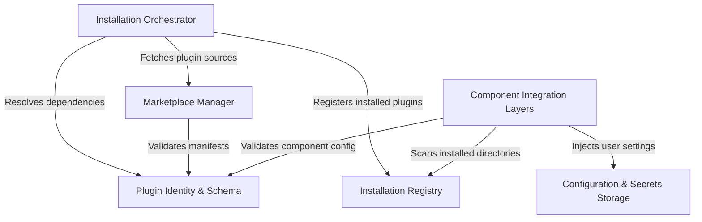

# Tutorial: plugins

This project implements a modular **plugin system** that extends the core application with external capabilities like commands, agents, and tools. It relies on a central **Installation Orchestrator** to fetch plugins from various **Marketplaces**, manage their lifecycle in a versioned **Installation Registry**, and dynamically load their features via **Integration Layers** while securely injecting user **Configuration & Secrets**.

## Chapters

1. [Plugin Identity & Schema](01_plugin_identity___schema.md)
2. [Marketplace Manager](02_marketplace_manager.md)
3. [Installation Orchestrator](03_installation_orchestrator.md)
4. [Installation Registry](04_installation_registry.md)
5. [Component Integration Layers](05_component_integration_layers.md)
6. [Configuration & Secrets Storage](06_configuration___secrets_storage.md)

---

Generated by [Code IQ](https://github.com/adityasoni99/Code-IQ)