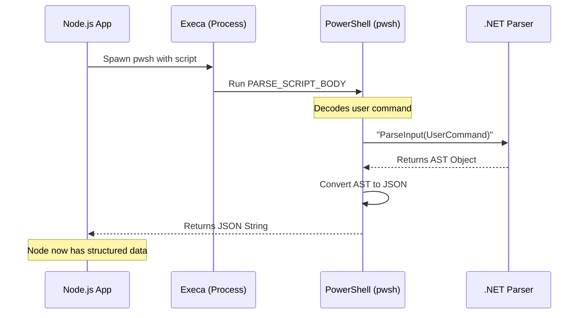

# Chapter 1: AST-Based Parsing Bridge

Welcome to the first chapter of our deep dive into the PowerShell integration engine!

In this tutorial series, we will explore how a Node.js application can safely understand and execute PowerShell commands. Before we can analyze a command for security or execute it, we must first **understand** what the command is actually saying.

This chapter introduces the **AST-Based Parsing Bridge**.

## The Problem: Two Different Worlds

Imagine you are a Node.js application. You speak JavaScript and JSON. A user sends you a string of text:

```powershell
Get-ChildItem -Path "C:\User Data" -Recurse
```

To you, this is just a string of characters. You might try to use Regular Expressions (Regex) to guess what it does, but PowerShell is complex. What if the user writes it like this?

```powershell
& 'Get-ChildItem' @('C:\User Data') -Recurse
```

Regex will likely fail here. You need a native speaker to translate this for you.

## The Solution: The Parsing Bridge

Instead of guessing, we use the **AST-Based Parsing Bridge**. It acts like a foreign language translator.

1.  **Node.js** sends the raw text to a background **PowerShell** process.
2.  **PowerShell** uses its own internal brain (the .NET parser) to break the sentence down into a grammatical diagram called an **AST** (Abstract Syntax Tree).
3.  **PowerShell** sends this diagram back to Node.js as **JSON**.

### Use Case: "What is this command?"

Let's look at a concrete use case. We want to know the **Command Name** and the **Parameters** used.

**Input String:**
```powershell
Write-Host "Hello" -ForegroundColor Green
```

**Bridge Output (Simplified JSON):**
```json
{
  "command": "Write-Host",
  "args": ["Hello", "Green"],
  "flags": ["-ForegroundColor"]
}
```

Now Node.js knows exactly what is happening without needing to understand PowerShell syntax rules!

---

## How It Works: The "Translator" Implementation

Let's break down the implementation. The bridge consists of three main steps: **Encoding**, **Spawning**, and **Parsing**.

### Step 1: The Secret Payload (`PARSE_SCRIPT_BODY`)

We can't just run `pwsh -Command "Parse this"`. We need a specific script that tells PowerShell *how* to parse input without executing it.

We store this script in a variable called `PARSE_SCRIPT_BODY`. Think of this as the "instructions" we give to our translator.

```typescript
// parser.ts
export const PARSE_SCRIPT_BODY = `
  $parseErrors = $null
  $tokens = $null
  // Ask the native .NET engine to parse the command
  $ast = [System.Management.Automation.Language.Parser]::ParseInput(
      $Command, [ref]$tokens, [ref]$parseErrors
  )
  // Convert the result to JSON
  $output | ConvertTo-Json -Depth 10 -Compress
`
```

> **Explanation:** This PowerShell code calls `[System.Management.Automation.Language.Parser]::ParseInput`. This is the exact same engine PowerShell uses internally. It returns an AST, which we then convert to JSON.

### Step 2: Preparing the Package

To send the user's command to PowerShell safely, we wrap it up. We Base64 encode the command so that special characters (like quotes or newlines) don't break the bridge.

```typescript
// parser.ts
function buildParseScript(command: string): string {
  // Encode the user's command into Base64
  const encoded = Buffer.from(command, 'utf8').toString('base64')
  
  // Inject it into our instruction script
  return `$EncodedCommand = '${encoded}'\n${PARSE_SCRIPT_BODY}`
}
```

> **Explanation:** We create a single script that sets a variable `$EncodedCommand` and then immediately runs our parsing logic (`PARSE_SCRIPT_BODY`).

### Step 3: Spawning the Bridge

Now we actually cross the bridge. We spawn a `pwsh` (PowerShell) subprocess and feed it our script.

```typescript
// parser.ts
import { execa } from 'execa'

async function parsePowerShellCommandImpl(command: string) {
  const script = buildParseScript(command)
  
  // Convert the WHOLE script to Base64 for the -EncodedCommand flag
  const encodedScript = toUtf16LeBase64(script)
  
  // Spawn PowerShell
  const result = await execa('pwsh', ['-EncodedCommand', encodedScript])
  
  return result.stdout // This is our JSON!
}
```

> **Explanation:** We use `execa` to start PowerShell. We pass the `-EncodedCommand` flag, which tells PowerShell, "Hey, here is a block of Base64 code; please decode and run it."

---

## Visualizing the Flow

Here is what happens when you ask the bridge to parse a command.



---

## Analyzing the Output

The output we get back isn't just a simple string; it's a rich structure. The native parser identifies different parts of the command by their **Type**.

If we parse `echo "Hello"`, the raw JSON from the bridge might look like this (simplified):

```json
{
  "statements": [
    {
      "type": "PipelineAst",
      "elements": [
        {
          "type": "CommandAst",
          "text": "echo \"Hello\"",
          "commandElements": [
            { "type": "StringConstantExpressionAst", "value": "echo" },
            { "type": "StringConstantExpressionAst", "value": "Hello" }
          ]
        }
      ]
    }
  ]
}
```

This raw data is powerful but verbose. It tells us exactly what kind of expression every word is (e.g., `StringConstantExpressionAst`).

### Why is this better than Regex?
If the user typed `echo $(Get-Date)`, the parser would identify `$(Get-Date)` as a `SubExpressionAst`. A regex might just see it as a string, missing the fact that code is executing inside the parentheses!

## Conclusion

We have successfully built a bridge! We can now take raw text, send it to a native PowerShell process, and receive a structured, grammatical breakdown of the command.

However, the raw JSON coming from PowerShell is very complex and difficult to work with directly. In the next chapter, we will learn how to clean up this raw data into a friendly format we can easily use in our code.

[Next: Chapter 2 - AST Transformation & Normalization](02_ast_transformation___normalization.md)

---

Generated by [Code IQ](https://github.com/adityasoni99/Code-IQ)