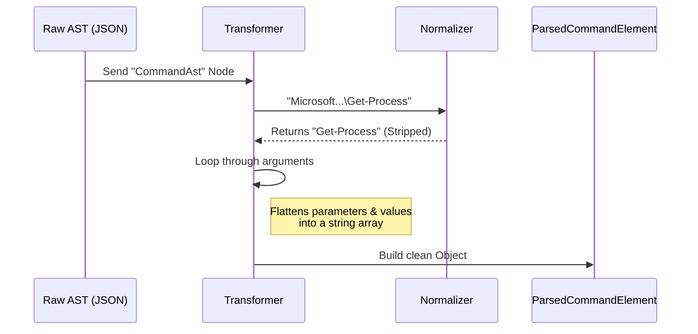

# Chapter 2: AST Transformation & Normalization

Welcome back! In the previous chapter, [Chapter 1: AST-Based Parsing Bridge](01_ast_based_parsing_bridge.md), we learned how to ask PowerShell to parse a command and return a raw JSON AST (Abstract Syntax Tree).

While getting that AST was a huge victory, we have a new problem. The raw AST is **verbose** and **noisy**. It describes the code exactly as the .NET engine sees it, which includes a lot of implementation details we don't need.

This chapter covers **AST Transformation & Normalization**. We will build a logic layer that acts as a refinery, turning raw ore (complex .NET objects) into gold bars (clean, predictable TypeScript interfaces).

## The Problem: The "Raw" Data is Messy

Let's look at a real example. A user runs this command:

```powershell
Microsoft.PowerShell.Management\Get-Process -Name "node"
```

The raw AST JSON from Chapter 1 looks something like this (simplified):

```json
{
  "type": "CommandAst",
  "commandElements": [
    { "type": "StringConstantExpressionAst", "value": "Microsoft.PowerShell.Management\\Get-Process" },
    { "type": "CommandParameterAst", "parameterName": "Name" },
    { "type": "StringConstantExpressionAst", "value": "node" }
  ]
}
```

**Why this is hard to use:**
1.  **Prefixes:** The command name includes the module path (`Microsoft.PowerShell.Management\`). If we have a security rule for `Get-Process`, this string won't match!
2.  **Aliases:** If the user typed `ps` (an alias for `Get-Process`), the AST would say `ps`. We need to know they mean the same thing.
3.  **Complexity:** To get arguments, we have to loop through `commandElements` and check types. We just want a simple list of arguments.

## The Solution: Normalization

We need a transformation layer. We want to convert that complex JSON above into this clean TypeScript object:

```typescript
const cleanCommand = {
  name: "Get-Process",        // Cleaned!
  nameType: "cmdlet",         // Classified!
  args: ["-Name", "node"]     // Simplified!
}
```

This process allows the rest of our application to ignore the weird quirks of PowerShell syntax and focus on **what the command does**.

---

## Key Concept 1: Stripping Prefixes

PowerShell allows you to be very specific about where a command comes from. But for security checks, we usually care about the *command*, not the *module*.

We use a helper function to strip these prefixes.

```typescript
// parser.ts
export function stripModulePrefix(name: string): string {
  // Find the last backslash
  const idx = name.lastIndexOf('\\')
  
  // If no backslash, return the name as is
  if (idx < 0) return name
  
  // Return everything AFTER the backslash
  return name.substring(idx + 1)
}
```

> **Explanation:** This logic converts `Microsoft.PowerShell.Management\Get-Process` into simply `Get-Process`. It normalizes the input so our security rules don't need to guess every possible module path.

---

## Key Concept 2: Command Classification

Is the user running a built-in PowerShell tool (Cmdlet) or an external program (like `git` or `node`)? This distinction matters for security.

We classify commands based on their naming convention.

```typescript
// parser.ts
export function classifyCommandName(name: string): 'cmdlet' | 'application' | 'unknown' {
  // Cmdlets usually look like Verb-Noun (e.g., Get-Process)
  if (/^[A-Za-z]+-[A-Za-z]+$/.test(name)) {
    return 'cmdlet'
  }
  
  // Applications usually have extensions or paths (e.g., ./script.ps1)
  if (/[.\\/]/.test(name)) {
    return 'application'
  }
  
  return 'unknown'
}
```

> **Explanation:** 
> *   **Cmdlet:** Matches the `Verb-Noun` pattern.
> *   **Application:** Contains dots or slashes (indicating a file path or extension).
> *   **Unknown:** Everything else (like aliases `ls`, `dir`).

---

## Key Concept 3: Handling Aliases

PowerShell users love aliases. `dir`, `ls`, and `gci` all mean `Get-ChildItem`.

If we deny `Get-ChildItem` but allow `ls`, we have a security hole. We solve this by maintaining a dictionary of "Common Aliases".

```typescript
// parser.ts
export const COMMON_ALIASES: Record<string, string> = {
  'ls': 'Get-ChildItem',
  'dir': 'Get-ChildItem',
  'echo': 'Write-Output',
  'cat': 'Get-Content',
  'ps': 'Get-Process',
  'curl': 'Invoke-WebRequest',
  // ... many more
}
```

Later, when checking permissions, we look up the command name in this list. If `name` is `ls`, we treat it exactly as if it were `Get-ChildItem`.

---

## Implementation Walkthrough

Now let's put it together. We iterate over the raw AST nodes and "transform" them into our clean interfaces.

### The Transformation Flow



### The Code: Transforming a Command

This function takes a raw `RawPipelineElement` (from the JSON) and returns a clean `ParsedCommandElement`.

```typescript
// parser.ts (Simplified)
export function transformCommandAst(raw: RawPipelineElement): ParsedCommandElement {
  const args: string[] = []
  
  // 1. Get the raw name (usually the first element)
  const rawName = raw.commandElements[0].text
  
  // 2. Normalize the name
  const name = stripModulePrefix(rawName)
  const nameType = classifyCommandName(name)

  // 3. Flatten arguments
  // Start at index 1 (skip the command name itself)
  for (let i = 1; i < raw.commandElements.length; i++) {
    args.push(raw.commandElements[i].text)
  }

  // 4. Return the clean object
  return { name, nameType, args, text: raw.text, elementType: 'CommandAst' }
}
```

> **Explanation:** 
> 1.  We extract the command name from the first element.
> 2.  We clean it using the helper functions we wrote earlier.
> 3.  We loop through the rest of the elements and simply push their text into an `args` array.
> 4.  We return a strictly typed object that is easy to use.

### The Result: Type-Safe Interfaces

The output of this transformation is a `ParsedPowerShellCommand`. This is the interface our application actually uses.

```typescript
// parser.ts
export type ParsedCommandElement = {
  name: string
  nameType: 'cmdlet' | 'application' | 'unknown'
  args: string[]
  // ...
}

export type ParsedPowerShellCommand = {
  valid: boolean
  statements: ParsedStatement[]
  // ...
}
```

## Why This Matters for Security

Imagine we want to block the user from stopping a process.

**Without Normalization:**
We have to check if the command equals `Stop-Process`, OR `Microsoft.PowerShell.Management\Stop-Process`, OR `kill`, OR `spps` (another alias).

**With Normalization:**
1.  We strip the prefix: `Microsoft...\Stop-Process` becomes `Stop-Process`.
2.  We resolve aliases: `kill` becomes `Stop-Process`.
3.  **The Check:** We simply check if `name === "Stop-Process"`.

By normalizing the data *before* we analyze it, we make our security logic significantly simpler and more robust.

## Conclusion

We have successfully bridged the gap between the chaotic world of raw PowerShell ASTs and the structured world of TypeScript application logic. We can now:
1.  **Parse** a raw string into an AST.
2.  **Clean** that AST by stripping prefixes and flattening structures.
3.  **Classify** commands and prepare them for analysis.

However, knowing the *names* of the commands isn't enough. PowerShell is a dynamic language. Users can hide malicious intent inside strings like `$(expression)` or script blocks `{ ... }`.

In the next chapter, we will learn how to detect these hidden dangers.

[Next: Chapter 3 - Security Pattern Detection](03_security_pattern_detection.md)

---

Generated by [Code IQ](https://github.com/adityasoni99/Code-IQ)