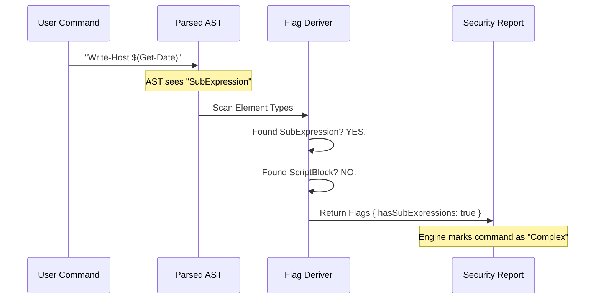

# Chapter 3: Security Pattern Detection

Welcome back!

In [Chapter 2: AST Transformation & Normalization](02_ast_transformation___normalization.md), we learned how to clean up the raw data from PowerShell into a nice, tidy format. We can now easily read the command name and its arguments.

But here is the scary part: **Knowing the command name is not enough.**

This chapter introduces **Security Pattern Detection**. This is the layer that looks *inside* the arguments to find hidden dangers.

## The Problem: The "Trojan Horse"

Imagine you have a security rule that allows the command `Write-Host` (which just prints text to the screen).

A malicious user sends this:

```powershell
Write-Host "Current Date: $(Get-Date)"
```

This looks innocent. But look at `$(...)`. That syntax tells PowerShell: "Stop what you are doing, **execute** the code inside these parentheses, and put the result here."

If the user writes:

```powershell
Write-Host "Hacked: $(Invoke-Expression 'format C:')"
```

If we only look at the command name (`Write-Host`), we would allow this. But hidden inside the argument is a command that wipes the drive!

## The Solution: The X-Ray Scanner

We need a system that acts like an **Airport X-Ray Scanner**.

*   **Chapter 2 (Normalization)** checked the passenger manifest (the command name).
*   **Chapter 3 (Pattern Detection)** looks inside the luggage.

We don't care *what* command is running. We care if the syntax uses specific "shapes" that allow code execution.

---

## Key Concepts: The Dangerous Objects

We look for specific structures in the AST that indicate complexity or danger.

### 1. Sub-Expressions `$(...)`
This allows code to run inside strings.

*   **Why it's risky:** It enables "Code Injection." We can't predict what the command will do until it actually runs.
*   **AST Type:** `SubExpression`, `ParenExpression`.

### 2. Script Blocks `{ ... }`
A script block is a chunk of code wrapped in curly braces, passed as an argument.

```powershell
Invoke-Command -ScriptBlock { Remove-Item C:\Important }
```

*   **Why it's risky:** This is literally a bag of code waiting to be executed.
*   **AST Type:** `ScriptBlock`.

### 3. Member Invocations `::` or `.`
This happens when a user tries to access .NET functionality directly.

```powershell
[System.Math]::Sqrt(64)
```

*   **Why it's risky:** A user might try to use .NET classes to bypass PowerShell security restrictions.
*   **AST Type:** `MemberInvocation`.

### 4. Splatting `@params`
Splatting allows a user to store arguments in a variable and pass them all at once.

```powershell
$params = @{ Path = "C:\"; Recurse = $true }
Get-ChildItem @params
```

*   **Why it's risky:** We can't see the arguments! They are hidden inside the variable `$params`.
*   **AST Type:** `Variable` (with `isSplatted` flag).

---

## Visualizing the Scan

Here is how our engine scans the command.



---

## Implementation: Deriving Flags

We don't need to write complex Regular Expressions to find these patterns. Because we used the **AST Bridge** (Chapter 1), PowerShell has already told us what everything is!

We just need to loop through the AST and fill out a checklist.

### Step 1: The Checklist (Types)

First, we define a simple interface representing our "X-Ray Results".

```typescript
// parser.ts
type SecurityFlags = {
  hasSubExpressions: boolean    // $(...)
  hasScriptBlocks: boolean      // { ... }
  hasSplatting: boolean         // @params
  hasMemberInvocations: boolean // [Math]::Sqrt()
  // ... other flags
}
```

### Step 2: The Scanner

We write a function `deriveSecurityFlags`. It takes the parsed command and walks through every element.

```typescript
// parser.ts
export function deriveSecurityFlags(parsed: ParsedPowerShellCommand): SecurityFlags {
  // 1. Initialize all flags to false (Safe until proven otherwise)
  const flags = {
    hasSubExpressions: false,
    hasScriptBlocks: false,
    hasSplatting: false,
    hasMemberInvocations: false,
    // ...
  }

  // 2. Loop through every statement and command
  for (const statement of parsed.statements) {
    for (const cmd of statement.commands) {
      // Check the elements inside this command
      checkElements(cmd, flags)
    }
  }

  return flags
}
```

> **Explanation:** We start with a clean slate. We loop through every part of the command structure we built in Chapter 2.

### Step 3: Checking the Luggage

Inside `checkElements`, we look at the `elementTypes` array we created during normalization.

```typescript
// parser.ts (Simplified)
function checkElements(cmd: ParsedCommandElement, flags: SecurityFlags) {
  // If we don't know the types, stop.
  if (!cmd.elementTypes) return

  for (const type of cmd.elementTypes) {
    if (type === 'SubExpression') {
      flags.hasSubExpressions = true
    }
    if (type === 'ScriptBlock') {
      flags.hasScriptBlocks = true
    }
    if (type === 'MemberInvocation') {
      flags.hasMemberInvocations = true
    }
  }
}
```

> **Explanation:** This is the core logic. If the AST says an argument is a `ScriptBlock`, we immediately raise the `hasScriptBlocks` flag. It is simple, fast, and accurate.

---

## Putting It Together: A Real Example

Let's see how this protects us.

**Input Command:**
```powershell
Write-Host "Result: $(Get-Date)"
```

**1. Normalization (Chapter 2 Output):**
```typescript
{
  name: "Write-Host",
  args: ["Result: ", "$(Get-Date)"], // Looks like strings
  elementTypes: ["StringConstant", "SubExpression"] // Wait!
}
```

**2. Pattern Detection (Chapter 3 Output):**
```typescript
const securityFlags = {
  hasSubExpressions: true, // FLAGGED!
  hasScriptBlocks: false,
  hasMemberInvocations: false
}
```

**3. The Decision:**
Because `hasSubExpressions` is true, our security engine can say:
*"This command is dynamic. I cannot predict what it will do statically. I must deny it (or ask the user for confirmation)."*

## Conclusion

In this chapter, we learned how to perform **X-Ray scans** on commands.

We moved beyond just reading the command name. We now analyze the **structure** of the arguments to detect potential code injection, obfuscation, or complex logic that makes static analysis impossible.

But wait! What if the user types `Get-ChildItem C:\Windows`? That is a static path.
What if they type `Get-ChildItem $MyPath`? That is a variable.

How do we tell the difference between a safe, static string and a variable? We need to know **exactly** what the arguments are.

In the next chapter, we will learn how to extract these static values safely.

[Next: Chapter 4 - Static Prefix Extraction](04_static_prefix_extraction.md)

---

Generated by [Code IQ](https://github.com/adityasoni99/Code-IQ)