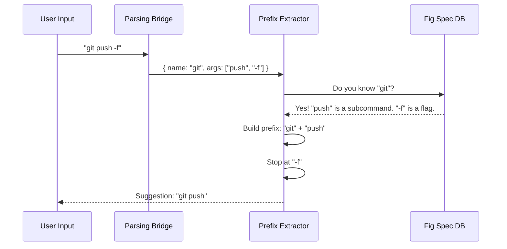

# Chapter 4: Static Prefix Extraction

Welcome back!

In [Chapter 3: Security Pattern Detection](03_security_pattern_detection.md), we built an "X-Ray Scanner" to detect hidden code execution and dangerous patterns. We now know if a command is "safe enough" to interpret.

But "safe" isn't enough for a good user experience.

If a user runs `git push origin master`, we could ask:
> *"Do you want to allow `git`?"*

If they say yes, they accidentally allow **everything** `git` can do (including `git delete`!). This is the **Master Key** problem.

We could ask:
> *"Do you want to allow `git push origin master`?"*

If they say yes, the next time they run `git push origin main`, it will fail. This is too specific.

This chapter introduces **Static Prefix Extraction**. We want to act like an intelligent key cutter: we want to give the user a key that opens *just the functionality they need*. In this case: `git push`.

---

## The Concept: Least Privilege

The goal of this system is to find the "Sweet Spot" between a command that is too broad and one that is too specific.

### The "Fig Spec" Database
To do this, we need to understand how different tools work.
*   **Cmdlets:** `Get-Process` is a single unit. The prefix is just `Get-Process`.
*   **CLIs:** `git`, `npm`, and `docker` have **subcommands**.

We use a library of "Fig Specs" (standard descriptions of CLI tools) to tell the difference between a **Subcommand** (part of the prefix) and a **Flag/Argument** (user input).

| Input Command | Extracted Prefix | Why? |
| :--- | :--- | :--- |
| `Get-Process -Id 123` | `Get-Process` | Cmdlets don't have subcommands. |
| `git commit -m "WIP"` | `git commit` | `commit` is a subcommand. `-m` is a flag. |
| `npm run test` | `npm run` | `run` is a subcommand. `test` is an argument. |
| `python script.py` | `python` | `script.py` is a file, not a subcommand. |

---

## Visualizing the Extraction

Here is how the system decides what the prefix should be.



---

## Implementation: The Extractor

Let's look at how we implement this in `staticPrefix.ts`. We use the parsed AST from [Chapter 2: AST Transformation & Normalization](02_ast_transformation___normalization.md).

### Step 1: The Gatekeeper
First, we filter out commands that shouldn't generate suggestions. If a command is a file path (like `./script.ps1`) or a variable, we can't create a static rule for it.

```typescript
// staticPrefix.ts
async function extractPrefixFromElement(cmd: ParsedCommandElement) {
  // If it's a file path (e.g. ./my-script), don't suggest a global rule
  if (cmd.nameType === 'application') {
    return null
  }
  
  // If it's a PowerShell Cmdlet, the name IS the prefix
  if (cmd.nameType === 'cmdlet') {
    return cmd.name // e.g., "Get-Process"
  }
  
  // Continued below...
}
```

> **Explanation:** If the user runs `.\deploy.ps1`, we return `null`. We don't want to auto-allow a specific file path because that file might change content. Cmdlets like `Get-Process` are simple; the name is the full prefix.

### Step 2: The Spec Lookup
For external tools (like `git` or `npm`), we need to look up their structure. We use a helper `buildPrefix` (shared with our Bash integration) that consults the Fig Spec database.

```typescript
// staticPrefix.ts (Continued)
  const name = cmd.name.toLowerCase()
  
  // 1. Get the "map" for this command (the Fig Spec)
  const spec = await getCommandSpec(name)
  
  // 2. Ask the map to calculate the prefix based on arguments
  // This logic knows that 'commit' is a subcommand of 'git'
  const prefix = await buildPrefix(cmd.name, cmd.args, spec)
```

> **Explanation:** `getCommandSpec` loads the definition for `git`. `buildPrefix` walks through the arguments (`push`, `origin`) and checks the spec. It sees `push` is a subcommand, so it adds it. It sees `origin` is an argument, so it stops.

### Step 3: Verification (The Safety Check)
Sometimes, the spec might be fuzzy, or the user input is weird. We need to verify that the prefix we built actually matches the words the user typed, in order.

```typescript
// staticPrefix.ts
  // Verify the prefix matches the arguments positionally
  let argIdx = 0
  
  // Split our proposed prefix into words (e.g. ["git", "push"])
  for (const word of prefix.split(' ').slice(1)) {
    // If we can't find the word in the user's actual args, reject it.
    while (argIdx < cmd.args.length) {
       if (cmd.args[argIdx] === word) break 
       argIdx++
    }
    
    // If we ran out of args without finding the word, the prefix is invalid
    if (argIdx >= cmd.args.length) return null
  }

  return prefix
```

> **Explanation:** This loop ensures we don't hallucinate a prefix. If `buildPrefix` returns `git commit`, we make sure the user actually typed `git` followed eventually by `commit`.

---

## Advanced Logic: Compound Commands

What happens if a user chains commands?
```powershell
npm run test; npm run build
```

We don't want to ask the user twice. We want to find the **Longest Common Prefix** (LCP).

### The Collapser
We group commands by their root program (`npm`) and try to find what they share.

```typescript
// staticPrefix.ts
function wordAlignedLCP(strings: string[]): string {
  // Split strings into words
  const firstWords = strings[0].split(' ')
  let commonCount = firstWords.length

  // Compare word by word
  for (let i = 1; i < strings.length; i++) {
    const words = strings[i].split(' ')
    // Reduce commonCount until it matches this string
    // ... (logic to reduce count)
  }

  // Join the common words back together
  return firstWords.slice(0, commonCount).join(' ')
}
```

**Example:**
1.  Inputs: `npm run test`, `npm run build`
2.  Common Words: `npm`, `run`
3.  Result: `npm run`

Now the UI can suggest: *"Allow `npm run`?"* This covers both commands safely!

---

## Integrating with the UI

Finally, we wrap this all up in a function that the UI calls.

```typescript
// staticPrefix.ts
export async function getCommandPrefixStatic(command: string) {
  // 1. Parse the command using Chapter 1 & 2 logic
  const parsed = await parsePowerShellCommand(command)
  
  // 2. Find the first command node
  const firstCommand = getAllCommands(parsed).find(
    cmd => cmd.elementType === 'CommandAst'
  )

  // 3. Extract the prefix
  return { 
    commandPrefix: await extractPrefixFromElement(firstCommand) 
  }
}
```

## Conclusion

We have created a smart system that understands the *intent* of a command structure.
1.  It identifies **Cmdlets** (`Get-Service`).
2.  It identifies **Subcommands** (`git checkout`).
3.  It ignores **Arguments** (`-Force`, `origin`).

This allows us to offer permission suggestions that are **secure** (least privilege) but also **usable** (don't ask for every single flag).

However, there is one final problem. Some commands are so dangerous that we should **never** suggest a prefix for them, or we should treat them with extreme caution. Commands like `Invoke-Expression` or `Start-Process` can bypass our checks if we aren't careful.

In the final chapter, we will build a registry to track these high-risk tools.

[Next: Chapter 5 - Dangerous Cmdlet Registry](05_dangerous_cmdlet_registry.md)

---

Generated by [Code IQ](https://github.com/adityasoni99/Code-IQ)