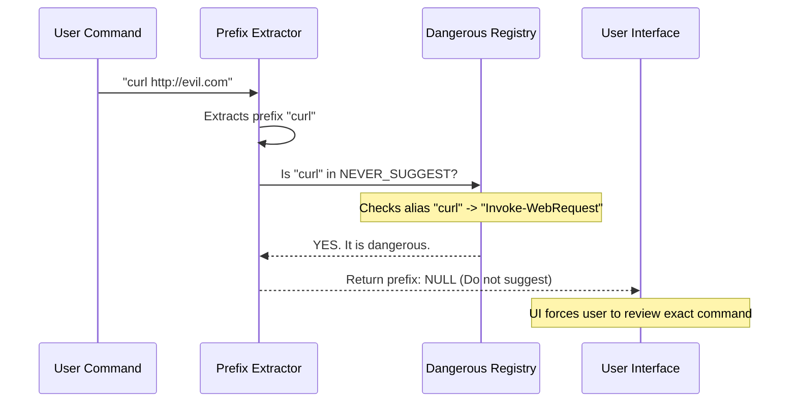

# Chapter 5: Dangerous Cmdlet Registry

Welcome to the final chapter of our series!

In [Chapter 4: Static Prefix Extraction](04_static_prefix_extraction.md), we built a smart system that creates helpful shortcuts for users. If a user runs `git push origin`, we suggest allowing `git push`. This makes the user experience smooth.

However, convenience is often the enemy of security.

There are some PowerShell commands that are so powerful—and so prone to abuse—that we should **never** suggest a shortcut for them.

This chapter introduces the **Dangerous Cmdlet Registry**. This is our "No-Fly List." It ensures that even if our logic *could* create a shortcut, our security conscience steps in and says, "No, that's too risky."

## The Problem: The "Blank Check" Trap

Imagine a user runs this command:

```powershell
Invoke-Expression "Write-Host 'Hello'"
```

Our logic from Chapter 4 might look at this and say:
> "Hey, the command is `Invoke-Expression`. Let's suggest allowing `Invoke-Expression *` so the user doesn't have to approve it again!"

**This is a disaster.**

`Invoke-Expression` (often aliased as `iex`) takes *any* string and runs it as code. If the user approves `Invoke-Expression *`, a malicious script can later run:

```powershell
Invoke-Expression "Remove-Item C:\Windows\System32 -Recurse -Force"
```

Because the user gave a "Blank Check" (the wildcard `*`), our system would allow this. We need a way to forbid these blank checks for high-risk tools.

## The Solution: A Centralized Registry

We create a centralized knowledge base that categorizes commands based on their capabilities.

If a command appears in this registry, we flag it as `NEVER_SUGGEST`. This tells the UI: **"Do not offer a wildcard permission for this. Require the user to approve every single specific invocation."**

---

## Concept 1: Categorizing the Danger

Not all dangerous commands are the same. We group them by *why* they are dangerous. This helps us maintain the list logically.

### 1. Code Executors
These are the most dangerous. They take text or files and turn them into running code.

```typescript
// dangerousCmdlets.ts
export const FILEPATH_EXECUTION_CMDLETS = new Set([
  'invoke-command', // Runs scripts on remote machines
  'start-job',      // Runs scripts in background
  // ...
])
```

> **Why:** If you allow these broadly, you allow arbitrary code execution.

### 2. Network Access
Tools that can download files or send data out to the internet.

```typescript
// dangerousCmdlets.ts
export const NETWORK_CMDLETS = new Set([
  'invoke-webrequest', // "curl" for PowerShell
  'invoke-restmethod',
])
```

> **Why:** Malware uses these to download payloads (viruses) or upload stolen data (exfiltration).

### 3. System Hijackers
Tools that can change how the shell itself works.

```typescript
// dangerousCmdlets.ts
export const ALIAS_HIJACK_CMDLETS = new Set([
  'set-alias',    // Can make 'ls' run a virus
  'set-variable', // Can overwrite system settings
])
```

> **Why:** If a script changes the alias for `git` to run a malware script, the user won't know until it's too late.

---

## Concept 2: Handling Aliases Automatically

PowerShell has many names for the same command. `Invoke-WebRequest`, `curl`, `wget`, and `iwr` are all the same thing.

If we block `Invoke-WebRequest` but forget to block `curl`, our security is useless.

We use a helper function to automatically find all aliases for our dangerous commands.

```typescript
// dangerousCmdlets.ts
function aliasesOf(targets: ReadonlySet<string>): string[] {
  // Look through COMMON_ALIASES (from Chapter 2)
  return Object.entries(COMMON_ALIASES)
    .filter(([, target]) => targets.has(target.toLowerCase()))
    .map(([alias]) => alias) // Return the alias name (e.g., 'curl')
}
```

> **Explanation:** This function looks at our "Bad List". It then searches our Alias Dictionary to see if any of those bad commands have nicknames. It returns all the nicknames so we can block them too.

---

## Implementation: The "NEVER_SUGGEST" Set

We combine all our categories into one master set called `NEVER_SUGGEST`. This is the single source of truth for our UI logic.

```typescript
// dangerousCmdlets.ts
export const NEVER_SUGGEST: ReadonlySet<string> = (() => {
  // 1. Combine all specific danger lists
  const core = new Set<string>([
    ...FILEPATH_EXECUTION_CMDLETS,
    ...NETWORK_CMDLETS,
    ...ALIAS_HIJACK_CMDLETS,
    'invoke-expression', // The ultimate bad guy
  ])

  // 2. Add all their aliases automatically
  return new Set([...core, ...aliasesOf(core)])
})()
```

> **Explanation:** We use the Spread Syntax (`...`) to merge all our small sets into one big `core` set. Then we calculate the aliases and add them too.

---

## Visualizing the Safety Check

Here is how the system decides whether to offer a suggestion to the user.



---

## Integrating with the Engine

Now we update our logic from [Chapter 4: Static Prefix Extraction](04_static_prefix_extraction.md) to consult this registry.

If the extractor finds a prefix, it performs one final check before returning it.

```typescript
// staticPrefix.ts (Conceptual)
import { NEVER_SUGGEST } from './dangerousCmdlets'

export function getSafePrefix(commandName: string) {
  const cleanName = commandName.toLowerCase()

  // THE SECURITY CHECK
  if (NEVER_SUGGEST.has(cleanName)) {
    // Stop! This is too dangerous for a wildcard.
    return null 
  }

  // Otherwise, proceed with normal logic...
  return commandName
}
```

> **Explanation:** This function acts as a gatekeeper. Even if a command *looks* like a valid prefix, if it is on the list, we return `null`. This forces the application to treat the command as unique and one-time-only.

## Advanced: The "Arg Gated" Cmdlets

There is a subtle category in our registry called `ARG_GATED_CMDLETS`.

Commands like `Write-Host` seem safe. But remember [Chapter 3: Security Pattern Detection](03_security_pattern_detection.md)?

```powershell
Write-Host $(Invoke-Expression "malware")
```

We have logic that detects that `$(...)` and flags the command.

**The Problem:**
If we allow `Write-Host *`, that wildcard rule might skip the pattern detection check next time! A wildcard permission often bypasses deep inspection for performance.

**The Fix:**
We add `Write-Host` to `NEVER_SUGGEST`. This ensures that *every time* `Write-Host` is run, it must go through the deep scanning engine from Chapter 3. We never give it a "free pass."

## Conclusion: The Complete Picture

Congratulations! You have completed the PowerShell Integration tutorial. Let's recap the journey of a command through our system:

1.  **[Chapter 1](01_ast_based_parsing_bridge.md):** The command enters the **AST Bridge**. Node.js asks PowerShell, "What does this text mean?"
2.  **[Chapter 2](02_ast_transformation___normalization.md):** We **Normalize** the data. We strip weird prefixes (`Microsoft...`) and resolve aliases (`ls` -> `Get-ChildItem`).
3.  **[Chapter 3](03_security_pattern_detection.md):** We run an **X-Ray Scan**. We look for `$(...)` or script blocks `{...}` that hide malicious intent.
4.  **[Chapter 4](04_static_prefix_extraction.md):** We try to be helpful. We extract a **Prefix** (`git push`) to save the user time.
5.  **[Chapter 5](05_dangerous_cmdlet_registry.md):** We verify with the **Registry**. If the command is too dangerous (`Invoke-Expression`), we cancel the shortcut and force a full review.

By combining these five layers, we create a system that is **Secure by Design** but still **User Friendly**. We understand the command deeper than the user does, protecting them from threats they might not even see.

---

Generated by [Code IQ](https://github.com/adityasoni99/Code-IQ)