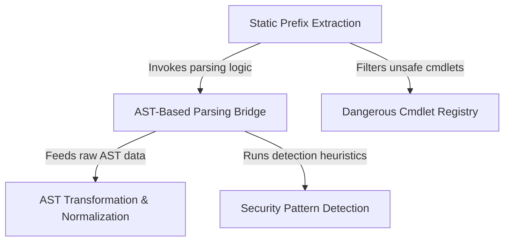

# Tutorial: powershell

This project serves as a secure **PowerShell analysis bridge** for Node.js, designed to safely interpret and classify user commands. It spawns a native `pwsh` process to parse scripts into a structured **Abstract Syntax Tree (AST)**, which is then normalized into typed objects. The system uses this structured data to detect **security patterns** (like injection risks), validate against a registry of **dangerous cmdlets**, and generate **least-privilege** permission suggestions for the user interface.

## Chapters

1. [AST-Based Parsing Bridge](01_ast_based_parsing_bridge.md)
2. [AST Transformation & Normalization](02_ast_transformation___normalization.md)
3. [Security Pattern Detection](03_security_pattern_detection.md)
4. [Static Prefix Extraction](04_static_prefix_extraction.md)
5. [Dangerous Cmdlet Registry](05_dangerous_cmdlet_registry.md)

---

Generated by [Code IQ](https://github.com/adityasoni99/Code-IQ)