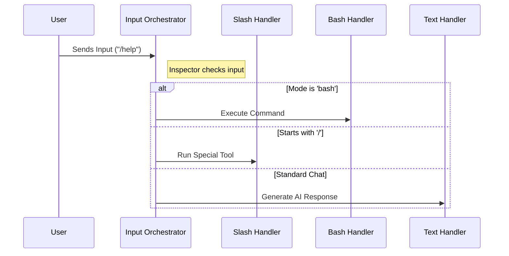

# Chapter 1: Input Orchestration

Welcome to the **processUserInput** project tutorial! If you are new here, don't worry. We are going to build your understanding of how an advanced AI chat interface handles user commands step-by-step.

## The Motivation: The Central Switchboard

Imagine you are building a chat application. Users can type all sorts of things into the input box:
1.  **"Write me a poem."** (A standard conversation)
2.  **"/reset"** (A specific command to restart context)
3.  **"npm install react"** (A terminal command to run code)

If you treated everything as a standard conversation, the AI might try to "talk" about installing React instead of actually doing it. We need a way to distinguish between these different types of requests.

**Input Orchestration** solves this. Think of it as a **Central Switchboard Operator**. When a "call" (user input) comes in, the operator listens for a split second and decides which department needs to handle it:
*   **Sales Department:** For regular chat and questions.
*   **Special Services:** For commands starting with `/`.
*   **Tech Support:** For running direct code or shell commands.

## Key Concepts

To understand Orchestration, we need to look at two specific variables that accompany every user input:

1.  **Mode:** This tells us the "state" the user is in. Are they in `prompt` mode (standard chat) or `bash` mode (expecting to run terminal scripts)?
2.  **Content:** What did the user actually type? We look for specific triggers, like a forward slash `/` at the beginning of the text.

### The Use Case

Let's look at a concrete use case we want to solve in this chapter:

> **Goal:** The user types `/help`. The system must recognize this is NOT a request for the AI to generate text, but a specific system command to show the help menu.

## How It Works: The Flow

Before we look at the code, let's visualize exactly what happens when you press "Enter".



1.  The **Input Orchestrator** receives the raw text.
2.  It checks the **Mode**.
3.  It checks the **Content** (does it start with `/`?).
4.  It routes the data to the correct file.

## Internal Implementation

The heart of this logic lives in the function `processUserInput`. This function is the "Main Entry Point." Let's look at how it makes decisions.

### 1. The Setup
First, the function accepts the `input` (what you typed) and the `mode` (how you typed it).

```typescript
// processUserInput.ts

export async function processUserInput({
  input,        // e.g., "Hello" or "/help"
  mode,         // e.g., 'prompt' or 'bash'
  // ... other context variables
}) {
    // Logic starts here...
}
```
*Explanation:* This is the function definition. It takes an object containing all the details about the user's interaction.

### 2. Handling Media (Preprocessing)
Before routing, we often need to clean up the input. For example, if the user pasted an image, we need to process it before deciding where it goes.

```typescript
// Checks if input is an array (contains images/files)
if (Array.isArray(input)) {
    // Resize images and prepare them for the API
    normalizedInput = await preprocessImages(input);
}
```
*Explanation:* We check if the input is complex (contains media). If so, we prepare it. This is covered in detail in [Chapter 3: Media and Attachment Preprocessing](03_media_and_attachment_preprocessing.md).

### 3. The "Bash" Route (Tech Support)
Now, the routing begins. The first check is for the "Bash" mode.

```typescript
// If the input bar is specifically set to 'bash' mode
if (inputString !== null && mode === 'bash') {
    // Import the specialized handler for shell commands
    const { processBashCommand } = await import('./processBashCommand.js');
    
    // Hand off the work and return the result
    return processBashCommand(inputString, ...args);
}
```
*Explanation:* If the user selected "Terminal" mode in the UI, we skip all AI chat logic and go straight to [Shell Command Execution](04_shell_command_execution.md).

### 4. The "Slash Command" Route (Special Services)
Next, we check if the text looks like a special command.

```typescript
// If input starts with '/' (and we aren't ignoring commands)
if (inputString !== null && inputString.startsWith('/')) {
    // Import the slash command handler
    const { processSlashCommand } = await import('./processSlashCommand.js');

    // Execute the specific tool (like /help, /reset, /config)
    return processSlashCommand(inputString, ...args);
}
```
*Explanation:* This catches inputs like `/help`. Instead of asking the AI what "help" means, we run a deterministic function mapped to that keyword.

### 5. The Default Route (Sales / Standard Chat)
If the input wasn't a Bash command and didn't start with a slash, it's a normal conversation!

```typescript
// Fallback: This is a standard user prompt to the AI
return processTextPrompt(
    normalizedInput, 
    attachmentMessages, 
    // ... context
);
```
*Explanation:* This is the most common path. The text is sent to the Large Language Model (LLM) to generate a response. We cover this in [Chapter 2: Standard Prompt Processing](02_standard_prompt_processing.md).

### 6. Lifecycle Hooks (Quality Control)
Finally, after the router decides *where* to send the message, we have a system to double-check the result before it finishes.

```typescript
// Execute hooks after processing logic
for await (const hookResult of executeUserPromptSubmitHooks(input)) {
    if (hookResult.blockingError) {
        // Stop everything if a hook finds a problem
        return createErrorSystemMessage(hookResult.blockingError);
    }
}
```
*Explanation:* This acts like a final quality check. Plugins or other parts of the system can inspect the submission and say "Wait, you can't do that!" or add extra data. This is covered in [Chapter 5: Submission Lifecycle Hooks](05_submission_lifecycle_hooks.md).

## Conclusion

You have just learned the architecture of **Input Orchestration**.

By acting as a "Switchboard Operator," the `processUserInput` function ensures that:
1.  **/slash commands** trigger tools.
2.  **Bash mode** triggers terminal scripts.
3.  **Regular text** triggers the AI.

This separation of concerns makes the application robust and prevents the AI from getting confused by system instructions.

Now that we know how the input is routed, let's see what happens when the switchboard connects us to the "Sales Department" (the default AI chat).

[Next Chapter: Standard Prompt Processing](02_standard_prompt_processing.md)

---

Generated by [Code IQ](https://github.com/adityasoni99/Code-IQ)