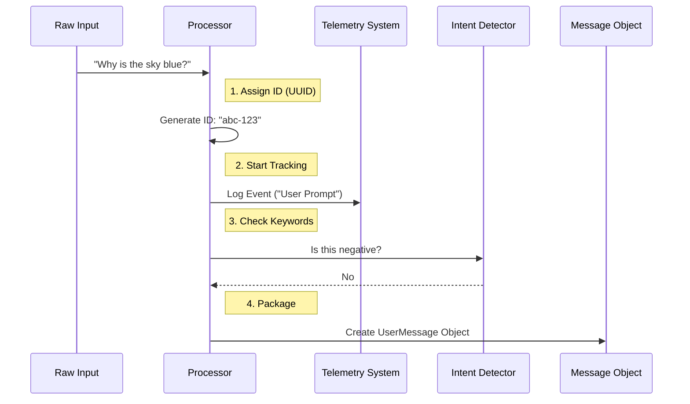

# Chapter 2: Standard Prompt Processing

Welcome back! In [Chapter 1: Input Orchestration](01_input_orchestration.md), we acted as the "Switchboard Operator," deciding where user input should go.

If the user didn't type a special command (like `/help`) or run a terminal script, the switchboard routes the call to the **Standard Prompt Processor**. This is the default path for normal conversations, like asking the AI to write code or explain a concept.

## The Motivation: From "Note" to "Package"

Why can't we just send the user's text straight to the AI?

Imagine dropping a loose piece of paper into a mailbox. It might get lost, crumpled, or mixed up. You wouldn't have a tracking number, and the post office wouldn't know if it's urgent.

**Standard Prompt Processing** is like a **Formal Processing Center**. It takes your casual note and:
1.  Stamps it with a unique **Tracking ID**.
2.  Logs it in the system (so we know it happened).
3.  Checks it for urgent keywords (like "Stop!").
4.  Packages it into a formal `UserMessage` object that the AI understands.

### The Use Case

> **Goal:** The user types "Why is the sky blue?" We need to convert this simple text into a tracked, structured message object ready for the AI.

## Key Concepts

Before looking at the code, let's understand the three main jobs this processor does:

1.  **Identity & Telemetry:** Every message gets a unique ID (UUID). We also use **OpenTelemetry** (a standard for logging) to record that a user prompt happened. This helps developers debug issues later.
2.  **Intent Detection:** We scan the text for specific "signals."
    *   *Negative Signals:* Did the user say "stop" or "no"?
    *   *Positive Signals:* Did the user say "keep going"?
    *   These signals help us understand user satisfaction without reading their private thoughts.
3.  **Message Construction:** The AI doesn't just read strings; it reads objects. We wrap the text in a JSON structure that includes permissions and metadata.

## How It Works: The Flow

Here is the lifecycle of a standard text prompt:



## Internal Implementation

The logic resides in `processTextPrompt.ts`. Let's walk through it piece by piece.

### 1. Assigning Identity
First, we generate a unique ID for this specific interaction. This effectively "stamps" the letter.

```typescript
// processTextPrompt.ts
import { randomUUID } from 'crypto'
import { setPromptId } from 'src/bootstrap/state.js'

export function processTextPrompt(input, /*...args*/) {
  // 1. Create a unique ID for this specific message
  const promptId = randomUUID()
  
  // 2. Save it to the global state so other parts of the app know it
  setPromptId(promptId)
  
  // ... continued below
```
*Explanation:* We use `randomUUID()` to create a string like `123e4567-e89b...`. This ensures that even if two users type "Hello" at the exact same time, the system treats them as distinct events.

### 2. logging the Event (Telemetry)
Next, we log the event. This is crucial for understanding how the application is being used. We handle both simple text strings (CLI) and complex arrays (VS Code).

```typescript
  // Extract the text string for logging purposes
  const otelPromptText = typeof input === 'string' 
      ? input 
      : input.findLast(block => block.type === 'text')?.text || ''

  // Log to OpenTelemetry (standardized tracking)
  if (otelPromptText) {
    void logOTelEvent('user_prompt', {
      prompt_length: String(otelPromptText.length),
      'prompt.id': promptId, // The ID we generated earlier
    })
  }
```
*Explanation:* We calculate the length of the prompt and attach the ID. `logOTelEvent` sends this data to our monitoring system. Note that we try to find the text even if the input is a complex array.

### 3. Intent Detection
The system quickly scans the text to see if the user is trying to steer the AI's behavior with keywords.

```typescript
  // Check for specific keywords
  const isNegative = matchesNegativeKeyword(userPromptText)   // e.g., "stop"
  const isKeepGoing = matchesKeepGoingKeyword(userPromptText) // e.g., "continue"

  // Log these intents for analytics
  logEvent('tengu_input_prompt', {
    is_negative: isNegative,
    is_keep_going: isKeepGoing,
  })
```
*Explanation:* If a user is getting frustrated and typing "No, stop!", we want to track that metric. This doesn't stop the code here, but it tags the message with extra information.

### 4. Handling Media (Briefly)
Sometimes a text prompt comes with an image. We have to check for that.

```typescript
  // If there are images attached to this text
  if (imageContentBlocks.length > 0) {
      // Combine text and images into one message
      const userMessage = createUserMessage({
        content: [...textContent, ...imageContentBlocks],
        uuid: uuid,
        // ...
      })
      
      return { messages: [userMessage], shouldQuery: true }
  }
```
*Explanation:* If images are present, we bundle them with the text. The specific logic for preparing these images happened *before* this function, which is covered in [Chapter 3: Media and Attachment Preprocessing](03_media_and_attachment_preprocessing.md).

### 5. Creating the Message Object
Finally, if it's just text, we wrap it up and return it.

```typescript
  // Create the standardized message object
  const userMessage = createUserMessage({
    content: input,
    uuid, // The ID passed in or generated
    permissionMode,
  })

  // Return the package ready for the AI
  return {
    messages: [userMessage, ...attachmentMessages],
    shouldQuery: true
  }
}
```
*Explanation:* `createUserMessage` is a helper that ensures our object matches exactly what the AI API expects. We return `shouldQuery: true` to tell the system, "Yes, please send this to the AI now."

## Conclusion

You've learned how **Standard Prompt Processing** turns a simple string of text into a robust, tracked system event.

By using this formal process, we ensure that:
1.  Every message is traceable via UUIDs.
2.  We have visibility into system usage via Telemetry.
3.  We can detect user sentiment (Positive/Negative keywords).

But what if the user didn't just type text? What if they dragged and dropped a screenshot of an error message?

To handle that, we need to step back and look at how we prepared the data *before* it reached this processor.

[Next Chapter: Media and Attachment Preprocessing](03_media_and_attachment_preprocessing.md)

---

Generated by [Code IQ](https://github.com/adityasoni99/Code-IQ)