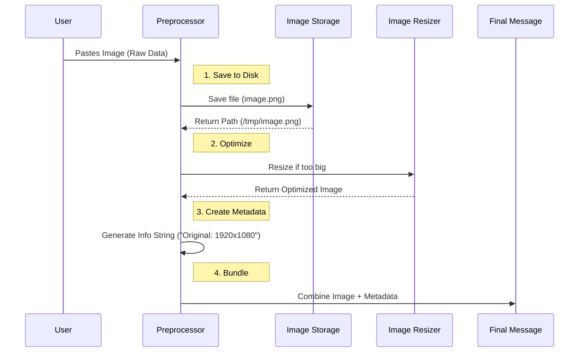

# Chapter 3: Media and Attachment Preprocessing

Welcome back! In [Chapter 2: Standard Prompt Processing](02_standard_prompt_processing.md), we learned how the system packages simple text messages.

But let's be honest—modern communication isn't just text. Users paste screenshots of error messages, drag and drop diagram files, or upload photos.

If we sent a raw, high-resolution 4K screenshot directly to an AI model, it might be too large (hitting API limits) or cost too many tokens. We need a way to clean up these "heavy" inputs before they reach the main logic.

## The Motivation: The Shipping Department

Imagine a standard letter carrier. They are great at delivering envelopes (text). But what happens if you try to mail a sofa (a large image)?

If you just hand the sofa to the letter carrier, they won't take it. You need a **Shipping Department**.

**Media Preprocessing** is that department. It performs three critical jobs:
1.  **Measure and Weigh:** It checks the dimensions of the image.
2.  **Repackage (Resize):** If the item is too big, it shrinks it down to a standard size that fits in the delivery truck.
3.  **Labeling (Metadata):** It attaches a tag saying "This was originally 4000x3000 pixels" so the recipient knows the context, even if they received a smaller version.

### The Use Case

> **Goal:** The user takes a screenshot of a bug and pastes it into the chat input (`Ctrl+V`). The system must resize this image to be API-friendly, save a local copy, and inform the AI about the file's original details.

## Key Concepts

To handle media, we introduce three concepts:

1.  **Normalization:** The input variable might be a simple string (`"Hello"`) or a complex array of objects (Text + Image Blocks). Normalization means converting everything into a format the processor understands.
2.  **Downsampling:** This is a fancy word for "resizing." We reduce the quality slightly to ensure speed and compatibility without losing the visual information the AI needs.
3.  **Meta Messages:** Sometimes we want to give the AI information (like file paths or image dimensions) that the *user* doesn't need to see in the chat history. We call these "Meta" messages—hidden notes passed to the brain of the AI.

## How It Works: The Flow

Before the code runs, let's visualize the journey of a pasted image.



## Internal Implementation

The logic for this is inside `processUserInputBase`. Let's break down the code into small, digestible steps.

### 1. Handling Complex Input Arrays
Sometimes the input isn't just a string; it's an array of blocks (some text, some images). We need to loop through them.

```typescript
// processUserInput.ts

// If input is an array (contains media blocks)
if (Array.isArray(input)) {
    const processedBlocks = []
    
    for (const block of input) {
      if (block.type === 'image') {
        // Stop! Resize this image before continuing.
        const resized = await maybeResizeAndDownsampleImageBlock(block)
        
        // Add the clean version to our list
        processedBlocks.push(resized.block)
      } else {
        // Text blocks pass through unchanged
        processedBlocks.push(block)
      }
    }
    // Update our input variable to use the processed blocks
    normalizedInput = processedBlocks
}
```
*Explanation:* We act as a filter. Text passes through. Images are caught, sent to the `maybeResizeAndDownsampleImageBlock` utility, and replaced with their optimized versions.

### 2. Handling Pasted Content (Clipboard)
Often, images come from the clipboard (`pastedContents`). These are raw binary data. We need to save them and process them.

```typescript
// 1. Save images to disk so we have a file path
const storedImagePaths = await storeImages(pastedContents)

// 2. Loop through every pasted item
const imageProcessingResults = await Promise.all(
  imageContents.map(async pastedImage => {
    // Create a raw image block
    const imageBlock = {
      type: 'image',
      source: { data: pastedImage.content }
    }
    
    // Resize it!
    const resized = await maybeResizeAndDownsampleImageBlock(imageBlock)
    
    return { resized, sourcePath: storedImagePaths.get(pastedImage.id) }
  })
)
```
*Explanation:*
1.  `storeImages`: Writes the file to your hard drive so the AI can refer to it by path later.
2.  `maybeResizeAndDownsampleImageBlock`: Ensures the pasted data isn't too heavy for the API.

### 3. Creating Metadata Labels
When we resize an image, we lose information about how big it originally was. We want to tell the AI, "Hey, this is a small version, but the original was huge."

```typescript
// Create a list to hold our notes
const imageMetadataTexts = []

for (const result of imageProcessingResults) {
    // Generate a text string like: "Image dimensions: 1024x768"
    const metadataText = createImageMetadataText(
        result.resized.dimensions, 
        result.sourcePath
    )
    
    if (metadataText) {
        imageMetadataTexts.push(metadataText)
    }
}
```
*Explanation:* `createImageMetadataText` creates a helpful string. This allows the AI to know the context of the image without analyzing the raw pixels for resolution.

### 4. Injecting the Hidden "Meta" Message
Finally, we attach these notes to the conversation. We don't want to clutter the user's chat UI with "Image dimensions: 1024x768", so we mark it as `isMeta`.

```typescript
function addImageMetadataMessage(result, imageMetadataTexts) {
  if (imageMetadataTexts.length > 0) {
    // Create a hidden UserMessage
    result.messages.push(
      createUserMessage({
        content: imageMetadataTexts.map(text => ({ type: 'text', text })),
        isMeta: true, // <--- This hides it from the UI!
      }),
    )
  }
  return result
}
```
*Explanation:* The user sees their image. The AI sees the image **plus** a hidden note explaining exactly what that image file is.

## Conclusion

You have successfully set up the **Media and Attachment Preprocessing** layer.

By adding this step, our application becomes much more robust:
1.  **Safety:** We never send oversized data to the API.
2.  **Context:** The AI understands file paths and dimensions.
3.  **Flexibility:** We can handle clipboard pastes and file uploads seamlessly.

Now that our text is polished (Chapter 2) and our media is optimized (Chapter 3), we are ready to handle the most powerful feature of this application: direct computer control.

[Next Chapter: Shell Command Execution](04_shell_command_execution.md)

---

Generated by [Code IQ](https://github.com/adityasoni99/Code-IQ)