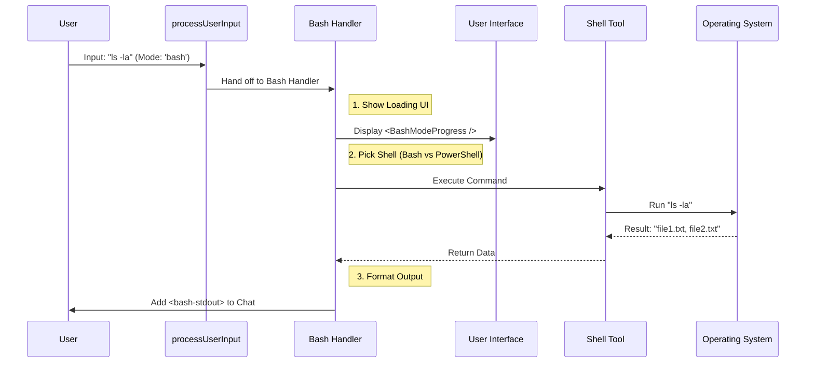

# Chapter 4: Shell Command Execution

Welcome back! In [Chapter 3: Media and Attachment Preprocessing](03_media_and_attachment_preprocessing.md), we learned how to prepare "heavy" data like images for the system.

Now that we have clean input, it's time to give our application some real power. Up until now, we've mostly discussed talking to an AI. But sometimes, you don't want to talk; you want to **do**.

## The Motivation: The Driver's Seat

Imagine you are in a self-driving car.
*   **Prompt Mode** is like telling the car: "Please drive me to the store." (The AI interprets your intent).
*   **Shell/Bash Mode** is grabbing the steering wheel yourself. You aren't asking nicely; you are manually controlling the machine.

If a user types `npm install react` into a standard chat, the AI might reply: *"Here is how you install React..."* and give you a tutorial.

But if the user switches to **Bash Mode**, they want the system to actually run that command on their computer. **Shell Command Execution** handles this responsibility. It acts as a direct bridge between the chat box and your operating system.

### The Use Case

> **Goal:** The user switches the input mode to "Terminal" and types `ls -la`. The system must execute this on the computer and display the list of files in the chat.

## Key Concepts

1.  **Direct Execution:** Unlike standard prompts, this input bypasses the Large Language Model (LLM) logic for generating a reply. It goes straight to a system tool.
2.  **Shell Selection:** Computers speak different languages. Windows uses **PowerShell**; macOS and Linux usually use **Bash** or **Zsh**. The code must automatically pick the right translator.
3.  **Real-Time Feedback:** System commands can take time (like installing software). We need to show the user a "spinner" or progress bar so they know the app hasn't frozen.
4.  **Structured Output:** When the computer replies (stdout/stderr), we need to format it so it looks nice in the chat history.

## How It Works: The Flow

Here is the lifecycle of a shell command:



## Internal Implementation

The journey starts in the familiar `processUserInput.ts`, but this time we take a different exit ramp.

### 1. The Entry Point
In [Chapter 1: Input Orchestration](01_input_orchestration.md), we saw how the system routes messages. Here is the specific check for Bash mode.

```typescript
// processUserInput.ts

// Check if the user explicitly selected 'bash' mode
if (inputString !== null && mode === 'bash') {
    // Dynamic import to keep the app fast
    const { processBashCommand } = await import('./processBashCommand.js');
    
    // Hand off control to the specialist
    return processBashCommand(inputString, ...args);
}
```
*Explanation:* We detect the mode immediately. Note that we `import` the handler dynamically. If the user never uses the terminal, we never load that code, keeping the app lightweight.

### 2. The Bash Handler: UI Feedback
Now we are inside `processBashCommand.tsx`. The first thing we do is tell the user, "I'm working on it."

```typescript
// processBashCommand.tsx

// Render a progress component in the chat interface
setToolJSX({
    jsx: <BashModeProgress 
            input={inputString} 
            progress={null} 
         />,
    shouldHidePromptInput: false
});
```
*Explanation:* `setToolJSX` is a special function that allows the backend logic to draw React components on the screen. The user sees a visual indicator that their command is running.

### 3. Choosing the Right Shell
We need to decide which tool to use based on the user's operating system.

```typescript
// Check if we are on Windows/PowerShell or Linux/Mac
const usePowerShell = isPowerShellToolEnabled() && 
                      resolveDefaultShell() === 'powershell';

// Select the correct tool class
const shellTool = usePowerShell ? PowerShellTool : BashTool;
```
*Explanation:* If the user is on Windows, we load the `PowerShellTool`. Otherwise, we default to the `BashTool`. This ensures the command syntax works correctly for the host machine.

### 4. Executing the Command
Now we run the command. Notice the flag `dangerouslyDisableSandbox`.

```typescript
// Call the tool to execute the text
const response = await shellTool.call({
  command: inputString,
  // We trust the user's direct input, so we run outside the safety sandbox
  dangerouslyDisableSandbox: true 
}, bashModeContext, undefined, undefined, onProgress);
```
*Explanation:* Usually, AI actions are sandboxed for safety. However, when the *user* explicitly types a command in Bash mode, we assume they know what they are doing, so we disable the sandbox to give them full access.

### 5. Formatting the Output
The computer returns the result in two streams: `stdout` (success messages) and `stderr` (errors). We wrap these in XML tags.

```typescript
const { stdout, stderr } = response.data;

return {
  messages: [
    // Create a message containing the raw output
    createUserMessage({
      content: `<bash-stdout>${escapeXml(stdout)}</bash-stdout>` +
               `<bash-stderr>${escapeXml(stderr)}</bash-stderr>`
    })
  ],
  shouldQuery: false // Don't send this to the AI, just show it.
};
```
*Explanation:* 
1.  `escapeXml`: Ensures that if the file list contains `<` or `>`, it doesn't break our data structure.
2.  `<bash-stdout>`: These tags allow the UI to style the output like a terminal window (green text on black background).
3.  `shouldQuery: false`: This tells the system "We are done. Do not ask the AI for a response to this."

## Handling Errors
What if the command fails (e.g., `command not found`)? We catch the error and format it nicely, rather than crashing the app.

```typescript
} catch (e) {
    return {
      messages: [
        createUserMessage({
          content: `<bash-stderr>Command failed: ${escapeXml(e.message)}</bash-stderr>`
        })
      ],
      shouldQuery: false
    };
}
```
*Explanation:* Even errors are wrapped in `<bash-stderr>`. This ensures they appear in red in the terminal UI, just like a real console.

## Conclusion

You have learned how **Shell Command Execution** turns the chat interface into a functional terminal.

By creating a specialized handler, we achieved:
1.  **OS Compatibility:** Automatically switching between Bash and PowerShell.
2.  **User Feedback:** Using `setToolJSX` to show progress.
3.  **Structured Output:** converting raw system text into formatted chat messages.

Now our system handles **Inputs** (Chapter 1), **Standard Prompts** (Chapter 2), **Media** (Chapter 3), and **System Commands** (Chapter 4).

But wait—before any of these messages are finalized and saved to the history, is there a way for plugins or other parts of the app to inspect them one last time? Yes, there is.

[Next Chapter: Submission Lifecycle Hooks](05_submission_lifecycle_hooks.md)

---

Generated by [Code IQ](https://github.com/adityasoni99/Code-IQ)