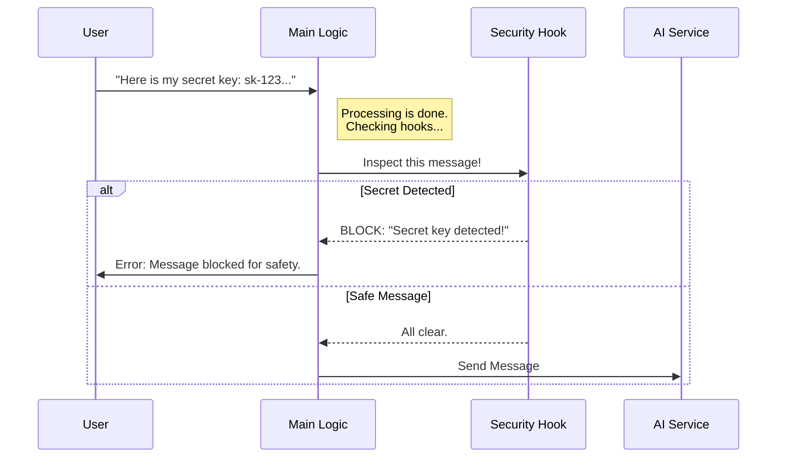

# Chapter 5: Submission Lifecycle Hooks

Welcome to the final chapter of the **processUserInput** tutorial!

In the previous chapter, [Shell Command Execution](04_shell_command_execution.md), we gave our application the power to run system commands directly. We have covered how to route inputs, package text, handle images, and execute scripts.

But before we send *any* of this off to the AI (or "take off"), there is one final safety check. This is where **Submission Lifecycle Hooks** come in.

## The Motivation: The Security Checkpoint

Imagine you are at an airport. You have your ticket (Input) and your luggage (Context). You are ready to fly. But before you can board the plane, you must pass through **Security**.

Security does two things:
1.  **Confiscates prohibited items:** If you have a bottle of water, they throw it away (Blocking).
2.  **Checks your ID:** They might add a sticker to your passport verifying you were checked (Augmenting context).

**Submission Lifecycle Hooks** act as this security gate for your application. They allow other plugins or parts of the system to inspect the user's message right before it is finalized.

### The Use Case

> **Goal:** "Secret Prevention." The user accidentally pastes an API Key (e.g., `sk-12345...`) into the chat. The system must detect this pattern and **block** the message instantly so the secret isn't sent to the AI cloud.

## Key Concepts

1.  **The Hook:** A listener that sits between the processing logic and the final submission. It "hooks" into the conversation flow.
2.  **Blocking Error:** If a hook spots something dangerous, it returns a `blockingError`. This stops the process immediately and shows a warning to the user.
3.  **Additional Context:** Sometimes a hook wants to help! For example, if you ask about a specific file, a hook could automatically read that file and attach its content to your message so the AI can see it.

## How It Works: The Flow

Let's visualize the "Security Checkpoint" flow.



## Internal Implementation

This logic is the very last step in the `processUserInput` function. We iterate through a list of registered hooks and let each one inspect the input.

### 1. The Hook Loop
We use a loop because there might be multiple security guards (plugins). One might check for secrets, another might check for profanity, etc.

```typescript
// processUserInput.ts

// 1. Loop through every active hook
for await (const hookResult of executeUserPromptSubmitHooks(
    inputMessage, 
    appState.toolPermissionContext.mode, 
    // ... context
)) {
    // Logic continues below...
}
```
*Explanation:* `executeUserPromptSubmitHooks` is a generator. It yields results one by one. We wait for each hook to finish its inspection before checking the next one.

### 2. The "Red Light" (Blocking)
This handles our use case. If a hook returns a `blockingError`, we abort the mission.

```typescript
// Inside the loop...

if (hookResult.blockingError) {
    // 2. Create a system warning message
    const blockingMessage = getUserPromptSubmitHookBlockingMessage(
        hookResult.blockingError
    );

    // 3. Return immediately! set shouldQuery to false.
    return {
        messages: [
            createSystemMessage(blockingMessage, 'warning')
        ],
        shouldQuery: false // Stop the AI request
    };
}
```
*Explanation:* We replace the user's original message with a System Message (warning). By setting `shouldQuery: false`, the text is never sent to the Large Language Model. The user stays safe.

### 3. The "Green Light" (Augmenting)
Sometimes hooks are helpful. They might find related information and want to attach it to the message "luggage."

```typescript
// Inside the loop...

if (hookResult.additionalContexts && hookResult.additionalContexts.length > 0) {
    // 4. Add the extra data to the message list
    result.messages.push(
        createAttachmentMessage({
            type: 'hook_additional_context',
            content: hookResult.additionalContexts,
            hookName: 'UserPromptSubmit',
        })
    );
}
```
*Explanation:* If the hook returns `additionalContexts`, we create a special `AttachmentMessage`. This bundles the extra info with the user's original text, making the AI smarter about the current context.

### 4. Stopping without Error
Sometimes a hook might want to handle the request entirely by itself and just tell the main system to stop, without showing an error.

```typescript
// Inside the loop...

if (hookResult.preventContinuation) {
    // 5. Add a note saying why we stopped
    result.messages.push(
        createUserMessage({
            content: `Operation stopped by hook: ${hookResult.stopReason}`,
        })
    );
    
    // 6. Stop processing gracefully
    result.shouldQuery = false;
    return result;
}
```
*Explanation:* This is useful if a plugin decides to run a different UI flow or wizard instead of a standard chat response.

## Conclusion

Congratulations! You have completed the **processUserInput** tutorial series.

Let's recap what we've built:
1.  **[Input Orchestration](01_input_orchestration.md):** The switchboard that decides if input is chat, code, or a command.
2.  **[Standard Prompt Processing](02_standard_prompt_processing.md):** The packaging center that wraps text in metadata and IDs.
3.  **[Media and Attachment Preprocessing](03_media_and_attachment_preprocessing.md):** The shipping department that resizes images.
4.  **[Shell Command Execution](04_shell_command_execution.md):** The driver's seat for running system scripts.
5.  **Submission Lifecycle Hooks:** The final security gate that protects the user and enriches the data.

You now understand the complete journey of a user's message, from the moment they press "Enter" to the moment it flies off to the AI. Happy coding!

---

Generated by [Code IQ](https://github.com/adityasoni99/Code-IQ)