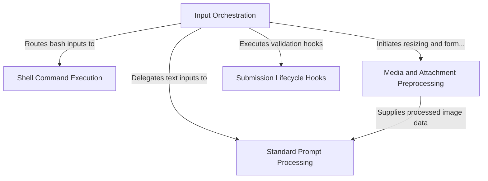

# Tutorial: processUserInput

This project serves as a robust **input processing engine** designed to interpret and route various types of user interactions. It acts as a central *switchboard*, intelligently distinguishing between standard text **prompts**, executable **shell commands**, and inputs containing **media attachments**. Additionally, it enforces a *lifecycle hook* system to validate, modify, or block requests before they are finalized and sent to the AI model.

## Chapters

1. [Input Orchestration](01_input_orchestration.md)
2. [Standard Prompt Processing](02_standard_prompt_processing.md)
3. [Media and Attachment Preprocessing](03_media_and_attachment_preprocessing.md)
4. [Shell Command Execution](04_shell_command_execution.md)
5. [Submission Lifecycle Hooks](05_submission_lifecycle_hooks.md)

---

Generated by [Code IQ](https://github.com/adityasoni99/Code-IQ)