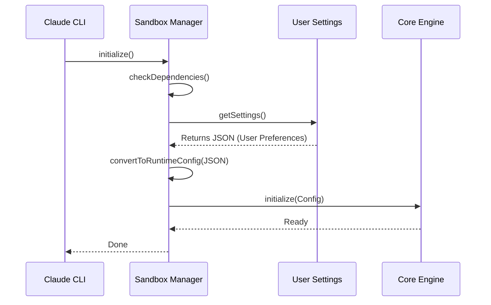

# Chapter 1: Sandbox Adapter Manager

Welcome to the **Sandbox** project! 

In this first chapter, we are going to explore the **Sandbox Adapter Manager**. If you are new to system architecture, you might be wondering: *"How does a user-friendly tool like Claude talk to a strict, complex security engine?"*

The answer lies in this chapter.

## The Motivation: The "Language Barrier"

Imagine you are a diplomat traveling to a foreign country. You speak **"High-Level Intent"** (e.g., *"I would like some water"*), but the locals speak **"Strict Technical Implementation"** (e.g., *"Provide H2O molecule stream at coordinates X,Y"*).

Without a translator, communication breaks down.

In our project:
1.  **The Claude CLI** speaks in "Settings" and "User Intent" (e.g., *"Allow network access"*).
2.  **The Runtime Engine** (the low-level security tool) speaks in "Config Objects" and strict arguments (e.g., *"--share-net --bind /tmp"*).

The **Sandbox Adapter Manager** is that translator. It wraps the complex engine and exposes a simple, friendly interface to the rest of the application.

### Central Use Case: Running a Command

Let's say Claude wants to run `npm install`.
1.  **Claude asks:** "Please run this command, but keep it safe based on the user's settings."
2.  **The Manager:** Checks if sandboxing is supported, reads the settings, converts them into security rules, and wraps the command in a protective bubble.
3.  **The Result:** The command runs, but it cannot steal files or access forbidden network ports.

## Key Concepts

The Adapter Manager handles three main jobs:

1.  **Lifecycle Management:** It handles the startup (`initialize`) and shutdown (`reset`) of the sandbox engine.
2.  **Translation:** It converts user-friendly `settings.json` into strict `SandboxRuntimeConfig`.
3.  **Command Wrapping:** It takes a raw command string and wraps it with security binaries (like `bubblewrap`).

## How to Use It

Let's look at how the rest of the application interacts with the `SandboxManager`.

### 1. Initialization

Before we can use the sandbox, we must turn it on. The Manager ensures we don't start the engine if the computer doesn't support it (e.g., missing dependencies).

```typescript
import { SandboxManager } from './sandbox-adapter';

// Attempt to start the sandbox
// This checks dependencies and platform support first
await SandboxManager.initialize();

// Check if it actually started
if (SandboxManager.isSandboxingEnabled()) {
  console.log("System is secure and ready!");
}
```

**Explanation:**
The `initialize` method is the "Power On" button. It performs safety checks—which we will cover in detail in [Environment & Dependency Checking](02_environment___dependency_checking.md)—and sets up the internal state.

### 2. Wrapping a Command

This is the most common action. We want to take a command and make it safe.

```typescript
const unsafeCommand = 'npm install react';

// Ask the manager to wrap it
// It returns a new string containing the security executable and arguments
const safeCommand = await SandboxManager.wrapWithSandbox(unsafeCommand);

// Result might look like: 
// "bwrap --ro-bind / / --dev /dev -- npm install react"
console.log(safeCommand); 
```

**Explanation:**
The `wrapWithSandbox` function transforms the command. The rest of the CLI doesn't need to know *how* `bwrap` works; it just knows it got a safe command string back.

## Under the Hood: Internal Implementation

What happens inside the `SandboxManager` when we initialize it? It acts as a coordinator between data sources and the runtime.



### The Translation Logic

One of the most critical internal functions is `convertToSandboxRuntimeConfig`. It maps the "friendly" world to the "strict" world. We will explore the deep details of this in [Configuration Translation](03_configuration_translation.md), but here is a peek at how the Manager orchestrates it:

```typescript
// Inside sandbox-adapter.ts

export function convertToSandboxRuntimeConfig(settings: SettingsJson) {
  // 1. Extract network rules
  const allowedDomains = settings.sandbox?.network?.allowedDomains || [];
  
  // 2. Define basic file permissions (e.g., allow current folder)
  const allowWrite = ['.', getClaudeTempDir()];

  // 3. Return the strict config object required by the runtime
  return {
    network: { allowedDomains },
    filesystem: { allowWrite, denyWrite: [] }
    // ... other strict props
  };
}
```

**Explanation:**
The Manager pulls data from `settings`, creates a list of allowed paths and domains, and packages them into a format the Runtime understands.

### Security Scrubbing

The Manager also acts as a "cleanup crew." Sometimes, a command inside the sandbox might leave behind dangerous files (like a fake `.git` directory to trick the system).

```typescript
// Inside sandbox-adapter.ts

function scrubBareGitRepoFiles(): void {
  // A list of files that could be dangerous if created by a malicious tool
  const dangerousFiles = bareGitRepoScrubPaths; 

  for (const p of dangerousFiles) {
    try {
      // Forcefully remove them
      rmSync(p, { recursive: true });
    } catch {
      // Ignore if file doesn't exist
    }
  }
}
```

**Explanation:**
This function runs after a command finishes. We will discuss this more in [Security Scrubbing & Mitigation](06_security_scrubbing___mitigation.md), but it's important to know that the **Manager** is responsible for triggering this cleanup.

## Conclusion

The **Sandbox Adapter Manager** is the brain of our security integration. It shields the rest of the Claude CLI from the complexities of OS-level security. It ensures that user intents ("Run this safely") are correctly translated into strict technical constraints.

However, before the Manager can do its job, it needs to ensure the computer is actually capable of running a sandbox. How does it know if `bubblewrap` is installed or if the user is on Windows or Linux?

We will find out in the next chapter.

[Next Chapter: Environment & Dependency Checking](02_environment___dependency_checking.md)

---

Generated by [Code IQ](https://github.com/adityasoni99/Code-IQ)