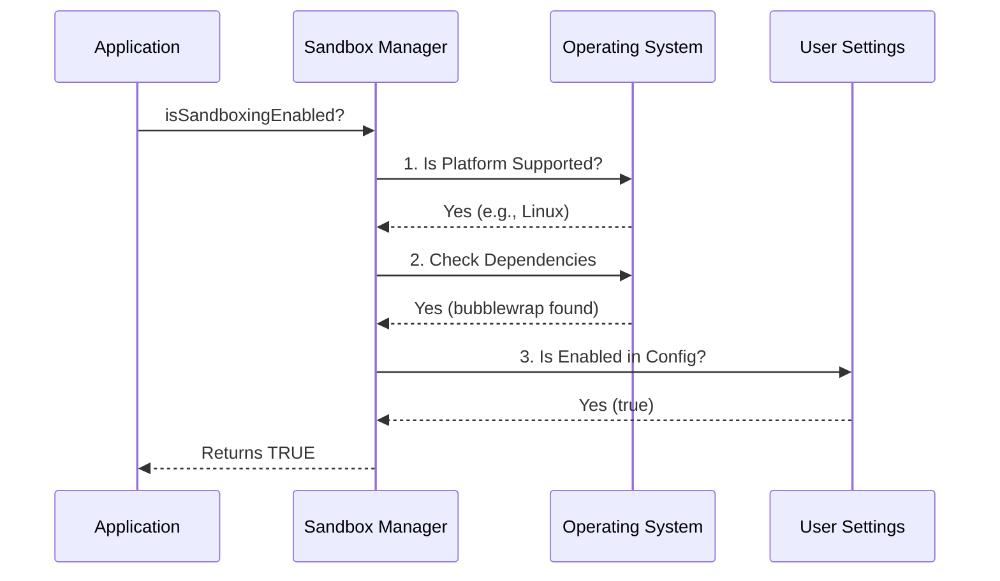

# Chapter 2: Environment & Dependency Checking

Welcome back! In [Chapter 1: Sandbox Adapter Manager](01_sandbox_adapter_manager.md), we introduced the **Sandbox Manager**, the "diplomat" that helps Claude talk to the security engine.

But before a diplomat can start negotiations, they need to check a few things: *Is the embassy open? Do we have a secure phone line?*

In this chapter, we explore **Environment & Dependency Checking**. This is the **"Pre-flight Checklist"** that runs before the sandbox ever turns on.

## The Motivation: The Pilot's Checklist

Imagine you are a pilot about to fly a plane. You don't just hop in and push the throttle to maximum. You go through a checklist:
1.  **Weather:** Is it safe to fly? (Is the Operating System supported?)
2.  **Equipment:** Is the engine working? (Are the required binaries installed?)
3.  **Clearance:** Do I have permission to fly? (Is the sandbox enabled in settings?)

If we skip these checks, the application might crash unexpectedly when it tries to run a command. We want to catch these issues early and explain them clearly to the user.

### Central Use Case: Preventing a Crash
**Scenario:** A user installs Claude on an old Windows machine without WSL (Windows Subsystem for Linux).
**Goal:** Instead of crashing with a confusing error code when Claude tries to run a command, the system should detect the incompatibility and gracefully disable the sandbox or warn the user.

## Key Concepts

To perform this safety check, the Sandbox Manager looks at three distinct layers:

1.  **Platform Support:** Not all Operating Systems are created equal. We support **macOS**, **Linux**, and **WSL2**.
2.  **Binary Dependencies:** On Linux, we rely on a tool called `bubblewrap` (bwrap) to create the secure bubble. If the user hasn't installed it, we can't protect them.
3.  **User Intent:** Even if the computer *can* run the sandbox, the user might have turned it off in their settings.

## How to Use It

The rest of the application mainly uses two methods to interact with this logic.

### 1. The Simple Check
When the application starts, it asks: *"Can we proceed with security?"*

```typescript
import { SandboxManager } from './sandbox-adapter';

// Returns true ONLY if:
// 1. OS is supported
// 2. Tools are installed
// 3. User enabled it in settings
if (SandboxManager.isSandboxingEnabled()) {
  console.log("Shields up! 🛡️");
} else {
  console.log("Running in standard mode.");
}
```

### 2. The Diagnostic Check
If the user *wanted* security but isn't getting it, we need to tell them why.

```typescript
// If enabled=true in settings, but system is broken, this returns a string.
// If everything is fine (or user set enabled=false), it returns undefined.
const reason = SandboxManager.getSandboxUnavailableReason();

if (reason) {
  // Example output: 
  // "sandbox.enabled is set but dependencies are missing: bubblewrap"
  console.error(reason); 
}
```

## Under the Hood: Internal Implementation

What happens when `isSandboxingEnabled()` is called? It runs a cascade of checks. If any step fails, the whole system reports "False".



### 1. Checking the Platform

First, we ask the Runtime Engine if the OS is valid. We use `memoize` (a caching technique) so we don't have to ask the OS every single time—the OS isn't going to change while the app is running!

```typescript
import { memoize } from 'lodash-es';
import { SandboxManager as BaseManager } from '@anthropic-ai/sandbox-runtime';

// Check if OS is macOS, Linux, or WSL2
const isSupportedPlatform = memoize((): boolean => {
  // This logic lives in the core runtime
  return BaseManager.isSupportedPlatform();
});
```
**Explanation:** This function is lightweight. It returns `true` for macOS and Linux, but carefully checks Windows to ensure it's running **WSL2** (WSL1 is too old and insecure).

### 2. Checking Dependencies

Next, we look for the tools. On Linux, `bubblewrap` is the engine that powers the sandbox.

```typescript
const checkDependencies = memoize(() => {
  // Check for 'rg' (ripgrep) and 'bwrap' (bubblewrap)
  const { rgPath, rgArgs } = ripgrepCommand();
  
  // The BaseManager runs actual shell commands like `bwrap --version`
  return BaseManager.checkDependencies({
    command: rgPath,
    args: rgArgs,
  });
});
```
**Explanation:** This returns an object containing a list of `errors` or `warnings`. If `errors` has any items (e.g., "bubblewrap not found"), the sandbox cannot start.

### 3. The "Why" Generator

This is one of the most user-friendly parts of the code. It solves the frustration of *"I turned it on, why isn't it working?"*

```typescript
function getSandboxUnavailableReason(): string | undefined {
  // If user didn't ask for it, we don't complain.
  if (!getSandboxEnabledSetting()) return undefined;

  // Check Platform
  if (!isSupportedPlatform()) {
    return `sandbox.enabled is set but ${getPlatform()} is not supported`;
  }

  // Check Dependencies
  const deps = checkDependencies();
  if (deps.errors.length > 0) {
    return `Missing tools: ${deps.errors.join(', ')}`;
  }

  return undefined; // Everything is good!
}
```
**Explanation:** This function performs the checks explicitly to generate a human-readable error message. It helps the user debug their environment (e.g., "Oh, I need to run `apt install bubblewrap`").

## Conclusion

In this chapter, we learned how the **Sandbox Manager** performs its "Pre-flight Checklist." It ensures that the computer is capable of running a secure environment before we even attempt to process a command.

Now that we know the "plane" is safe to fly, we need to figure out the flight plan. The user has given us settings (like "Allow access to google.com"), but the engine needs technical rules.

How do we convert friendly JSON settings into strict security rules?

[Next Chapter: Configuration Translation](03_configuration_translation.md)

---

Generated by [Code IQ](https://github.com/adityasoni99/Code-IQ)