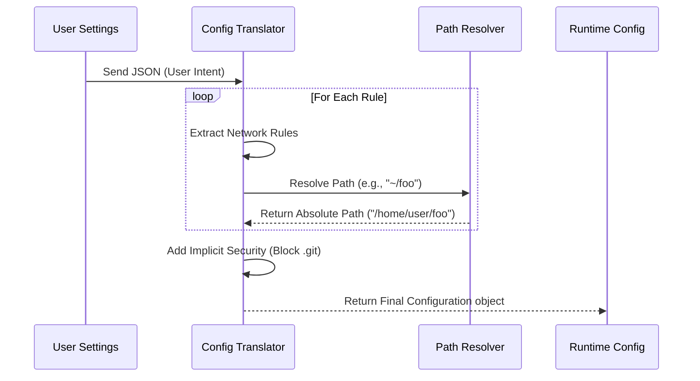

# Chapter 3: Configuration Translation

Welcome back! In [Chapter 2: Environment & Dependency Checking](02_environment___dependency_checking.md), we performed our "pre-flight checklist" to ensure the computer is capable of running a sandbox.

Now that we know the engine *can* run, we need to tell it *what* to do.

## The Motivation: The Chef's Ticket

Imagine you are at a restaurant.
1.  **The Customer (User)** says: "I'd like a burger, but I'm allergic to onions."
2.  **The Chef (Runtime Engine)** doesn't speak "conversation." The Chef needs a strict ticket: `Item: Burger`, `Ingredients: [Bun, Meat, Cheese]`, `Excluded: [Onion]`.

If you just shouted "I want a burger!" into the kitchen, the Chef wouldn't know exactly which ingredients are safe.

In our project:
*   **The User** writes friendly settings in `settings.json` (e.g., `"allowedDomains": ["google.com"]`).
*   **The Runtime Engine** requires a strict object called `SandboxRuntimeConfig`.

**Configuration Translation** is the process of writing that ticket for the Chef. It converts user preferences into strict security rules.

### Central Use Case
**Scenario:** A user wants to allow Claude to edit files in their project folder but specifically wants to **block** access to their `.env` file (which contains secrets).
**Goal:** Take the user's `settings.json` and generate a runtime configuration that explicitly lists the `.env` file in the `denyWrite` list.

## Key Concepts

The translation process handles three main categories of data:

1.  **Network Rules:** Converting a list of websites (strings) into allowed host patterns.
2.  **Filesystem Paths:** This is the hardest part. Users might type `~/project`, `./src`, or `//absolute/path`. The translator must resolve all of these into absolute paths the OS understands.
3.  **Implicit Security:** The user might forget to protect their settings file. The translator automatically adds "invisible" rules to protect critical system files (like `.git` or `settings.json`) even if the user didn't ask for it.

## How to Use It

This logic is encapsulated in a single, powerful function: `convertToSandboxRuntimeConfig`.

### Example Input (User Settings)
The user provides this JSON:
```json
{
  "sandbox": {
    "network": { "allowedDomains": ["api.github.com"] },
    "filesystem": { "denyWrite": ["./secrets.txt"] }
  }
}
```

### Example Output (Runtime Config)
The translator converts it into this strict structure:
```typescript
const runtimeConfig = convertToSandboxRuntimeConfig(userSettings);

// Result (Simplified):
// {
//   network: { allowedDomains: ["api.github.com"], deny: [] },
//   filesystem: { 
//      allowWrite: ["/current/working/dir"], 
//      denyWrite: ["/current/working/dir/secrets.txt"] 
//   }
// }
```

The Runtime Engine now has exact instructions: "Block writes to `/current/working/dir/secrets.txt`."

## Under the Hood: Internal Implementation

When the sandbox starts, it pulls settings from multiple sources (global config, project config) and merges them. Then, it runs the translation.



### Deep Dive: The `convertToSandboxRuntimeConfig` Function

This function (located in `sandbox-adapter.ts`) acts like a compiler. Let's look at how it handles specific tasks.

#### 1. Handling Network Rules
The function iterates over the user's allowed domains. It also checks for "Policy Overrides"—if an administrator has locked down the network, those rules take precedence.

```typescript
// Inside convertToSandboxRuntimeConfig
const allowedDomains: string[] = [];

// 1. Check if we are forced to use policy settings only
if (shouldAllowManagedSandboxDomainsOnly()) {
  // Only add domains defined by IT policy
  pushPolicyDomains(allowedDomains);
} else {
  // Add user's personal settings
  allowedDomains.push(...settings.sandbox.network.allowedDomains);
}
```
**Explanation:** This logic ensures that if an Enterprise Admin says "Only GitHub Allowed," the user cannot override it in their local `settings.json`.

#### 2. Path Resolution
This is where things get tricky. We have special syntax for paths in Claude Code:
*   `//path` means "Absolute path from root".
*   `/path` means "Relative to the settings file".

We use a helper called `resolvePathPatternForSandbox`:

```typescript
export function resolvePathPatternForSandbox(pattern: string, source: SettingSource) {
  // Case A: Pattern starts with '//' -> Treat as Absolute
  if (pattern.startsWith('//')) {
    return pattern.slice(1); // "//tmp" becomes "/tmp"
  }

  // Case B: Pattern starts with '/' -> Treat as Relative to Settings File
  if (pattern.startsWith('/')) {
    const root = getSettingsRootPathForSource(source);
    return resolve(root, pattern.slice(1));
  }
  
  // Case C: Standard path -> Pass through
  return pattern;
}
```
**Explanation:** This helper ensures that if a user shares a config file with a teammate, the paths (like `/src`) work correctly relative to where that file is saved, rather than breaking because the teammate has a different username.

#### 3. Implicit Security (The "Invisible Shield")
Even if the user wants to allow writing to the current directory (`.`), we must **never** allow the sandbox to overwrite its own brain (the settings file) or corrupt the Git history.

```typescript
// Always explicitly deny these, regardless of user settings
const denyWrite: string[] = [];

// 1. Protect the settings files themselves
denyWrite.push(resolve(cwd, '.claude', 'settings.json'));

// 2. Protect Git history from corruption
const bareGitRepoFiles = ['HEAD', 'objects', 'refs'];
for (const file of bareGitRepoFiles) {
   denyWrite.push(resolve(cwd, '.git', file));
}
```
**Explanation:** This code runs automatically. It creates a "Safe List" of paths that are forbidden, ensuring that a malicious or buggy command cannot delete the project's version history or change the security settings to escape the sandbox.

## Conclusion

**Configuration Translation** is the bridge between human intent and machine execution. It takes the flexible, user-friendly `settings.json` and compiles it into a rigorous, secure `SandboxRuntimeConfig`. It handles the complexity of path resolution and applies invisible security layers to protect the system.

Now that we have a configuration object with valid paths, we face a new challenge: What if the user provided a path like `~/Documents`, but the sandbox sees the file system differently?

We need to dive deeper into how the sandbox sees the world.

[Next Chapter: Path Resolution & Normalization](04_path_resolution___normalization.md)

---

Generated by [Code IQ](https://github.com/adityasoni99/Code-IQ)