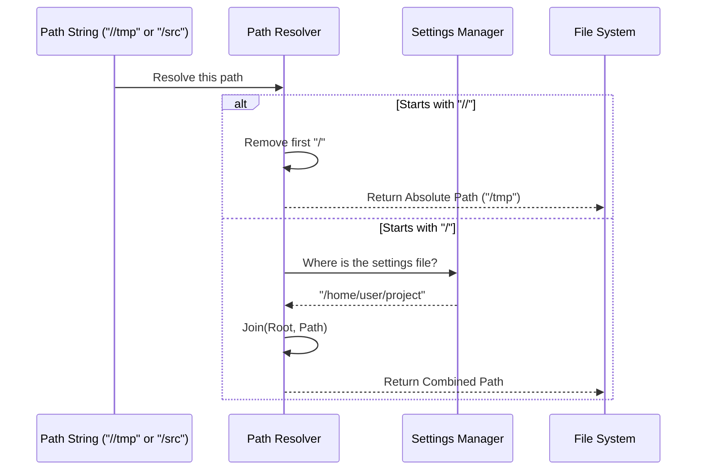

# Chapter 4: Path Resolution & Normalization

Welcome back! In [Chapter 3: Configuration Translation](03_configuration_translation.md), we learned how to turn a user's friendly `settings.json` into a strict ticket for the security engine.

However, we glazed over one very tricky detail: **File Paths**.

## The Motivation: The "It Works on My Machine" Problem

Imagine you and a friend are working on the same project.
*   **You (Alice)** are on a Mac. Your project is at `/Users/alice/my-app`.
*   **Your Friend (Bob)** is on Linux. His project is at `/home/bob/work/my-app`.

You want to share a `settings.json` file that says: *"Claude is allowed to edit the `src` folder."*

If you write the full path `/Users/alice/my-app/src`, **Bob's computer will crash** because that folder doesn't exist for him.

We need a system that acts like a smart GPS. It needs to understand:
1.  **Portable Paths:** "Look in the folder where the settings file is located."
2.  **Absolute Paths:** "Look at the actual root of the hard drive (e.g., `/tmp`)."

This chapter explains how the **Path Resolution** layer handles this.

### Central Use Case
**Scenario:** A shared project configuration file (`settings.json`) is located at `/Users/alice/project/settings.json`. Inside, it allows access to `/src`.
**Goal:** When the system reads `/src` from that file, it should automatically translate it to `/Users/alice/project/src`.

## Key Concepts

To solve this, Claude Code uses a special notation for paths inside "Permission Rules" (rules that tell tools what they can edit).

### 1. The "Settings-Relative" Path (`/`)
If a path in a rule starts with a single slash `/`, it doesn't mean "Root of the drive." It means **"Root of the Settings."**

*   **Input:** `/src`
*   **Context:** Config file is in `/home/user/project`
*   **Output:** `/home/user/project/src`

This makes configurations portable. You can move the folder, and the rules still work.

### 2. The "True Absolute" Path (`//`)
Sometimes, you actually *do* want to point to the root of the computer (e.g., for temporary files or system logs). We use a double slash `//` to indicate this.

*   **Input:** `//tmp/logs`
*   **Output:** `/tmp/logs` (The actual root directory)

### 3. The "Standard" Path (`~` or `.`)
Standard shell symbols like `~` (Home directory) or `.` (Current directory) are passed through to the OS normally.

## How to Use It

The main function involved here is `resolvePathPatternForSandbox`. It takes a "dirty" path pattern and a "source" (where the setting came from) and returns a clean, absolute path.

### Example: Resolving a Portable Path

```typescript
import { resolvePathPatternForSandbox } from './sandbox-adapter';

// 1. The path written in the config file
const rawPattern = '/backend/src';

// 2. Where the config file lives
const source = 'projectSettings'; // implies /home/me/project

// 3. Resolve it
const finalPath = resolvePathPatternForSandbox(rawPattern, source);

// Result: "/home/me/project/backend/src"
console.log(finalPath);
```

### Example: Resolving an Absolute Path

```typescript
// 1. The user wants to access the system's temporary folder
const rawPattern = '//tmp';

// 2. Resolve it
const finalPath = resolvePathPatternForSandbox(rawPattern, source);

// Result: "/tmp" (The double slash was stripped)
console.log(finalPath);
```

## Under the Hood: Internal Implementation

How does the resolver decide what to do? It looks at the very first characters of the string.



### Deep Dive: The Code

Let's look at the implementation in `sandbox-adapter.ts`. It's a simple but critical utility function.

#### 1. The Special Syntax Resolver

This handles the logic we described above.

```typescript
export function resolvePathPatternForSandbox(
  pattern: string,
  source: SettingSource,
): string {
  // Case 1: Starts with // -> Treat as Absolute Root
  if (pattern.startsWith('//')) {
    return pattern.slice(1); // "//tmp" -> "/tmp"
  }

  // Case 2: Starts with / -> Treat as Relative to Settings
  if (pattern.startsWith('/')) {
    const root = getSettingsRootPathForSource(source);
    // Combine the setting's folder with the path
    return resolve(root, pattern.slice(1));
  }

  // Case 3: Other paths (~/foo) are left alone
  return pattern;
}
```

**Explanation:**
1.  We check for `//`. If found, we `slice(1)` (cut off the first character) to turn `//bin` into `/bin`.
2.  We check for `/`. If found, we ask `getSettingsRootPathForSource` for the folder location, then use Node's `resolve` to join them.

#### 2. The Standard Filesystem Resolver

There is a *second* function called `resolveSandboxFilesystemPath`. Why do we need two?

*   **Permission Rules (Tools):** Use the logic above (Portable).
*   **System Mounts (Bind Mounts):** Usually use standard shell paths.

If an IT Admin sets up a rule saying "Allow writing to `/usr/local/bin`", they usually mean the *real* `/usr/local/bin`, not a folder inside the project.

```typescript
export function resolveSandboxFilesystemPath(
  pattern: string,
  source: SettingSource,
): string {
  // Support legacy double-slash just in case
  if (pattern.startsWith('//')) return pattern.slice(1);

  // Standard expansion:
  // Converts "~/foo" -> "/Users/alice/foo"
  // Converts "/foo"  -> "/foo" (Absolute!)
  return expandPath(pattern, getSettingsRootPathForSource(source));
}
```

**Explanation:**
This function is more "standard." It treats `/` as the root of the drive (like normal bash), but it helps by expanding `~` to the user's home directory so the sandbox engine can understand it.

## Conclusion

**Path Resolution** is the translation layer that prevents confusion between "My Project Folder" and "The Computer's Root Folder." By normalizing these paths, we ensure that:
1.  Teams can share config files without breaking paths.
2.  Admins can still target absolute system paths when necessary.

Now we have a working environment, a translated configuration, and valid file paths. The stage is set. It is finally time to take a user's command and run it safely.

[Next Chapter: Command Execution Wrapping](05_command_execution_wrapping.md)

---

Generated by [Code IQ](https://github.com/adityasoni99/Code-IQ)