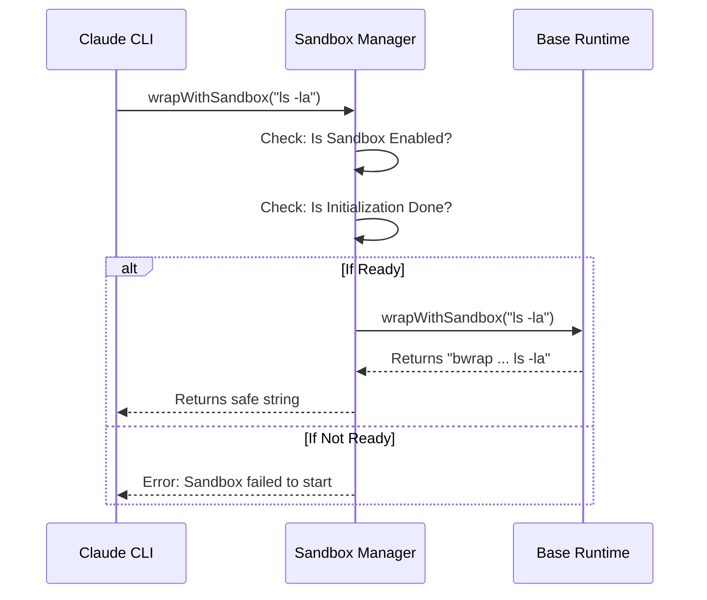

# Chapter 5: Command Execution Wrapping

Welcome back! In [Chapter 4: Path Resolution & Normalization](04_path_resolution___normalization.md), we ensured that all file paths (like `~/project`) were converted into exact locations the computer can understand.

Now we have a valid configuration and valid paths. It is time for the main event: **Running the Command.**

## The Motivation: The "Biohazard Box"

Imagine you receive a mysterious letter in the mail. It might be a friendly greeting, or it might contain a dangerous powder.
1.  **Unsafe Approach:** You rip it open at your kitchen table. If it's dangerous, your whole house is contaminated.
2.  **Safe Approach:** You place the letter inside a sealed glass **Biohazard Safety Box** with built-in rubber gloves. You open it inside the box. If it explodes, the mess stays inside the box.

In our system:
*   **The Letter** is the command (e.g., `npm install unknown-package`).
*   **The Safety Box** is the **Sandbox Wrapper** (e.g., `bubblewrap` on Linux).

**Command Execution Wrapping** is the process of taking the raw command and stuffing it inside that safety box before the computer executes it.

### Central Use Case
**Scenario:** Claude wants to run `python script.py`.
**Goal:** We don't want `script.py` to be able to read your SSH keys or delete your photos.
**Solution:** We transform the command into something like:
`bwrap --bind /project /project --ro-bind /usr /usr -- python script.py`

This ensures the script literally *cannot see* your photos folder.

## Key Concepts

To understand wrapping, we need to understand three components:

1.  **The Raw Command:** This is the string the user (or Claude) wants to run. It has no idea it is about to be jailed.
2.  **The Wrapper Binary:** This is the OS-level tool we use to create the jail. On Linux, we often use `bwrap` (Bubblewrap). On other platforms, we might use different isolation tools.
3.  **The Arguments (The Walls):** These are the long list of flags (like `--bind` or `--ro-bind`) that define exactly how thick the glass walls of the box are and what "holes" (permissions) exist.

## How to Use It

The rest of the application doesn't need to know how to build a complex `bubblewrap` command. It just asks the **Sandbox Manager** to "wrap this."

### 1. Wrapping a Command

We use the function `wrapWithSandbox`.

```typescript
// 1. The dangerous command
const rawCommand = 'node dangerous-script.js';

// 2. Ask the manager to wrap it
// This returns a NEW string
const safeCommand = await SandboxManager.wrapWithSandbox(rawCommand);

// 3. The result is a long, complex command string
// e.g. "/usr/bin/bwrap ... node dangerous-script.js"
console.log(safeCommand);
```

**Explanation:**
The `safeCommand` string is now ready to be executed by the system's shell. When it runs, the OS starts the wrapper first, which sets up the walls, and *then* runs the node script inside.

## Under the Hood: Internal Implementation

What happens inside `wrapWithSandbox`? It acts as a gatekeeper. It ensures the sandbox is actually turned on and fully loaded before allowing a command to pass through.



### Deep Dive: The Code

Let's look at the implementation in `sandbox-adapter.ts`.

#### 1. The Gatekeeper Logic

The function first checks if we are supposed to be sandboxing at all.

```typescript
async function wrapWithSandbox(
  command: string, 
  binShell?: string,
  customConfig?: Partial<SandboxRuntimeConfig>
): Promise<string> {
  
  // 1. If sandboxing is on, we MUST wait for it to be ready
  if (isSandboxingEnabled()) {
    if (initializationPromise) {
      await initializationPromise; // Wait for "Power On" to finish
    } else {
      throw new Error('Sandbox failed to initialize.');
    }
  }

  // ... (step 2 below)
}
```

**Explanation:**
We check `initializationPromise`. In [Chapter 1](01_sandbox_adapter_manager.md), we saw that `initialize()` starts an asynchronous process. Here, we ensure that process is 100% complete so we don't try to use the sandbox before the lock on the door is set.

#### 2. The Delegation

Once we know we are ready, we hand off the work to the core library.

```typescript
  // ... (continued from above)

  // 2. Let the low-level runtime do the hard work
  return BaseSandboxManager.wrapWithSandbox(
    command,
    binShell,
    customConfig
  );
}
```

**Explanation:**
The `BaseSandboxManager` (from the `@anthropic-ai/sandbox-runtime` package) is the one that actually knows the syntax for `bubblewrap` or other isolation tools. It takes the configuration we built in [Chapter 3](03_configuration_translation.md) and converts it into command-line flags.

### Why separate the Adapter from the Base Manager?

You might wonder why we don't just call the Base Manager directly.

The **Adapter** (this project) handles **Application State**:
1.  It knows if the user enabled the sandbox in `settings.json`.
2.  It handles waiting for async initialization.
3.  It handles "Excluded Commands" (commands users specifically asked *not* to sandbox).

The **Base Manager** only handles **Technical Implementation** (generating the string).

## Conclusion

**Command Execution Wrapping** is the final step in the preparation phase. We took a raw, potentially unsafe command and wrapped it in a protective shell based on the user's configuration.

Now, the CLI can execute this string, and the Operating System will enforce our rules.

However, even with a perfect sandbox, smart malware tries to leave things behind. For example, what if a command creates a file that looks innocent but tricks `git` into doing something dangerous later?

We need a cleanup crew.

[Next Chapter: Security Scrubbing & Mitigation](06_security_scrubbing___mitigation.md)

---

Generated by [Code IQ](https://github.com/adityasoni99/Code-IQ)