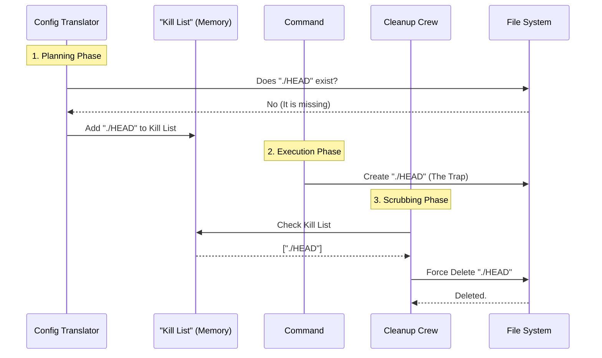

# Chapter 6: Security Scrubbing & Mitigation

Welcome back! In [Chapter 5: Command Execution Wrapping](05_command_execution_wrapping.md), we learned how to wrap a command in a "Biohazard Box" so it couldn't touch your personal files while it was running.

But what happens when the command is finished?

## The Motivation: The "Trojan Horse"

Imagine a demolition crew (the command) finishes working in your house. They didn't break anything while they were there because you were watching them. However, just before they left, they unlocked your back window and left it open.

They didn't steal anything *yet*. But next time *you* walk past that window, a thief could climb in.

In the world of sandboxing, this is a common attack vector:
1.  **The Attack:** A malicious script runs inside the sandbox. It can't steal your secrets immediately.
2.  **The Trap:** Instead of stealing, it creates a file that looks innocent, like a fake `.git` folder.
3.  **The Trigger:** Later, when **you** (the user) run a normal `git` command outside the sandbox, your Git tool sees that fake folder, gets confused, and accidentally executes malicious code hidden inside it.

**Security Scrubbing** is the cleanup crew that sweeps the room immediately after the command finishes. If it finds any "unlocked windows" (traps), it destroys them before you have a chance to stumble into them.

### Central Use Case
**Scenario:** A sandboxed script creates a folder named `.git` and puts a file named `HEAD` inside it.
**Goal:** As soon as the script finishes, the Sandbox Manager must detect that this `HEAD` file shouldn't be there and delete it immediately.

## Key Concepts

### 1. The "Bare Git Repo" Attack
Git is complex. If a folder contains specific files (like `HEAD`, `objects`, and `refs`), Git thinks, "Oh, this is a repository!" even if there is no `.git` folder. Attackers use this to trick your computer. The specific cleaner we use is called `scrubBareGitRepoFiles`.

### 2. The "Pre-computation" List
We don't scan the entire hard drive after every command (that would be too slow). Instead, *before* the command runs, we make a list of "Forbidden Files."
*   "If the file `HEAD` doesn't exist right now, add it to the **Kill List**."
*   "If `HEAD` appears during the command, we know it's new, so we delete it."

### 3. The Cleanup Hook
We need a trigger to run the cleaning logic. This is done via `cleanupAfterCommand`, which runs automatically every time the sandbox shuts down a process.

## How to Use It

This process is entirely automated. The rest of the application simply calls one method when it's done running a tool.

```typescript
// Inside the main application loop
import { SandboxManager } from './sandbox-adapter';

try {
  // Run the potentially dangerous command
  await executeCommand('npm install suspicious-package');
} finally {
  // ALWAYS run the cleanup, even if the command crashed
  SandboxManager.cleanupAfterCommand();
}
```

**Explanation:**
The `finally` block ensures that the cleanup crew runs no matter what. If the malicious script crashed your terminal, we still scrub the files to ensure safety.

## Under the Hood: Internal Implementation

The cleanup process is actually split into two parts: **Planning** (before the command) and **Execution** (after the command).



### Deep Dive: The Code

Let's look at how this is implemented in `sandbox-adapter.ts`.

#### 1. The Planning Phase
This happens inside `convertToSandboxRuntimeConfig` (which we discussed in Chapter 3). We check if these dangerous files already exist.

```typescript
// Define the files that make up a "Bare Git Repo"
const bareGitRepoFiles = ['HEAD', 'objects', 'refs', 'hooks', 'config'];
// A global list to remember what to delete later
const bareGitRepoScrubPaths: string[] = [];

for (const gitFile of bareGitRepoFiles) {
  const p = resolve(cwd, gitFile); // e.g., /project/HEAD
  try {
    statSync(p); // Check if it exists
    // If it exists, we make it Read-Only (handled elsewhere)
  } catch {
    // If it DOES NOT exist, we mark it for potential cleanup
    bareGitRepoScrubPaths.push(p);
  }
}
```

**Explanation:**
We use `statSync` to "look" at the file system. If the `try` block fails (executes the `catch`), it means the file is missing. If it's missing now, but appears later, it's an intruder. We add it to `bareGitRepoScrubPaths`.

#### 2. The Execution Phase
This runs inside `cleanupAfterCommand`.

```typescript
function scrubBareGitRepoFiles(): void {
  // Loop through the Kill List we made earlier
  for (const p of bareGitRepoScrubPaths) {
    try {
      // Forcefully remove the file/folder
      rmSync(p, { recursive: true });
      
      // Log it for debugging
      logForDebugging(`[Sandbox] scrubbed planted bare-repo file: ${p}`);
    } catch {
      // If the file still doesn't exist, that's good! Do nothing.
    }
  }
}
```

**Explanation:**
This function is ruthless. It iterates through the list of "forbidden new files." If the malicious command created them, `rmSync` deletes them instantly. If the command *didn't* create them, `rmSync` fails silently (inside the `catch`), and we move on.

#### 3. Tying it together in the Manager
The public `SandboxManager` object combines the standard cleanup with our custom Git scrubbing.

```typescript
export const SandboxManager: ISandboxManager = {
  // ... other methods ...

  cleanupAfterCommand: (): void => {
    // 1. Run standard cleanup (temp files, network sockets)
    BaseSandboxManager.cleanupAfterCommand();
    
    // 2. Run our custom anti-trap logic
    scrubBareGitRepoFiles();
  },
}
```

**Explanation:**
This ensures that when the application calls `cleanupAfterCommand`, both the generic cleanup (from the core library) and our specific "Bare Git Repo" protection run together.

## Conclusion

**Security Scrubbing** is the final layer of defense. While the **Sandbox Wrapper** prevents the command from accessing *existing* sensitive files, the **Scrubber** prevents the command from creating *new* dangerous files that could hurt you later.

By identifying potential traps (like fake Git metadata) before the command runs, and sweeping for them after it finishes, we ensure the workspace remains safe for the user.

We have now covered the entire security lifecycle:
1.  Checking the environment.
2.  Translating settings.
3.  Resolving paths.
4.  Wrapping execution.
5.  Cleaning up.

However, all of this happens silently in the background. How do we explain to the user what is happening without overwhelming them with technical logs?

[Next Chapter: UI Presentation Utilities](07_ui_presentation_utilities.md)

---

Generated by [Code IQ](https://github.com/adityasoni99/Code-IQ)