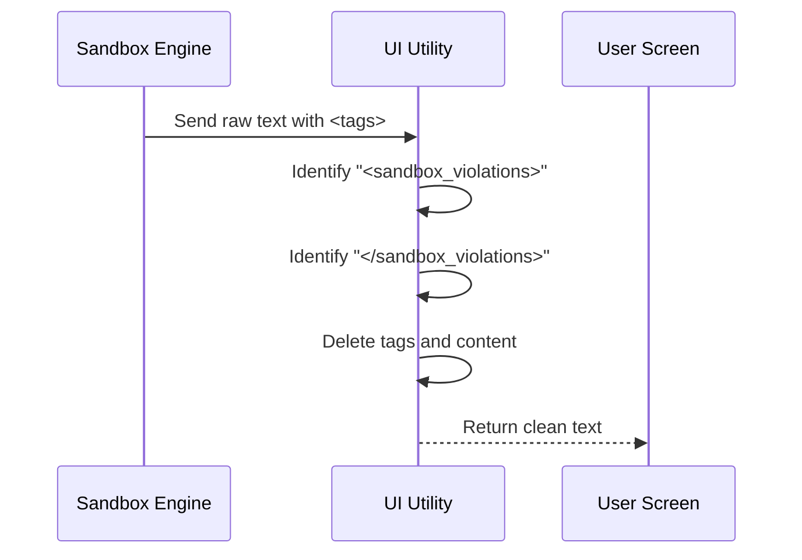

# Chapter 7: UI Presentation Utilities

Welcome to the final chapter of our tutorial series!

In the previous chapter, [Chapter 6: Security Scrubbing & Mitigation](06_security_scrubbing___mitigation.md), we acted as a "Cleanup Crew," sweeping the filesystem for dangerous files left behind by sandboxed commands.

Now that our system is secure, stable, and clean, we have one last problem to solve: **Communication.**

## The Motivation: The "Robot Speak" Problem

The **Sandbox Runtime** is a strict, technical engine. When it blocks a command or catches a violation, it logs the event using machine-readable formats, often wrapping important details in XML tags.

Imagine you are using Claude and you see this error message:

> **Error:** `<sandbox_violations>Network access to 'malware.com' was blocked.</sandbox_violations>`

While this is accurate, those XML tags (`<...>`) look scary and technical to a non-programmer. They look like a bug in the software.

**UI Presentation Utilities** acts as a **Copy Editor**. It takes the raw, messy notes from the system and polishes them into clean, human-readable text before they appear on the screen.

### Central Use Case
**Scenario:** The sandbox blocks a command and generates an error log containing internal XML tags.
**Goal:** We want to display the error message to the user, but we want to strip out the ugly tags so it looks like a normal sentence.

## Key Concepts

This utility layer is very lightweight. It focuses on one main concept: **String Sanitization**.

### The "Red Pen"
Think of this utility as a teacher with a red pen. It reads through the text generated by the sandbox. It doesn't change the *meaning* of the text, but it crosses out (deletes) the internal markup that the user doesn't need to see.

## How to Use It

The main function we use is `removeSandboxViolationTags`.

### Example: Cleaning an Error Message

Let's say the sandbox engine returns a raw string containing violation details.

```typescript
import { removeSandboxViolationTags } from './sandbox-ui-utils';

// 1. The raw input from the engine
const rawMessage = "Error: <sandbox_violations>File access denied</sandbox_violations>";

// 2. Pass it through the cleaner
const cleanMessage = removeSandboxViolationTags(rawMessage);

// 3. The result is human-friendly
// Output: "Error: "
console.log(cleanMessage);
```

*Note: In the current implementation, this specific function removes the tags **and** the content inside them, assuming that the violation details are handled elsewhere or summarized differently. It is a strict cleaner.*

## Under the Hood: Internal Implementation

What happens when we call this function? It uses a text-processing pattern called **Regular Expressions (Regex)** to find and remove specific patterns.



### Deep Dive: The Code

The implementation is located in `sandbox-ui-utils.ts`. It is short, sweet, and efficient.

```typescript
/**
 * Remove <sandbox_violations> tags from text
 */
export function removeSandboxViolationTags(text: string): string {
  // Use Regex to find the opening tag, the content, and the closing tag
  // Replace it with an empty string ('')
  return text.replace(/<sandbox_violations>[\s\S]*?<\/sandbox_violations>/g, '');
}
```

**Explanation:**
1.  **`/.../g`**: This tells the code to look globally (find *all* occurrences, not just the first one).
2.  **`<sandbox_violations>`**: We look for the exact start tag.
3.  **`[\s\S]*?`**: This is fancy Regex syntax for "Match absolutely any character, including newlines, until you hit the next part."
4.  **`''`**: We replace everything we found with an empty string. Effectively, we delete it.

## Conclusion & Series Wrap-Up

In this final chapter, we learned how **UI Presentation Utilities** polish the rough edges of the system, ensuring that technical logs don't clutter the user interface.

### Project Summary

Congratulations! You have navigated the entire architecture of the **Sandbox Project**. Let's recap our journey:

1.  **[Sandbox Adapter Manager](01_sandbox_adapter_manager.md):** We met the "Diplomat" that initializes the system.
2.  **[Environment Checking](02_environment___dependency_checking.md):** We ran the "Pre-flight Checklist" to ensure the OS was ready.
3.  **[Configuration Translation](03_configuration_translation.md):** We converted user settings into a strict "Ticket" for the engine.
4.  **[Path Resolution](04_path_resolution___normalization.md):** We ensured file paths worked on any computer.
5.  **[Command Wrapping](05_command_execution_wrapping.md):** We placed dangerous commands inside a "Biohazard Box."
6.  **[Security Scrubbing](06_security_scrubbing___mitigation.md):** We cleaned up traps (like fake Git files) left behind.
7.  **UI Utilities:** We polished the output for the human user.

You now understand how a complex security system can be built from modular, single-purpose components. Each part handles one specific job, from the deep kernel-level isolation up to the text displayed on your screen.

Thank you for reading the **Sandbox** tutorial series!

---

Generated by [Code IQ](https://github.com/adityasoni99/Code-IQ)