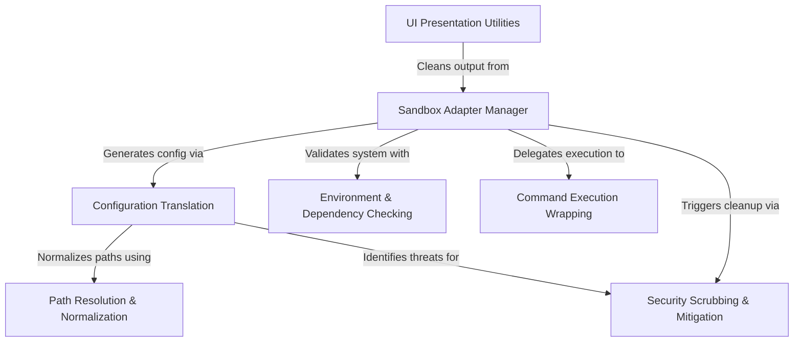

# Tutorial: sandbox

This project acts as a **security guard** for the Claude CLI, ensuring that generated commands run inside a safe, isolated container (the *sandbox*). It translates user-friendly settings into strict execution rules, checks if the computer has the necessary **tools and environment** to run safely, and cleans up any dangerous files left behind after a task is finished.

## Chapters

1. [Sandbox Adapter Manager](01_sandbox_adapter_manager.md)
2. [Environment & Dependency Checking](02_environment___dependency_checking.md)
3. [Configuration Translation](03_configuration_translation.md)
4. [Path Resolution & Normalization](04_path_resolution___normalization.md)
5. [Command Execution Wrapping](05_command_execution_wrapping.md)
6. [Security Scrubbing & Mitigation](06_security_scrubbing___mitigation.md)
7. [UI Presentation Utilities](07_ui_presentation_utilities.md)

---

Generated by [Code IQ](https://github.com/adityasoni99/Code-IQ)