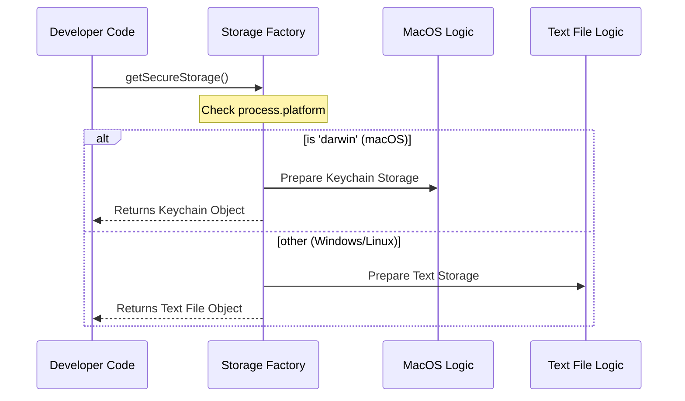

# Chapter 1: Platform-Based Storage Factory

Welcome to the **secureStorage** project! 

In this first chapter, we are going to explore the smart logic that acts as the entry point for our entire system. Before we worry about *how* to write data to a file or a system vault, we first need to decide *where* that data should go.

## Motivation: The "Travel Agent" Problem

Imagine you are planning a trip. 
- If you are going to a local park, walking or biking is best.
- If you are going overseas, you need a plane.

You don't want to worry about the mechanics of the plane engine or the bicycle gears; you just want a **Travel Agent** to tell you: "Here is the best mode of transport for your destination."

In software, saving sensitive data (like API keys) faces a similar problem:
- On **macOS**, there is a built-in, highly secure system called the **Keychain**.
- On **Linux** or **Windows**, we might not have immediate access to a standard keychain without extra libraries, so we might default to a **Text File**.

We don't want our application code to look like this every time we save a file:

```typescript
// We DON'T want this mess everywhere!
if (isMac) {
  saveToKeychain(data);
} else {
  saveToTextFile(data);
}
```

Instead, we use a **Platform-Based Storage Factory**. It acts as our Travel Agent. It checks the operating system once and gives us the correct storage tool.

## Use Case: Getting the Right Storage

Our goal is to write code that simply asks for "storage" without caring if it's running on a MacBook or a Windows server.

### How to use it

Here is how a developer uses this abstraction. Notice how simple it is—the developer doesn't need to know anything about operating systems.

```typescript
import { getSecureStorage } from './index.js';

// 1. Ask the factory for the correct storage
const myStorage = getSecureStorage();

// 2. Use it!
myStorage.update({ apiKey: 'secret_123' });
console.log("Data saved safely!");
```

**What happens here:**
1.  We call `getSecureStorage()`.
2.  The function secretly checks the computer's OS.
3.  It returns an object that has an `.update()` method.
4.  We save our data.

## Internal Implementation: Under the Hood

How does the Factory make this decision? Let's visualize the flow.

When you call the factory, it looks at `process.platform` (a Node.js variable that tells us the OS name).



### The Code Breakdown

The logic lives in `index.ts`. Let's break it down into tiny pieces.

#### 1. The Decision Maker

This is the core function. It checks the platform string. In the Node.js world, `'darwin'` is the code name for macOS.

```typescript
// File: index.ts
export function getSecureStorage(): SecureStorage {
  // Check if we are running on macOS
  if (process.platform === 'darwin') {
    // Return the specific macOS solution
    return createFallbackStorage(macOsKeychainStorage, plainTextStorage)
  }

  // ... logic for other platforms continues below ...
}
```

> **Note:** If it is macOS, we don't just return the Keychain. We wrap it in a "Fallback" layer. This ensures that if the Keychain fails, we have a backup plan. We will learn more about this in [Resilient Fallback Layer](03_resilient_fallback_layer.md).

#### 2. The Default Option

If we are not on macOS, we currently fall back to a simple text file storage mechanism.

```typescript
// File: index.ts (continued)

  // TODO: add libsecret support for Linux later

  // Default behavior for Windows/Linux
  return plainTextStorage
}
```

### A Quick Look at the Options

The factory chooses between two "workers." We won't go deep into their code yet, but it's helpful to know who they are.

**Option A: Plain Text Storage**
This is the simple worker. It writes JSON directly to a file on your disk. It works everywhere but isn't as secure.

```typescript
// File: plainTextStorage.ts
export const plainTextStorage = {
  name: 'plaintext',
  read(): SecureStorageData | null {
    // logic to read from a .json file
    // ...
  },
  // ...
}
```

**Option B: macOS Keychain Storage**
This is the sophisticated worker. It uses the `security` command line tool on Mac to lock data in the system vault.

```typescript
// File: macOsKeychainStorage.ts
export const macOsKeychainStorage = {
  name: 'keychain',
  read(): SecureStorageData | null {
    // logic to run "security find-generic-password"
    // ...
  },
  // ...
}
```

## Summary

In this chapter, we built the front door of our application: the **Platform-Based Storage Factory**.

1.  We identified that different operating systems need different storage strategies.
2.  We created a **Factory function** (`getSecureStorage`) that acts as a "Travel Agent."
3.  On macOS, it selects a complex, secure method (Keychain).
4.  On other platforms, it selects a compatible method (Plain Text).
5.  The rest of our app never has to worry about `process.platform` checks again.

Now that we have our storage object selected, how do we actually tell it to do things from the user's perspective?

[Next Chapter: CLI Command Interaction](02_cli_command_interaction.md)

---

Generated by [Code IQ](https://github.com/adityasoni99/Code-IQ)