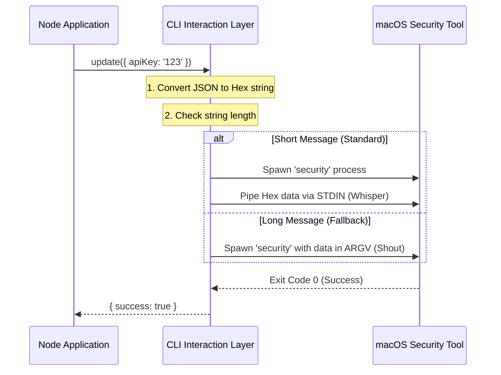

# Chapter 2: CLI Command Interaction

In the previous chapter, [Platform-Based Storage Factory](01_platform_based_storage_factory.md), we built a "Travel Agent" that decides where our data should go. If we are on a Mac, the agent chooses the **Keychain**.

But here is the problem: Node.js (JavaScript) doesn't inherently know how to talk to the macOS Keychain. They speak different languages.

## Motivation: The "Translator" Problem

Imagine you need to deliver a secret message to a vault inside a bank.
- You (the JavaScript code) are standing in the lobby.
- The Vault Manager (the macOS Operating System) is behind bulletproof glass.
- You cannot just walk in and put the file there. You have to fill out a specific slip of paper, strictly formatted, and slide it through a slot.

If you write the slip in the wrong ink, or fold it the wrong way, the Vault Manager rejects it immediately.

This abstraction acts as our **Translator**. It handles the messy work of:
1.  Formatting our data so the OS accepts it.
2.  Actually sliding the data through the "slot" (running a system command).
3.  Reading the result back and translating it into a JavaScript object.

## Use Case: Talking to the OS

We want to save a simple object, like an API key.

```typescript
const data = { apiKey: 'super_secret_123' };
```

To the macOS Keychain, this object means nothing. The Keychain expects a command line instruction like this:

```bash
security add-generic-password -a "myUser" -s "myService" -w "super_secret_123"
```

Our goal for this chapter is to build the code that turns that JSON object into that Terminal command automatically.

## Key Concepts

Before we look at the code, we need to understand three tricks we use to make this work safely.

### 1. Hex Encoding (The "Safe Packaging")
Command lines hate special characters. If your password has a quote `"` or a space ` `, the command line might get confused and think the command has ended.

To solve this, we convert our data into **Hexadecimal** (numbers and letters A-F) before sending it.
- **Raw:** `{ "key": "value" }`
- **Hex:** `7b20226b6579223a202276616c756522207d`

Now it is just a safe block of text. The `security` tool has a special flag (`-X`) to read Hex data.

### 2. Standard Input (The "Whisper")
When we run a command, we usually type arguments: `command --password=secret`.
However, anyone looking at the "Task Manager" (or Activity Monitor) on the computer can see these arguments! That is a security risk.

Instead, we prefer to use **Standard Input (stdin)**. This is like "piping" the data into the command. It's like whispering the password so people standing nearby (process monitors) can't hear it.

### 3. Buffer Limits (The "Shout" Fallback)
Sometimes, the "whisper" pipe is too narrow. If we have a huge JSON file, the operating system might cut off the message halfway through.

If the data is too big for the pipe, we are forced to fall back to passing it as an argument (Argument Vector or `argv`). It's less private, but it ensures the data actually gets saved.

## Internal Implementation: Under the Hood

Let's visualize how our driver talks to the OS.



### The Code Breakdown

The logic lives in `macOsKeychainStorage.ts`. Let's look at the critical parts.

#### 1. Preparing the Payload
First, we turn our data into a hex string so the command line doesn't crash on special characters.

```typescript
// Inside macOsKeychainStorage.ts

const jsonString = JSON.stringify(data)

// Convert to hexadecimal to avoid escaping issues
// Example: "abc" -> "616263"
const hexValue = Buffer.from(jsonString, 'utf-8').toString('hex')
```

#### 2. The Interaction Logic (Smart Switching)
This is the smartest part of the driver. It checks the size of the command. If it fits in the buffer (approx 4096 bytes), we do it the secure way.

```typescript
// We define a safety limit for the buffer
const SECURITY_STDIN_LINE_LIMIT = 4096 - 64

let result
// Check if the command fits in the pipe
if (command.length <= SECURITY_STDIN_LINE_LIMIT) {
  // Option A: SECURE. Pipe data via stdin (-i flag)
  result = execaSync('security', ['-i'], {
    input: command, // Data goes here
    stdio: ['pipe', 'pipe', 'pipe'],
  })
} else {
  // Option B: FALLBACK. Pass data as arguments
  // Used only when data is very large
  result = execaSync('security', [ ..., '-X', hexValue ], {
    stdio: ['ignore', 'pipe', 'pipe'],
  })
}
```

> **Why is this important?** If we tried to pipe 5MB of data into a 4KB pipe, the command would crash or, worse, only save the first half of your file!

#### 3. Reading Data Back
When we want to read, we ask the `security` tool to find our data. We ask for the password (`-w`) and tell it we want the raw secret.

```typescript
// Reading from the Keychain
try {
  const result = execSync(
    `security find-generic-password -a "${user}" -w -s "${service}"`
  )
  
  if (result) {
    // Parse the result back into an object
    return JSON.parse(result.toString())
  }
} catch (e) {
  // If the item isn't found, it throws an error.
  // We catch it and return null (empty).
  return null
}
```

#### 4. Checking for Locks
Sometimes, even if the code is perfect, it fails because the computer is locked (like when you are using SSH). We have a helper to check this.

```typescript
export function isMacOsKeychainLocked(): boolean {
  try {
    const result = execaSync('security', ['show-keychain-info'])
    // Exit code 36 specifically means "Keychain is locked"
    return result.exitCode === 36
  } catch {
    return false
  }
}
```

## Summary

In this chapter, we built the "Driver" that allows our application to talk to the macOS operating system.

1.  We learned that the OS requires **Command Line** instructions, not JavaScript objects.
2.  We used **Hex Encoding** to prevent special characters from breaking commands.
3.  We implemented a smart switch: use **Stdin** (whisper) for security, but switch to **Argv** (shout) for large files to prevent crashes.

However, interacting with the OS is risky. What if the `security` command fails? What if the user updated their OS and the command changed? What if the file is corrupted?

We need a system that can survive a crash.

[Next Chapter: Resilient Fallback Layer](03_resilient_fallback_layer.md)

---

Generated by [Code IQ](https://github.com/adityasoni99/Code-IQ)