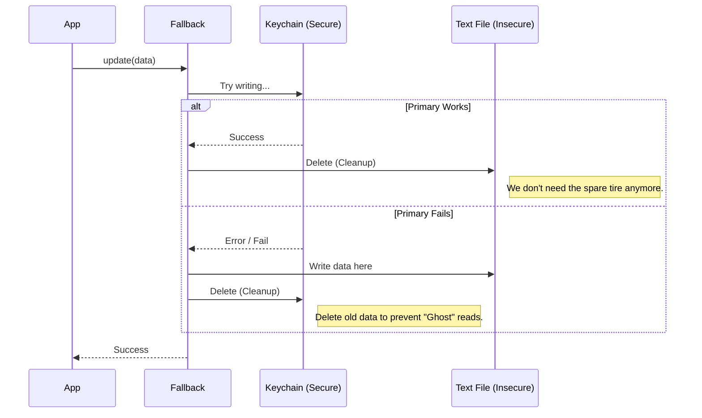

# Chapter 3: Resilient Fallback Layer

In the previous chapter, [CLI Command Interaction](02_cli_command_interaction.md), we learned how to translate JavaScript objects into command-line instructions for the macOS Keychain.

But here is a scary question: **What if the Keychain fails?**

Keychains can be corrupted, files can be locked, or the user might be accessing the computer remotely (SSH) where the Keychain isn't available. If our storage fails, the user gets logged out or the app crashes. We need a backup plan.

## Motivation: The "Spare Tire" Strategy

Imagine you are driving a car. The macOS Keychain is your set of high-performance tires. They are secure and fast.
However, sometimes you get a "flat tire" (the system throws an error).

You don't want the car to stop moving just because of a flat tire. You want a **Spare Tire**.
- The spare tire isn't as good (it's just a text file, not a vault).
- But it allows the car (the application) to keep driving.

This chapter introduces the **Resilient Fallback Layer**. It wraps our secure storage and our insecure storage into one smart package.

## Use Case: Surviving a Crash

Let's say our application tries to save a user's session token.

**Scenario:** The user is logged in via SSH. The macOS Keychain is locked and refuses to save the password.

**Without Fallback:**
```
Error: Security command failed.
App crashes. User loses data.
```

**With Fallback:**
1. App tries to write to Keychain -> **Fails**.
2. App automatically catches the error.
3. App writes to a local text file -> **Success**.
4. User stays logged in. They don't even know something went wrong.

## Key Concept: Preventing "Ghost" Data

There is one tricky logic puzzle we must solve here. We call it **Shadowing**.

Imagine this rule: *"Always check the Fridge (Primary) for milk. If the Fridge is empty, check the Counter (Secondary)."*

1.  **Monday:** You put milk in the Fridge. (Fridge: Yes, Counter: No).
2.  **Tuesday:** The Fridge door gets jammed. You buy fresh milk, but you can't put it in the Fridge. You put it on the Counter.
3.  **Wednesday:** You want milk. You follow the rule: *"Check the Fridge."*
    *   You open the Fridge (it unjammed, or you peeked in).
    *   You find the **OLD, SOUR** milk from Monday.
    *   You drink it and get sick. You ignored the fresh milk on the counter.

**The Fix:** If the Fridge jams and you are forced to use the Counter, you must **throw away the milk in the Fridge**. This ensures that next time you look, the Fridge is empty, and you are forced to look at the Counter.

## Internal Implementation: Under the Hood

Let's visualize how the Fallback Layer handles a write request.



### The Code Breakdown

The logic lives in `fallbackStorage.ts`. It takes two storage engines as arguments.

#### 1. The Wrapper
We create a new storage object that contains the other two.

```typescript
export function createFallbackStorage(
  primary: SecureStorage,   // The Keychain
  secondary: SecureStorage, // The Text File
): SecureStorage {
  return {
    name: `${primary.name}-with-${secondary.name}-fallback`,
    // ... methods go here
  }
}
```

#### 2. The Smart Read
Reading is simple. We prefer the Primary. If it returns something real, we use it. If not, we check the Secondary.

```typescript
read(): SecureStorageData {
  const result = primary.read()
  
  // If primary has data, use it!
  if (result !== null && result !== undefined) {
    return result
  }
  
  // Otherwise, check the backup
  return secondary.read() || {}
},
```

#### 3. The Smart Update (Happy Path)
When we write data, we first try the Primary. If it works, we clean up the Secondary so we don't have duplicate data lying around.

```typescript
update(data: SecureStorageData) {
  // Check what we had before (important for later logic)
  const primaryDataBefore = primary.read()

  // Try to save to the main vault
  const result = primary.update(data)

  if (result.success) {
    // If successful, delete the backup file.
    // We want a single source of truth.
    if (primaryDataBefore === null) {
      secondary.delete()
    }
    return result
  }
  // ... continued below ...
```

#### 4. The Smart Update (Fallback Path)
If the Primary failed, we save to Secondary. But remember the "Sour Milk" analogy? We must delete the Primary data if it exists, so we don't accidentally read old data later.

```typescript
  // ... continued from above ...

  // Primary failed! Try the backup.
  const fallbackResult = secondary.update(data)

  if (fallbackResult.success) {
    // CRITICAL: If primary has old data, delete it!
    // Otherwise, read() will find the old data in primary
    // and ignore our new data in secondary.
    if (primaryDataBefore !== null) {
      primary.delete()
    }
    
    return { success: true, warning: fallbackResult.warning }
  }

  return { success: false }
}
```

> **Why is this `primary.delete()` so important?**
> If we update a token because the old one expired, and the Keychain write fails, the Keychain still holds the *expired* token. Our `read()` logic prioritizes the Keychain. Without this delete, the app would forever read the expired token and fail to log in, ignoring the fresh token in the text file.

## Summary

In this chapter, we built the **Resilient Fallback Layer**.

1.  We learned that systems fail, and we need a **Backup Plan** (Secondary storage).
2.  We implemented a **Wrapper** that automatically switches storage methods if one fails.
3.  We solved the **Shadowing Problem** (Ghost Data) by ensuring we never leave stale data in the primary storage if we switch to the secondary.

Now our storage is smart (Chapter 1), speaks the OS language (Chapter 2), and is resilient to crashes (Chapter 3).

However, constantly asking the OS for the Keychain status is slow. It requires spawning a process every single time we need a value. How can we make this faster?

[Next Chapter: Keychain State Caching](04_keychain_state_caching.md)

---

Generated by [Code IQ](https://github.com/adityasoni99/Code-IQ)