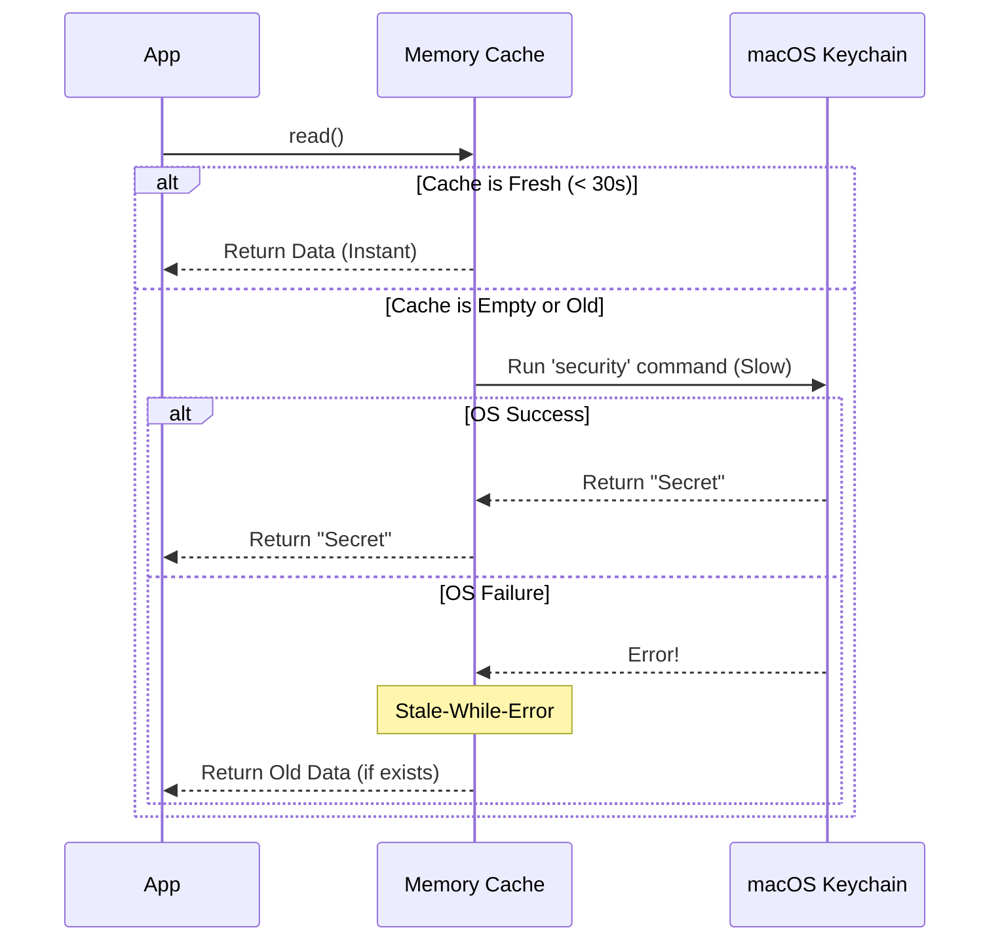

# Chapter 4: Keychain State Caching

In the previous chapter, [Resilient Fallback Layer](03_resilient_fallback_layer.md), we ensured our application never crashes, even if the system vault fails.

However, we have introduced a new problem: **Performance**.

Every time we ask the macOS Keychain for a password, we have to spawn a "subprocess" (a separate mini-program). This takes time—sometimes up to 500 milliseconds (half a second). If our app asks for the API key 10 times during startup (for logging, billing, syncing, etc.), the user stares at a frozen screen for 5 seconds.

## Motivation: The "Librarian" Problem

Imagine you are doing research in a library.
- **The Book** is your API Key.
- **The Archives** (basement) is the macOS Keychain.
- **The Librarian** is our code.

Every time you ask: "What is the API key?", the Librarian walks all the way down to the basement, unlocks the vault, finds the paper, reads it, locks the vault, and walks back up.

If you ask her 5 times in one minute, she spends all her time walking up and down stairs. She becomes slow and tired.

**The Solution: A Desk Copy (Caching)**
The first time you ask, she goes to the basement. When she returns, she writes the answer on a sticky note and puts it on her desk.
For the next 30 seconds, if you ask again, she just reads the sticky note. It's instant.

This is **Keychain State Caching**.

## Use Case: The Startup Storm

When a complex application starts, many different components wake up at the same time:
1.  The User Profile component asks for the token.
2.  The Analytics component asks for the token.
3.  The API Client asks for the token.

**Without Caching:**
```
Request 1 -> Spawn Process (500ms)
Request 2 -> Spawn Process (500ms)
Request 3 -> Spawn Process (500ms)
Total Delay: 1.5 seconds
```

**With Caching:**
```
Request 1 -> Spawn Process (500ms) -> Save to Memory
Request 2 -> Read Memory (0ms)
Request 3 -> Read Memory (0ms)
Total Delay: 0.5 seconds
```

## Key Concepts

To build this, we need three specific rules.

### 1. Time To Live (TTL)
Data on the "sticky note" shouldn't last forever. If the user changes their password outside our app, our note is wrong. We set a **TTL (Time To Live)** of 30 seconds. After 30 seconds, the Librarian *must* go back to the basement to check for changes.

### 2. Cache Invalidation
If *we* are the ones changing the password (writing new data), we know the sticky note is instantly wrong. We must rip it up (clear the cache) immediately before writing the new value.

### 3. Stale-While-Error
This is a safety feature.
1.  The sticky note is 31 seconds old (expired).
2.  The Librarian goes to the basement, but the door is jammed (Error!).
3.  Instead of saying "I don't know," she says: *"I can't check the vault right now, but 31 seconds ago the password was 'secret123'. Here is that old value."*

It is better to give slightly old data than to crash.

## Internal Implementation: Under the Hood

Let's visualize the decision process.



### The Code Breakdown

The caching logic is split between `macOsKeychainHelpers.ts` (where the memory lives) and `macOsKeychainStorage.ts` (where the logic lives).

#### 1. The Short-Term Memory
We need a place to store the data and the time we fetched it. This lives in global memory.

```typescript
// File: macOsKeychainHelpers.ts

export const KEYCHAIN_CACHE_TTL_MS = 30_000 // 30 seconds

export const keychainCacheState = {
  // The sticky note on the desk
  cache: { 
    data: null,      // The password
    cachedAt: 0      // Timestamp (0 means empty)
  },
  generation: 0      // Helps track updates
}
```

#### 2. Reading with Cache Checks
When we read, we first check the timestamp. If it is recent, we skip the hard work.

```typescript
// File: macOsKeychainStorage.ts

read(): SecureStorageData | null {
  const prev = keychainCacheState.cache

  // 1. Check if the "sticky note" is fresh
  if (Date.now() - prev.cachedAt < KEYCHAIN_CACHE_TTL_MS) {
    return prev.data
  }

  // If not fresh, we must continue to ask the OS...
```

#### 3. Handling the "Miss" (Asking the OS)
If the cache was old, we run the command. If it works, we update the timestamp.

```typescript
  // ... continued inside read()

  try {
    // Run the expensive 'security' command (See Chapter 2)
    const result = execSyncWithDefaults_DEPRECATED(...)
    
    if (result) {
      const data = jsonParse(result)
      // Update the cache with new data + current time
      keychainCacheState.cache = { data, cachedAt: Date.now() }
      return data
    }
  } catch (e) {
    // Oh no, the OS command failed!
  }
```

#### 4. Stale-While-Error
If the `try/catch` block caught an error (e.g., system busy), we check if we have *old* data.

```typescript
  // ... inside the catch block or after failure

  // If we have old data, return it instead of failing!
  if (prev.data !== null) {
    console.warn('Read failed; serving stale cache')
    
    // Reset the timer so we don't spam the OS immediately
    keychainCacheState.cache = { data: prev.data, cachedAt: Date.now() }
    return prev.data
  }
  
  return null
}
```

#### 5. Invalidation (Writing)
When we write data, we must clear the cache. We don't update the cache with the new data immediately; we just clear it to be safe.

```typescript
update(data: SecureStorageData) {
  // CRITICAL: Throw away the old sticky note!
  // If we don't, the next read() will return the old password.
  clearKeychainCache()

  try {
    // ... run the 'security add-generic-password' command ...
    // ... logic from Chapter 2 ...
    
    // Only if the OS write succeeds do we update the cache
    keychainCacheState.cache = { data, cachedAt: Date.now() }
    return { success: true }
  } catch (e) {
    return { success: false }
  }
}
```

## Summary

In this chapter, we optimized our storage system using **Keychain State Caching**.

1.  We identified that system calls are **slow** and block the application.
2.  We implemented a **30-second memory buffer** to serve repeated requests instantly.
3.  We added **Invalidation** logic to ensure we don't serve old data after a write.
4.  We added **Stale-While-Error** protection to keep the app alive even if the OS blips.

We have now built a storage system that is Smart (Factory), Capable (CLI), Resilient (Fallback), and Fast (Caching).

But... there is still one moment where the app is slow: **The very first millisecond of startup**. The cache is empty when the app launches, so the first read is always slow. Can we fix that?

[Next Chapter: Parallel Startup Prefetching](05_parallel_startup_prefetching.md)

---

Generated by [Code IQ](https://github.com/adityasoni99/Code-IQ)