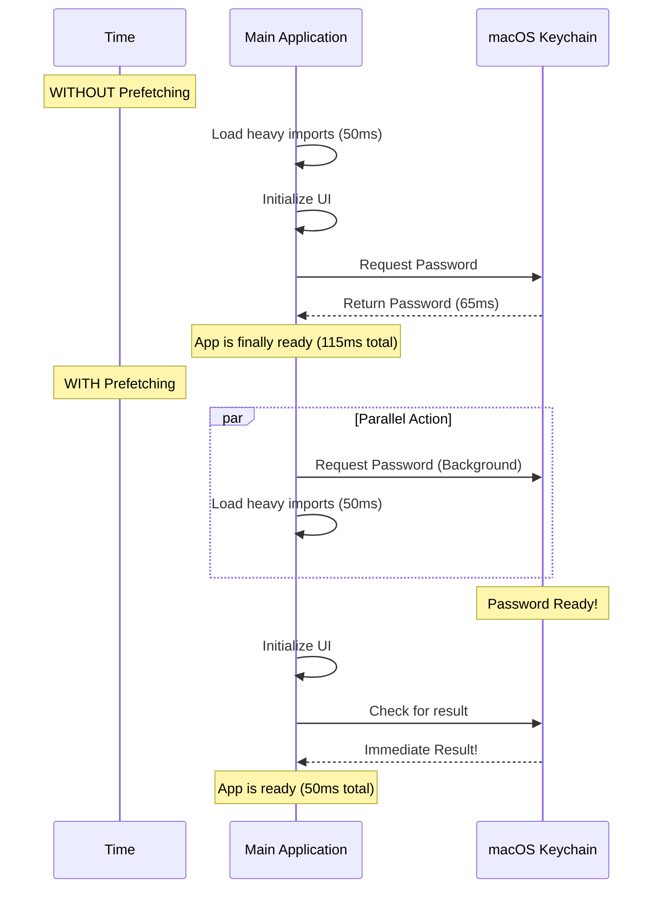

# Chapter 5: Parallel Startup Prefetching

Welcome to the final chapter of our **secureStorage** tutorial!

In the previous chapter, [Keychain State Caching](04_keychain_state_caching.md), we sped up our application by remembering the password after we fetched it once. This made the application very fast *after* the first request.

However, we still have one problem: **The First Read.**

When your application first launches, the cache is empty. It *must* go to the "basement" (the macOS Keychain) to fetch the credentials. As we learned, this takes about **65 milliseconds**. That might sound fast, but in the world of application startup, every millisecond counts.

## Motivation: Pre-ordering Your Coffee

Imagine you are going to a coffee shop before work.

**Method A: The Normal Way (Synchronous)**
1.  You walk to the shop (10 minutes).
2.  You arrive, wait in line, and order.
3.  The barista makes the coffee (5 minutes).
4.  You get your coffee and start working.
*Total wait after arrival: 5 minutes.*

**Method B: The Prefetch Way (Parallel)**
1.  **Before** you leave your house, you open the mobile app and click "Order."
2.  You walk to the shop (10 minutes). *While you are walking, the barista is making the coffee.*
3.  You arrive. The coffee is already on the counter.
4.  You grab it and start working immediately.
*Total wait after arrival: 0 minutes.*

**Parallel Startup Prefetching** is Method B.
Instead of waiting for the application to fully load before asking for the password, we send the "Order" (the Keychain request) the very instant the user clicks the app icon. By the time the app finishes loading its heavy files (walking to the shop), the password (coffee) is ready.

## Use Case: Hiding the Latency

Node.js applications have to "import" many files at startup. This takes time (CPU work). While the CPU is busy reading files, the "Network" or "System Command" lane is completely empty.

We want to utilize that empty lane.

**Goal:** Start the `security` command immediately, so it runs in the background while the main application logic (`main.tsx`) is being imported.

## Internal Implementation: Under the Hood

Let's visualize the timeline comparison.



We effectively save roughly 65ms of startup time by overlapping the work.

## Key Concepts & Implementation

To make this work, we have to be very careful about *dependencies*.

If our "Pre-order" script imports heavy libraries (like the ones we use for the main app), it defeats the purpose! It would take too long to start the script. We must use lightweight, native tools.

### 1. The Native Trigger
We use the native Node.js `child_process` module directly. We do not use the `execa` library we used in Chapter 2, because loading `execa` takes time.

```typescript
// File: keychainPrefetch.ts
import { execFile } from 'child_process'
import { getUsername } from './macOsKeychainHelpers.js'

// We define a promise so we can track the background task
let prefetchPromise: Promise<void> | null = null
```

### 2. Starting the Race
We create a function that fires the command but **does not wait** for it to finish immediately. It just starts the process and stores the "receipt" (the Promise).

```typescript
export function startKeychainPrefetch(): void {
  // Only run on Mac
  if (process.platform !== 'darwin') return

  // Fire the command!
  // We don't use 'await' here because we want the app 
  // to keep loading while this runs.
  const mySpawn = spawnSecurity('Claude Code-credentials')
  
  // Save the promise so we can check it later
  prefetchPromise = Promise.all([mySpawn]).then((result) => {
     // Save result to cache (Concept 3)
     primeKeychainCacheFromPrefetch(result[0].stdout)
  })
}
```

### 3. The Low-Level Spawn
This helper wraps the native `execFile` command. It's the rawest way to talk to the OS.

```typescript
function spawnSecurity(serviceName: string): Promise<any> {
  return new Promise(resolve => {
    execFile(
      'security', 
      ['find-generic-password', '-a', getUsername(), '-w', '-s', serviceName],
      { encoding: 'utf-8', timeout: 10000 },
      (err, stdout) => {
        // Resolve with the data (or null if failed)
        resolve({ stdout: stdout?.trim() || null })
      }
    )
  })
}
```

### 4. Priming the Cache
Remember `keychainCacheState` from [Chapter 4](04_keychain_state_caching.md)?
When our background process finishes, we inject the data directly into that memory cache.

```typescript
// File: macOsKeychainHelpers.ts

export function primeKeychainCacheFromPrefetch(stdout: string | null): void {
  // If the main app already fetched data, don't overwrite it.
  if (keychainCacheState.cache.cachedAt !== 0) return

  // Parse the raw string from the CLI into JSON
  const data = JSON.parse(stdout)

  // Put it in the "sticky note" memory spot
  keychainCacheState.cache = { 
    data, 
    cachedAt: Date.now() 
  }
}
```

### 5. The Rendezvous Point
Finally, in our main application file (`main.tsx`), we need a checkpoint. Just before the app tries to use the credentials, it ensures the prefetch has finished.

Usually, the prefetch finishes *way before* this line of code is reached. But if the computer is slow, we `await` here to be safe.

```typescript
// File: main.tsx

// 1. Start the prefetch at the very top of the file
startKeychainPrefetch()

// ... lots of heavy imports happen here ...

async function main() {
  // 2. Before we start, make sure the background task is done
  await ensureKeychainPrefetchCompleted()
  
  // 3. Now the cache is primed! This read is instant.
  const storage = getSecureStorage()
  const data = storage.read() 
}
```

## Summary

In this final chapter, we implemented **Parallel Startup Prefetching**.

1.  We identified that waiting for dependencies to load creates "dead time" for the network/OS.
2.  We used `child_process.execFile` (a lightweight tool) to fire the keychain request immediately at startup.
3.  We allowed the heavy application imports to run **in parallel** with the keychain lookup.
4.  We injected the result into the Global Cache we built in Chapter 4, so when the app is finally ready, the data is already waiting.

### Project Conclusion

Congratulations! You have built a production-grade secure storage system. Let's review what you've accomplished:

1.  **[Platform-Based Storage Factory](01_platform_based_storage_factory.md):** Your code automatically detects the OS and chooses the right tool.
2.  **[CLI Command Interaction](02_cli_command_interaction.md):** You learned to speak the language of the macOS Kernel (`security` CLI) using Hex encoding and pipes.
3.  **[Resilient Fallback Layer](03_resilient_fallback_layer.md):** You ensured the app never crashes by failing over to text files, while preventing "Ghost Data."
4.  **[Keychain State Caching](04_keychain_state_caching.md):** You optimized performance by keeping a short-term memory of the secrets.
5.  **Parallel Startup Prefetching (This Chapter):** You eliminated startup latency by doing two things at once.

You now have a storage engine that is **Secure**, **Resilient**, and **Incredibly Fast**.

---

Generated by [Code IQ](https://github.com/adityasoni99/Code-IQ)