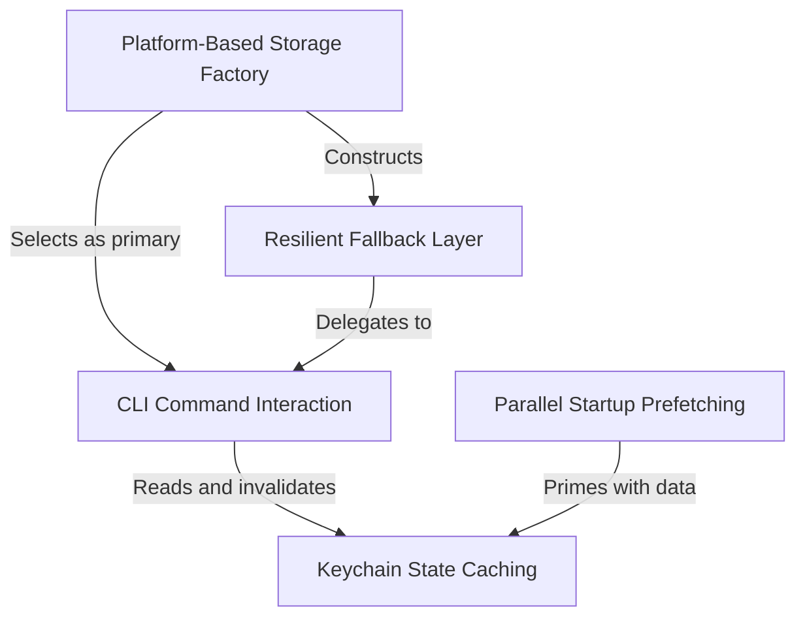

# Tutorial: secureStorage

This project provides a robust mechanism for **securely storing** sensitive credentials like API keys and OAuth tokens. It automatically determines the best storage method based on the operating system, prioritizing the **system keychain** on macOS while providing a *resilient fallback* to text files if errors occur. To optimize performance, it utilizes **parallel prefetching** to retrieve data during startup and maintains an **in-memory cache** to minimize slow system interactions.

## Chapters

1. [Platform-Based Storage Factory](01_platform_based_storage_factory.md)
2. [CLI Command Interaction](02_cli_command_interaction.md)
3. [Resilient Fallback Layer](03_resilient_fallback_layer.md)
4. [Keychain State Caching](04_keychain_state_caching.md)
5. [Parallel Startup Prefetching](05_parallel_startup_prefetching.md)

---

Generated by [Code IQ](https://github.com/adityasoni99/Code-IQ)