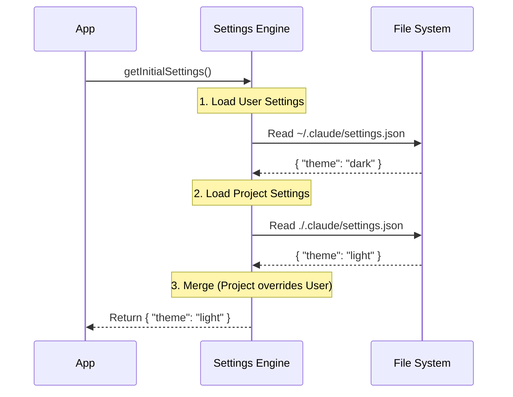

# Chapter 1: Settings Cascade & Resolution

Welcome to the `settings` project! If you've ever wondered how an application decides which configuration to use when there are multiple conflicting options (like user preferences vs. company rules), you are in the right place.

## The Motivation: "Who Wins?"

Imagine this scenario:
1.  **You (The User)** prefer `dark mode` for all your projects.
2.  **Your Team (The Project)** decides this specific repository must use `spaces` instead of tabs.
3.  **Your Company (The Policy)** mandates that `telemetry` must be enabled for security compliance.

When the application starts, it reads all these different files. But which one "wins" if they conflict?

The **Settings Cascade** is the engine that answers this question. It loads settings from a hierarchy of sources and merges them into a final, single configuration object.

### The Analogy: Transparent Sheets

Think of the Settings Cascade like a stack of transparent sheets placed on top of each other.

*   **Bottom Sheet (User Settings):** Your personal defaults.
*   **Middle Sheet (Project Settings):** Overrides the user defaults for this specific folder.
*   **Top Sheet (Policy Settings):** The "Boss." Anything written here blocks out everything underneath it.

When you look down from the top, the combined image you see is the **Resolved Configuration**.

## Key Concepts: The Hierarchy

In this project, settings are loaded in a specific order of priority (from lowest to highest). Later sources override earlier ones.

1.  **User Settings (`userSettings`):** Global defaults stored in your home directory (`~/.claude/settings.json`).
2.  **Project Settings (`projectSettings`):** Shared settings committed to the repo (`.claude/settings.json`).
3.  **Local Settings (`localSettings`):** Private project overrides that are ignored by Git (`.claude/settings.local.json`).
4.  **Flag Settings (`flagSettings`):** Temporary overrides passed via command line (e.g., `--settings ...`).
5.  **Policy Settings (`policySettings`):** Enterprise managed settings (IT overrides).

## How to Use the Cascade

As a developer using this module, you generally just want the final result. You don't want to manually load five different files.

### Reading the Final Configuration

The main entry point is `getInitialSettings()`. This function does all the heavy lifting: finding files, parsing them, and merging them.

```typescript
import { getInitialSettings } from './settings'

// This returns the final, merged object
const config = getInitialSettings()

console.log(config.theme) // Result of the merge
```

### Merging Logic Example

Let's look at how the data merges. Note how arrays are combined and values are overwritten.

**Input 1 (User Settings - Bottom):**
```json
{
  "theme": "dark",
  "ignoredFiles": ["*.log"]
}
```

**Input 2 (Project Settings - Middle):**
```json
{
  "theme": "light", 
  "ignoredFiles": ["node_modules"]
}
```

**Output (Resolved Settings):**
```json
{
  "theme": "light", // Project overwrote User
  "ignoredFiles": ["*.log", "node_modules"] // Arrays are combined!
}
```

## Internal Implementation: How It Works

Under the hood, the engine loops through the defined sources in `constants.ts` and merges them one by one.

### The Flow



### Code Deep Dive

The core logic resides in `settings.ts`. Let's look at the `loadSettingsFromDisk` function (simplified).

#### 1. Defining the Sources
First, we need to know the order. This is defined in `constants.ts`.

```typescript
// constants.ts
export const SETTING_SOURCES = [
  'userSettings',    // Lowest priority
  'projectSettings',
  'localSettings',
  'flagSettings',
  'policySettings',  // Highest priority
] as const
```
*Note: The array order matters! Later items in the array will overwrite earlier items.*

#### 2. The Merging Loop
In `settings.ts`, we loop through these sources and apply a "deep merge".

```typescript
// settings.ts (Simplified)
function loadSettingsFromDisk() {
  let mergedSettings = {} 

  // Loop through sources in priority order
  for (const source of getEnabledSettingSources()) {
    
    // 1. Get the file path for this source
    const filePath = getSettingsFilePathForSource(source)
    
    // 2. Parse the file (if it exists)
    const { settings } = parseSettingsFile(filePath)

    if (settings) {
      // 3. Merge onto the pile
      mergedSettings = mergeWith(
        mergedSettings, 
        settings, 
        settingsMergeCustomizer
      )
    }
  }
  return { settings: mergedSettings }
}
```

#### 3. The Special Merge Customizer
We don't just replace values; we need special handling for arrays (like lists of permissions or ignored files). We want to **combine** lists, not replace them.

```typescript
// settings.ts
export function settingsMergeCustomizer(objValue: unknown, srcValue: unknown) {
  // If both the existing value and the new value are arrays...
  if (Array.isArray(objValue) && Array.isArray(srcValue)) {
    // ...combine them into one list!
    return mergeArrays(objValue, srcValue)
  }
  // Otherwise, use default behavior (overwrite)
  return undefined
}
```

## Conclusion

You now understand the "Cascading" part of Settings. We load configurations from the bottom up (User → Project → Policy), combining them into a single usable object. This allows flexibility for developers while maintaining control for enterprises.

 However, just because we merged JSON files successfully doesn't mean the data is valid! What if a user types `"theme": 123` instead of `"dark"`?

In the next chapter, we will learn how to enforce rules on this data.
[Schema Definition & Data Integrity](02_schema_definition___data_integrity.md)

---

Generated by [Code IQ](https://github.com/adityasoni99/Code-IQ)