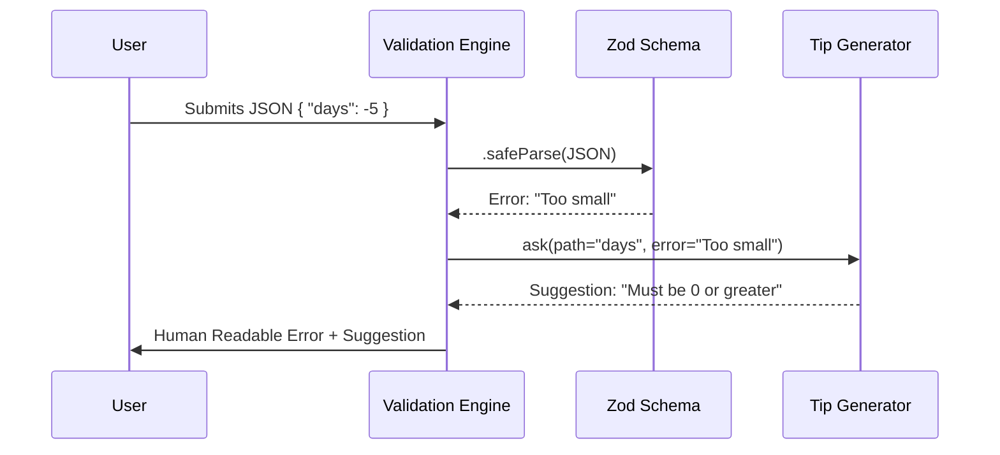

# Chapter 2: Schema Definition & Data Integrity

In the previous chapter, [Settings Cascade & Resolution](01_settings_cascade___resolution.md), we learned how the application gathers settings from multiple files and merges them into one.

But here is the catch: **Merging is blind.**

If a user writes `"timeout": "five minutes"` (a string) but the application expects `"timeout": 300` (a number), the merge will succeed, but the application will crash when it tries to do math on the text "five minutes".

## The Motivation: The "Border Patrol"

We need a rigid system to check data **after** it is merged but **before** the application uses it.

Think of **Schema Definition** as the Border Patrol or a Nightclub Bouncer.
1.  **The Rules:** There is a strict list of allowed inputs (IDs, tickets, passports).
2.  **The Check:** Every single setting is inspected.
3.  **The Rejection:** If something is wrong, it doesn't just say "No." It says, "Your passport is expired," or "Sneakers are not allowed."

In this project, we use a library called **Zod** to define these rules.

## Key Concept: The Schema

A **Schema** is a blueprint that describes exactly what the data should look like.

### 1. Defining the Blueprint
We define the "shape" of our settings in `src/settings/types.ts`. We use Zod (`z`) to create these rules.

Here is a simplified example of what a rule looks like:

```typescript
// types.ts (Simplified)
export const SettingsSchema = z.object({
  // Rule: Must be a number, cannot be negative
  cleanupPeriodDays: z.number().nonnegative().optional(),
  
  // Rule: Must be exactly "bash" or "powershell"
  defaultShell: z.enum(['bash', 'powershell']).optional(),
})
```

### 2. The Check (Validation)
When the application loads, it passes the merged JSON object through this schema.

*   **Happy Path:** The data matches the rules. The app starts.
*   **Sad Path:** The data breaks a rule. Zod creates an "Issue" report.

## How to Use: Reading Errors

As a developer or user, you will mostly interact with this system when you make a mistake. The system is designed to give you **Actionable Advice**, not just cryptic error codes.

### Example Scenario
Imagine you are editing your configuration and you make a typo:

```json
{
  "cleanupPeriodDays": -5
}
```

The schema says `.nonnegative()`. Zod catches this.

**What the System Outputs:**
```text
Settings validation failed:
- cleanupPeriodDays: Number must be greater than or equal to 0
```

### Example: Helpful Tips
The system goes a step further. If you make a common mistake, it offers a suggestion.

**Input:**
```json
{
  "env": { "DEBUG": true } // Error: Environment variables must be strings!
}
```

**Output:**
```text
- env.DEBUG: Expected string, received boolean. 
  Tip: Environment variables must be strings. Wrap numbers and booleans in quotes. 
  Example: "DEBUG": "true"
```

## Internal Implementation: How It Works

How do we turn raw validation errors into friendly tips? Let's walk through the process.

### The Flow



### Code Deep Dive

The logic is split into three main parts: Defining the rules, Running the check, and Polishing the errors.

#### 1. The Schema (`types.ts`)
This file is the "Law Book." It contains the Zod definitions.

```typescript
// types.ts
export const SettingsSchema = lazySchema(() =>
  z.object({
    // Defines 'env' as a dictionary where both key and value are strings
    env: EnvironmentVariablesSchema().optional(),
    
    // Defines 'cleanupPeriodDays' as a positive integer
    cleanupPeriodDays: z.number().nonnegative().int().optional(),
  }).passthrough()
)
```
*Note: `.passthrough()` means "if you see extra keys I don't know about, just ignore them, don't crash."*

#### 2. The Validator (`validation.ts`)
This is the engine that runs the check. It uses `safeParse` so the app doesn't crash on invalid data.

```typescript
// validation.ts
export function validateSettingsFileContent(content: string) {
  const jsonData = jsonParse(content)
  
  // Run the data against the blueprint
  const result = SettingsSchema().strict().safeParse(jsonData)

  if (result.success) {
    return { isValid: true }
  }

  // If failed, make errors readable
  const errors = formatZodError(result.error, 'settings')
  return { isValid: false, error: errors }
}
```

#### 3. The Tip Generator (`validationTips.ts`)
This is the "Friendly Support Agent." It looks at the ugly technical error and tries to match it to a helpful hint.

It uses a list of `TIP_MATCHERS` to find specific context.

```typescript
// validationTips.ts
const TIP_MATCHERS = [
  {
    // If the error is in 'env' and the type is wrong...
    matches: (ctx) => 
      ctx.path.startsWith('env.') && ctx.code === 'invalid_type',
      
    // ...suggest wrapping the value in quotes!
    tip: {
      suggestion: 'Environment variables must be strings. Wrap numbers in quotes.',
    },
  },
  // ... more rules
]
```

## Conclusion

We have ensured that our configuration data structure is correct. The "Border Patrol" stops numbers from entering fields meant for strings and ensures required formats are respected.

However, some rules are too complex for a simple structure check. For example, allowing a tool to run **only** if it matches a specific complex command string like `Bash(npm run test)`. For that, we need a specialized parser.

In the next chapter, we will look at how we validate these complex permission strings.

[Permission Rule Syntax Validation](03_permission_rule_syntax_validation.md)

---

Generated by [Code IQ](https://github.com/adityasoni99/Code-IQ)