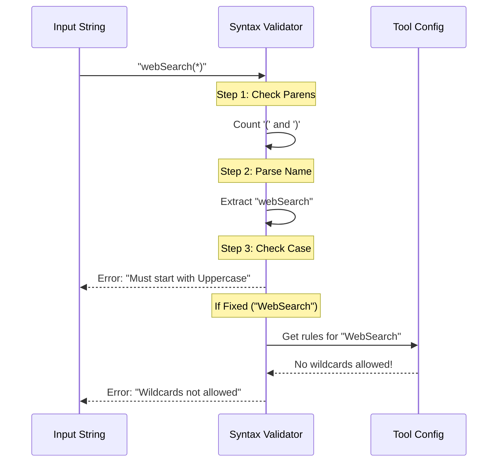

# Chapter 3: Permission Rule Syntax Validation

In the previous chapter, [Schema Definition & Data Integrity](02_schema_definition___data_integrity.md), we built a "Border Patrol" that ensures our settings file is valid JSON. We made sure arrays are arrays and numbers are numbers.

But we have a remaining problem. Look at this configuration:

```json
{
  "permissions": [
    "Bash(npm run test", 
    "read(src/**)"
  ]
}
```

According to our JSON Schema, this is **valid**. It is an array of strings. 
However, logically, it is **broken**:
1.  `Bash(npm run test` is missing a closing parenthesis `)`.
2.  `read` is lowercase, but our system requires capitalized tool names (`Read`).

If we let this pass, the application will crash later when it tries to parse these strings. We need a way to validate the **grammar** inside the strings.

## The Motivation: The "Grammar Teacher"

While the Schema Validator checks the **container** (the JSON structure), the Syntax Validator checks the **content** (the text inside).

Think of it like mailing a letter:
1.  **Schema (Chapter 2):** Checks if you used a valid envelope and put a stamp on it.
2.  **Syntax (Chapter 3):** Opens the letter and checks if you wrote legible sentences.

We need to catch typos, missing parentheses, and invalid commands *before* the security engine tries to use them.

## Key Concepts

To validate a permission string, we look at three specific things:

### 1. Structure Balance
Every rule follows the format `ToolName(Content)`.
*   **Bad:** `Bash(ls` (Unbalanced)
*   **Good:** `Bash(ls)`

### 2. Tool Naming Convention
All internal tools in this project must start with a Capital Letter.
*   **Bad:** `bash(*)`, `webSearch(foo)`
*   **Good:** `Bash(*)`, `WebSearch(foo)`

### 3. Tool-Specific Logic
Different tools accept different types of "Content".
*   **File Tools** (like `Read`) accept glob patterns: `src/*.ts`.
*   **Command Tools** (like `Bash`) accept wildcards: `npm *`.
*   **Search Tools** (like `WebSearch`) might forbid wildcards entirely.

## How to Use: The User Experience

This system runs automatically. As a user or developer, you simply define your rules. If you make a typo, the system provides specific feedback.

### Example 1: The "Unbalanced" Error

**Input:**
```json
"permissions": ["Bash(npm test"]
```

**Output:**
```text
Error: Mismatched parentheses. 
Suggestion: Ensure all opening parentheses have matching closing parentheses.
```

### Example 2: The "Wrong Tool Type" Error

**Input:**
```json
"permissions": ["WebSearch(cat videos *)"]
```

**Output:**
```text
Error: WebSearch does not support wildcards.
Suggestion: Use exact search terms without * or ?.
```

## Internal Implementation: How It Works

This logic lives in `src/settings/permissions/permissionValidation.ts`. It doesn't use a library like Zod; it is custom logic because the rules are so specific.

### The Flow



### Code Deep Dive

Let's look at how we implement this. We handle validation in layers, failing fast if the basic structure is wrong.

#### 1. Defining the Rules (`toolValidationConfig.ts`)
First, we classify our tools. Some act like file systems, some like terminals.

```typescript
// toolValidationConfig.ts
export const TOOL_VALIDATION_CONFIG = {
  // Tools that understand paths like src/**/*.ts
  filePatternTools: ['Read', 'Write', 'Edit'],

  // Tools that understand command wildcards
  bashPrefixTools: ['Bash'],

  // Special custom rules
  customValidation: {
    WebSearch: (content) => {
      if (content.includes('*')) {
        return { valid: false, error: 'No wildcards allowed' }
      }
      return { valid: true }
    }
  }
}
```

#### 2. The Main Validator (`permissionValidation.ts`)
The function `validatePermissionRule` runs the checks in order.

**Check A: Parentheses**
We simply count the tokens. If they don't match, we stop immediately.

```typescript
// permissionValidation.ts
export function validatePermissionRule(rule: string) {
  // 1. Basic Balance Check
  const openCount = countUnescapedChar(rule, '(')
  const closeCount = countUnescapedChar(rule, ')')
  
  if (openCount !== closeCount) {
    return {
      valid: false,
      error: 'Mismatched parentheses'
    }
  }
  // ... continue to next check
}
```

**Check B: Tool Naming**
We extract the text before the first `(` and check its casing.

```typescript
  // 2. Parse the name
  const parsed = permissionRuleValueFromString(rule) // e.g., "bash"
  
  // 3. Check Capitalization
  if (parsed.toolName[0] !== parsed.toolName[0]?.toUpperCase()) {
    return {
      valid: false,
      error: 'Tool names must start with uppercase',
      suggestion: `Use "${capitalize(parsed.toolName)}"`
    }
  }
```

**Check C: Context Awareness**
This is the smartest part. We look up the tool in our config to see what kind of patterns it allows.

```typescript
  // 4. Specific Logic
  // If it is a File Tool (like Read), warn about Bash syntax
  if (isFilePatternTool(parsed.toolName)) {
    
    // Users often mistakenly type "Read(:*)" which is Bash syntax
    if (parsed.ruleContent.includes(':*')) {
      return {
        valid: false,
        error: 'The ":*" syntax is only for Bash prefix rules',
        suggestion: 'Use glob patterns like "*" or "**" for file matching'
      }
    }
  }
```

### Integration with Zod

Finally, we hook this custom logic back into the Zod schema we learned about in Chapter 2. Zod allows `superRefine`, which lets us run custom code during validation.

```typescript
// permissionValidation.ts
export const PermissionRuleSchema = z.string().superRefine((val, ctx) => {
  // Run our custom function
  const result = validatePermissionRule(val)
  
  // If invalid, tell Zod to raise an issue
  if (!result.valid) {
    ctx.addIssue({
      code: z.ZodIssueCode.custom,
      message: result.error
    })
  }
})
```

## Conclusion

We now have a robust defense system. 
1.  **Chapter 1** gathers settings from files.
2.  **Chapter 2** ensures the JSON structure is correct.
3.  **Chapter 3** (this chapter) ensures the Permission Strings inside that JSON make sense grammatically.

We have handled the user's local setup perfectly. But in a professional environment, users aren't the only ones setting rules. What happens when the Company IT Department wants to force specific settings on everyone?

In the next chapter, we will learn how to integrate "immutable" settings from the organization.

[Enterprise Policy (MDM) Integration](04_enterprise_policy__mdm__integration.md)

---

Generated by [Code IQ](https://github.com/adityasoni99/Code-IQ)