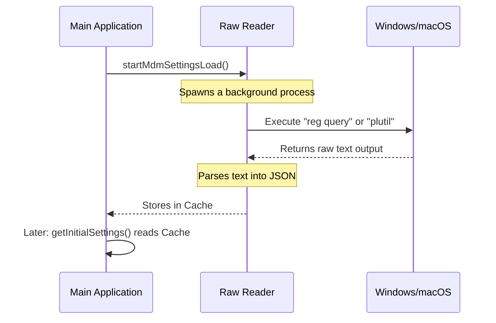

# Chapter 4: Enterprise Policy (MDM) Integration

In the previous chapter, [Permission Rule Syntax Validation](03_permission_rule_syntax_validation.md), we ensured that the settings provided by the user are grammatically correct.

But in a corporate environment, we often have a "Boss" factor.
If a developer wants to turn off security logging (`telemetry: false`), but the Company IT Department mandates it (`telemetry: true`), the Company must win.

We cannot rely on a JSON file in the user's folder for this, because the user could just delete it. instead, we look at **Enterprise Policies** (often called MDM or Mobile Device Management).

## The Motivation: The Unchangeable Rule

Imagine you are using a work laptop. There are certain settings, like "Screen Lock Timeout" or "Antivirus Updates," that you cannot change. They are greyed out.

This system achieves the same thing for our application.

1.  **The Source:** Settings are hidden deep in the Operating System (Windows Registry or macOS Plists).
2.  **The Authority:** These require Administrator/Root access to write.
3.  **The Priority:** These settings override *everything* else (User, Project, or Flag settings).

## Key Concepts

### 1. OS-Level Sources
Standard settings live in `.json` files. Enterprise settings live in the OS "brain":
*   **Windows:** The Registry (`HKLM\SOFTWARE\Policies\...`).
*   **macOS:** Property Lists (`/Library/Managed Preferences/...`).
*   **Linux:** Since Linux lacks a standardized registry, we fall back to a locked file at `/etc/claude-code/`.

### 2. "First Source Wins"
In Chapter 1, we learned about "Cascading" (merging layers).
For Enterprise policies, we use a simpler strategy: **First Source Wins**.

We check sources in order of power:
1.  **Remote/MDM Policy:** (Highest Power)
2.  **Local Machine Policy:** (Medium Power)
3.  **Local User Policy:** (Lowest Power)

If we find settings in the highest power slot, we stop looking. We don't merge them with lower priorities.

### 3. Safe Subprocesses
Reading the Windows Registry or parsing binary Plist files is heavy work. If the registry is corrupt, we don't want our app to crash.
To solve this, we run these checks in a **Subprocess**—a tiny, separate program that runs alongside our main app just to fetch these values.

## How to Use: The "Black Box"

From the perspective of the rest of the app, this system is a black box that just returns a configuration object.

### Example Scenario
**The IT Admin** runs a script to update the Windows Registry:
`reg add HKLM\SOFTWARE\Policies\ClaudeCode /v Settings /t REG_SZ /d "{\"allowedTools\": [\"Bash\"]}"`

**The Application** starts up:
1.  It detects this registry key.
2.  It locks the `allowedTools` setting.
3.  If the user tries to use `Python` (which is not in the list), the app blocks it, regardless of what is in the user's `settings.json`.

## Internal Implementation: How It Works

We need to safely extract data from the OS without blocking the main application startup.

### The Flow



### Code Deep Dive

Let's look at the three stages of this process: Firing the command, Parsing the output, and Caching the result.

#### 1. The Raw Reader (`mdm/rawRead.ts`)
We use `execFile` to run a system command. This is safer than `exec` because it avoids shell injection attacks.

```typescript
// mdm/rawRead.ts (Simplified)
import { execFile } from 'child_process'

// Fires 'reg query' on Windows to read policies
function fireRawRead() {
  return new Promise((resolve) => {
    execFile('reg', ['query', 'HKLM\\...'], (err, stdout) => {
      // Return the raw text output from the command
      resolve({ 
        hklmStdout: err ? null : stdout 
      })
    })
  })
}
```

#### 2. The Parser (`mdm/settings.ts`)
The OS returns messy text, not clean JSON. We need to find the JSON string hidden inside the command output.

**Windows Output Example:**
```text
HKEY_LOCAL_MACHINE\SOFTWARE\Policies\ClaudeCode
    Settings    REG_SZ    {"theme": "light"}
```

**The Code:**
```typescript
// mdm/settings.ts (Simplified)
export function parseRegQueryStdout(stdout: string) {
  // Look for the line containing "REG_SZ" and capture the text after it
  const match = stdout.match(/REG_SZ\s+(.*)$/m)
  
  if (match && match[1]) {
    // Found it! Return "{"theme": "light"}"
    return match[1].trim()
  }
  return null
}
```

#### 3. Validation Integration
Just because an Admin wrote the settings doesn't mean they are perfect! We still need to run the **Schema Validation** we built in [Chapter 2](02_schema_definition___data_integrity.md).

```typescript
// mdm/settings.ts (Simplified)
function parseCommandOutputAsSettings(jsonString: string) {
  const data = JSON.parse(jsonString)
  
  // Reuse our Schema from Chapter 2!
  const result = SettingsSchema.safeParse(data)

  if (result.success) {
    return result.data
  }
  // If the admin made a mistake, we log an error but don't crash
  return {} 
}
```

#### 4. The First-Source-Wins Logic
Finally, we decide which settings to keep.

```typescript
// mdm/settings.ts (Simplified)
function consumeRawReadResult(raw) {
  // 1. Did we find Enterprise Policy (HKLM)?
  if (raw.hklmStdout) {
    return parseCommandOutputAsSettings(raw.hklmStdout)
  }

  // 2. No? Did we find User Policy (HKCU)?
  if (raw.hkcuStdout) {
    return parseCommandOutputAsSettings(raw.hkcuStdout)
  }
  
  // 3. Fallback to nothing
  return {}
}
```

## Conclusion

We have now successfully integrated the "Boss" layer.
1.  We spawn a safe background process to ask the OS for policies.
2.  We parse the messy text output into clean JSON.
3.  We validate it using our Schema.
4.  We lock these settings so user files cannot override them.

We have a complete system for loading settings at startup. But what happens if the user changes their settings file *while the application is running*? We don't want to force them to restart the app every time.

In the next chapter, we will build a system to watch files and update configuration instantly.

[Live Change Detection](05_live_change_detection.md)

---

Generated by [Code IQ](https://github.com/adityasoni99/Code-IQ)