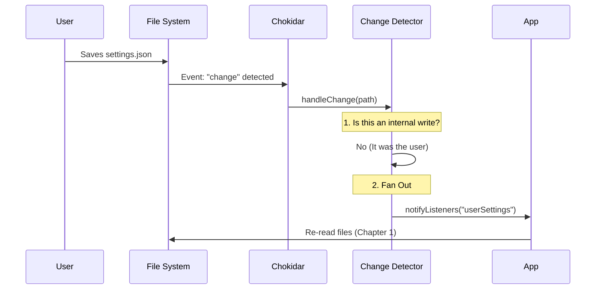

# Chapter 5: Live Change Detection

In the previous chapter, [Enterprise Policy (MDM) Integration](04_enterprise_policy__mdm__integration.md), we learned how to lock down settings using corporate policies. At this point, our application can read settings from everywhere—user files, project files, and system registries—when it starts up.

But what happens if you change a file **after** the application has started?

## The Motivation: "No Restarts Required"

Imagine this scenario:
1.  You are running the application.
2.  You realize you want to enable `verbose` logging.
3.  You open `.claude/settings.json` and change `"verbose": false` to `"true"`.
4.  **Result:** Nothing happens. You have to kill the app and restart it to see the change.

That is a bad user experience. We want **Live Change Detection**.

We want the application to behave like a security guard watching a monitor. The moment a file is modified, added, or deleted, the application should instantly wake up, re-read the settings, and apply them.

## Key Concepts

### 1. The Watcher
We use a library called `chokidar` to monitor the file system. It listens for events like `change`, `add`, or `unlink` (delete).

### 2. The "Echo" Problem (Internal Writes)
This is the trickiest part.
Sometimes, **the application itself** modifies the settings file (for example, if you run a command like `claude config --set theme=dark`).

1.  App writes to file.
2.  Watcher sees file change.
3.  Watcher tells App "Hey, the file changed!"
4.  App re-reads the file it just wrote.

This is unnecessary work (and potentially an infinite loop). We need a way to distinguish between **"You changed it"** (External) and **"I changed it"** (Internal).

### 3. Deletion Grace Periods
When you "save" a file in some editors, they don't just write to the file. They often **delete** the old file and **create** a new one instantly. If our watcher is too fast, it might panic and say "The settings are gone!", only for them to reappear 1 millisecond later. We need a "Grace Period" to handle this.

## How to Use

From the perspective of the rest of the application, the `changeDetector` is a simple subscription service.

You don't need to tell it which files to watch; it figures that out based on the logic we learned in [Settings Cascade & Resolution](01_settings_cascade___resolution.md).

### Subscribing to Changes

Here is how a component listens for updates:

```typescript
import { settingsChangeDetector } from './changeDetector'

// Subscribe to updates
const unsubscribe = settingsChangeDetector.subscribe((source) => {
  console.log(`Something changed in: ${source}`)
  
  // Now we should re-load the settings!
  reloadSettings()
})
```

If you edit `~/.claude/settings.json`, the console will log:
`"Something changed in: userSettings"`

## Internal Implementation: How It Works

Let's look at the flow of data when a file is modified.

### The Flow



### Code Deep Dive

The logic resides in `src/settings/changeDetector.ts`. Let's break it down.

#### 1. Setting up the Watcher
We ask `chokidar` to watch the directories where our settings live. We use a `stabilityThreshold` to ensure we don't read a file while it is still being written to.

```typescript
// changeDetector.ts (Simplified)
watcher = chokidar.watch(dirs, {
  ignoreInitial: true, // Don't trigger for existing files at startup
  awaitWriteFinish: {
    stabilityThreshold: 1000, // Wait 1s for writes to finish
  },
})

watcher.on('change', handleChange)
watcher.on('unlink', handleDelete)
```

#### 2. Handling the "Echo" (Internal Writes)
This logic is split into `internalWrites.ts`. When the app writes a file, it "marks" it with a timestamp. When the watcher sees a change, it checks if there is a recent mark.

**Step A: Marking the Write**
```typescript
// internalWrites.ts
const timestamps = new Map<string, number>()

export function markInternalWrite(path: string): void {
  // "I am writing to this file right now"
  timestamps.set(path, Date.now())
}
```

**Step B: Checking the Mark**
```typescript
// changeDetector.ts
function handleChange(path: string): void {
  // If we marked this file less than 5 seconds ago...
  if (consumeInternalWrite(path, 5000)) {
    // ...ignore this event. It's just an echo.
    return
  }

  // Otherwise, it's a real user change!
  notifyChange(getSourceForPath(path))
}
```

#### 3. Handling "Delete-and-Recreate"
To solve the issue of editors deleting files temporarily during save, we don't react to deletions immediately. We set a timer.

```typescript
// changeDetector.ts (Simplified)
function handleDelete(path: string): void {
  // Wait a bit before panicking
  const timer = setTimeout(() => {
    // If we are still here, the file is truly gone.
    notifyChange(getSourceForPath(path))
  }, DELETION_GRACE_MS)

  pendingDeletions.set(path, timer)
}
```

If the file is added back before the timer runs out, `handleAdd` cancels the timer!

```typescript
// changeDetector.ts (Simplified)
function handleAdd(path: string): void {
  const pendingTimer = pendingDeletions.get(path)
  
  if (pendingTimer) {
    // It's back! Cancel the deletion alert.
    clearTimeout(pendingTimer)
    pendingDeletions.delete(path)
    
    // Treat it as a modification instead
    handleChange(path)
  }
}
```

### 4. Polling for MDM
As discussed in [Chapter 4](04_enterprise_policy__mdm__integration.md), Enterprise policies live in the Registry, not in files. `chokidar` cannot watch the Registry.

For this, we use a simple polling mechanism (checking every 30 minutes).

```typescript
// changeDetector.ts (Simplified)
mdmPollTimer = setInterval(async () => {
  // 1. Get current values
  const current = await refreshMdmSettings()
  
  // 2. Compare with last known values
  if (JSON.stringify(current) !== lastMdmSnapshot) {
    notifyChange('policySettings')
  }
}, 30 * 60 * 1000) // 30 minutes
```

## Conclusion

We have built a responsive system. 
*   If a user edits a file, we update. 
*   If the app edits a file, we ignore the echo. 
*   If an editor does a weird "delete-then-create" save, we handle it gracefully.

However, all this watching and reloading comes at a cost. Reading files from the disk is slow. If we have 10 different parts of the application asking for settings, we don't want to read the disk 10 times.

In the final chapter, we will learn how to make this efficient.

[Settings Caching Strategy](06_settings_caching_strategy.md)

---

Generated by [Code IQ](https://github.com/adityasoni99/Code-IQ)