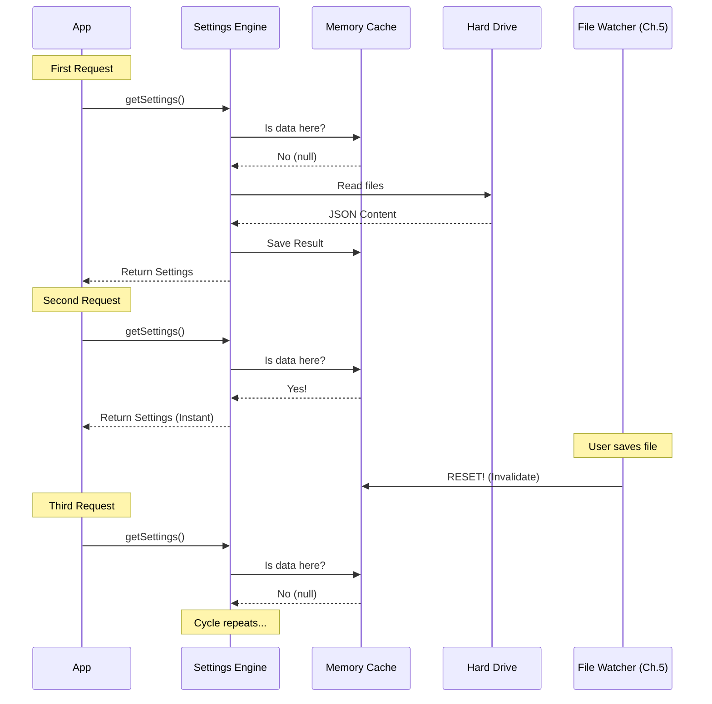

# Chapter 6: Settings Caching Strategy

In the previous chapter, [Live Change Detection](05_live_change_detection.md), we built a system that watches for file changes and triggers updates instantly.

However, we created a potential performance problem. If the application checks the configuration 100 times a second (e.g., "Is debug mode on?"), we do not want to read the hard drive 100 times a second. Reading from a disk is thousands of times slower than reading from memory.

## The Motivation: The "Library" Analogy

Imagine you are writing a research paper.
*   **No Cache:** Every time you need to check a fact, you stand up, walk to the public library, find the book, read the fact, and walk back to your desk. This is slow.
*   **With Cache:** You go to the library once. You write all the facts onto a notepad on your desk. Now, when you need a fact, you just look at your notepad. This is instant.

The **Settings Caching Strategy** is that notepad. It stores the parsed, validated, and merged settings in the computer's RAM (Random Access Memory) so the application runs smoothly.

## Key Concepts

We use three levels of caching to ensure speed and consistency.

### 1. The Session Cache (The Final Result)
This is the "Top Sheet" we learned about in [Chapter 1](01_settings_cascade___resolution.md). It is the final, merged configuration object ready for use. 99% of the time, the application reads from here.

### 2. The Source Cache (The Layers)
Sometimes, we need to know specifically what is in the `userSettings` file versus the `projectSettings` file (perhaps to display a UI showing where a setting comes from). We cache these individual layers separately.

### 3. Cache Invalidation (The Reset Button)
The most important part of caching is knowing when to **delete** the cache. If the user edits a file (detected in Chapter 5), our "notepad" is now outdated. We must throw it away and go back to the library.

## How to Use the Cache

As a consumer of the settings module, you don't manually write to the cache. You simply ask for settings, and the system handles the rest.

### The Logic Flow

When you call `getInitialSettings()`, the system performs this check:

1.  **Check:** Is the variable `sessionSettingsCache` full?
2.  **Yes:** Return it immediately. (Zero cost).
3.  **No:** Read disk, parse JSON, merge layers, validate, save to variable, then return. (Expensive).

### Example: Accessing Cached Data

The cache is stored in a simple variable.

```typescript
import { getSessionSettingsCache } from './settingsCache'

// 1. Try to get cached settings
const cached = getSessionSettingsCache()

if (cached) {
  console.log("Read from memory! Fast!")
} else {
  console.log("Cache empty. Must read from disk.")
}
```

## Internal Implementation: How It Works

Let's look at the lifecycle of a setting request, from the first load to a file update.

### The Flow



### Code Deep Dive

The implementation is surprisingly simple. It relies on module-level variables in `src/settings/settingsCache.ts`.

#### 1. The Session Cache
This variable holds the final result.

```typescript
// settingsCache.ts
import type { SettingsWithErrors } from './validation.js'

// The "Notepad" - initially empty
let sessionSettingsCache: SettingsWithErrors | null = null

export function getSessionSettingsCache() {
  return sessionSettingsCache
}
```

#### 2. The Setter
When the Settings Engine finishes the hard work of merging files, it saves the result here.

```typescript
// settingsCache.ts
export function setSessionSettingsCache(value: SettingsWithErrors): void {
  // Save the result for next time
  sessionSettingsCache = value
}
```

#### 3. The Source Cache (Map)
We use a `Map` to store individual layers (like `userSettings` or `projectSettings`). This prevents us from re-reading the User Settings file if only the Project Settings file changed.

```typescript
import type { SettingSource } from './constants.js'

// Maps a source name (e.g. 'userSettings') to its JSON content
const perSourceCache = new Map<SettingSource, SettingsJson | null>()

export function getCachedSettingsForSource(source: SettingSource) {
  // Returns undefined if we haven't loaded this source yet
  return perSourceCache.has(source) 
    ? perSourceCache.get(source) 
    : undefined
}
```

#### 4. The Reset (Invalidation)
This is the function called by the **Watcher** from [Chapter 5](05_live_change_detection.md). When a file changes, we wipe everything clean.

```typescript
// settingsCache.ts
export function resetSettingsCache(): void {
  // 1. Wipe the final merged result
  sessionSettingsCache = null
  
  // 2. Wipe the individual layer caches
  perSourceCache.clear()
  
  // 3. Wipe the raw file parse cache
  parseFileCache.clear()
}
```

### Optimization: The `parseFileCache`

There is one more optimization layer. Sometimes, two different logical sources might point to the same physical file.

For example, `loadSettingsFromDisk` (the main loader) and `getSettingsForSource` (a specific helper) both need to read the file. We cache the **Raw Parsing** step to ensure we don't parse the same JSON string twice during the same operation.

```typescript
// settingsCache.ts
type ParsedSettings = {
  settings: SettingsJson | null
  errors: ValidationError[]
}

const parseFileCache = new Map<string, ParsedSettings>()
```
*Note: This maps a File Path (string) to the Parsed Result.*

## Conclusion

Congratulations! You have completed the **Settings** project tutorial.

You have built a robust, enterprise-grade configuration system from scratch:

1.  **[Settings Cascade](01_settings_cascade___resolution.md):** You learned how to merge multiple layers of configuration.
2.  **[Schema Definition](02_schema_definition___data_integrity.md):** You learned how to enforce strict data types using Zod.
3.  **[Permission Syntax](03_permission_rule_syntax_validation.md):** You learned how to validate complex grammar inside strings.
4.  **[Enterprise Policy](04_enterprise_policy__mdm__integration.md):** You learned how to respect immutable IT rules.
5.  **[Live Change Detection](05_live_change_detection.md):** You learned how to watch for file changes in real-time.
6.  **Settings Caching (This Chapter):** You learned how to make the whole system blazing fast using memory caching.

You now possess the knowledge to manage complex application configurations that are both user-friendly and developer-friendly. Happy coding!

---

Generated by [Code IQ](https://github.com/adityasoni99/Code-IQ)