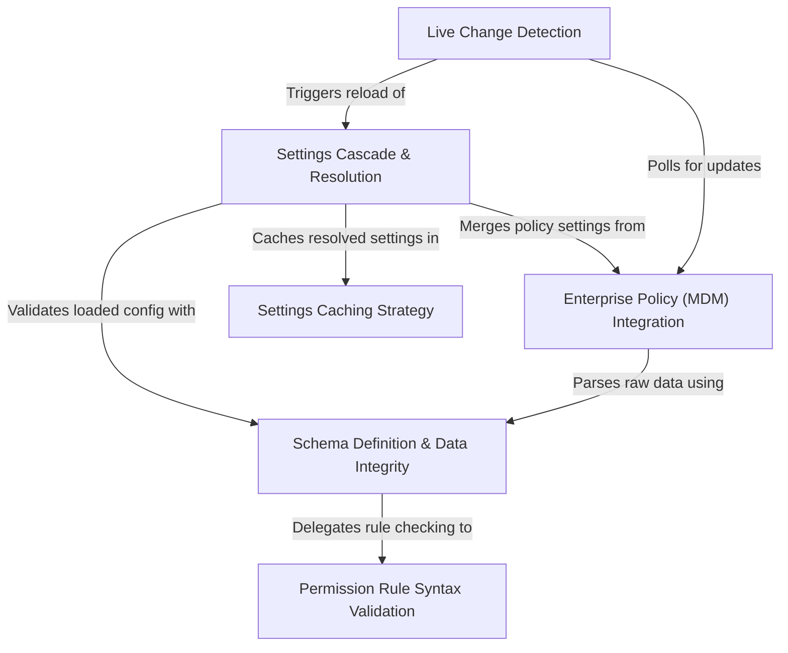

# Tutorial: settings

This project implements a robust **configuration management system** that merges settings from multiple hierarchical sources, such as *User*, *Project*, and *Enterprise Policy*, to determine the application's final state. It ensures data reliability through strict **schema validation** and maintains synchronization with disk and OS-level changes via **real-time detection**, all while optimizing performance using an in-memory **caching strategy**.

## Chapters

1. [Settings Cascade & Resolution](01_settings_cascade___resolution.md)
2. [Schema Definition & Data Integrity](02_schema_definition___data_integrity.md)
3. [Permission Rule Syntax Validation](03_permission_rule_syntax_validation.md)
4. [Enterprise Policy (MDM) Integration](04_enterprise_policy__mdm__integration.md)
5. [Live Change Detection](05_live_change_detection.md)
6. [Settings Caching Strategy](06_settings_caching_strategy.md)

---

Generated by [Code IQ](https://github.com/adityasoni99/Code-IQ)