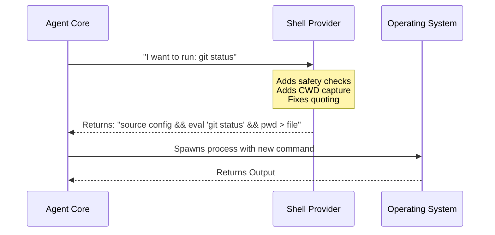

# Chapter 1: Shell Provider Pattern

Welcome to the `shell` project! This is the first chapter of our journey into how an AI agent interacts with your computer's operating system.

## The Problem: Speaking Different Languages

Imagine you are trying to order a coffee. In New York, you might ask for a "Regular Coffee." In Italy, you ask for a "Caffè." If you switch countries but keep using the wrong words, you won't get what you want.

Operating systems are similar:
*   **Linux & macOS** usually speak **Bash** (or Zsh).
*   **Windows** usually speaks **PowerShell**.

If our AI agent wants to run a command like "list all files," it needs to know exactly how to talk to the specific shell running on your computer. Writing `if (windows) { ... } else { ... }` everywhere in our code would be messy and hard to maintain.

## The Solution: The Universal Adapter

The **Shell Provider Pattern** acts like a universal travel adapter. The core system simply says, "I want to execute this command," and the Provider handles the translation for the specific operating system.

### The Use Case

Let's say the agent wants to run `git status`.
1.  **Core System:** Asks the Provider to prepare `git status`.
2.  **Provider:** Wraps this command with necessary setups (like ensuring quotes are correct and capturing the current folder path).
3.  **Core System:** Receives the final string and runs it.

## Key Concept: The Interface

In TypeScript, we define a "shape" (interface) that every shell adapter must follow. This ensures that no matter if we are on Windows or Mac, we interact with the shell exactly the same way.

Here is the simplified `ShellProvider` interface:

```typescript
// shellProvider.ts
export type ShellProvider = {
  type: 'bash' | 'powershell'
  
  // Prepares the command string (adds setups, wrappers)
  buildExecCommand(command: string, opts: any): Promise<any>

  // Returns the arguments needed to spawn the process
  getSpawnArgs(commandString: string): string[]
}
```

*   **`type`**: Tells us which shell is active.
*   **`buildExecCommand`**: The magic function. It takes the raw command (e.g., `ls`) and turns it into a full script line.
*   **`getSpawnArgs`**: Tells Node.js how to actually launch the shell (e.g., `['bash', '-c', ...]`).

## How It Works: A High-Level Flow

Before looking at the code, let's visualize the flow.



## Internal Implementation

Let's look at how the two different providers implement this pattern.

### 1. The Bash Provider (`bashProvider.ts`)

Bash is picky about environment variables and quoting. The Bash provider wraps commands in an `eval` statement.

**Step 1: Quoting and Safety**
The provider ensures the command doesn't break if it has special characters.

```typescript
// bashProvider.ts
// ... inside buildExecCommand ...

// Normalize and quote the command so it runs safely
const normalizedCommand = rewriteWindowsNullRedirect(command)
let quotedCommand = quoteShellCommand(normalizedCommand, addStdinRedirect)

// We wrap the command in 'eval' to handle complex syntax correctly
commandParts.push(`eval ${quotedCommand}`)
```

**Step 2: Tracking Location**
After a command runs (like `cd new_folder`), the agent needs to know it moved. The provider automatically adds a command to save the "Current Working Directory" (CWD) to a temporary file.

```typescript
// bashProvider.ts (Simplified)

// pwd -P prints the physical path
// >| forces writing to the file even if noclobber is set
commandParts.push(`pwd -P >| ${quote([shellCwdFilePath])}`)

// Join everything with "&&" (AND) operators
let commandString = commandParts.join(' && ')
```
*Result:* The agent runs `git status`, but the shell actually executes `setup_env && eval 'git status' && save_current_path`.

### 2. The PowerShell Provider (`powershellProvider.ts`)

PowerShell has a unique challenge: quoting hell. If you try to pass complex quotes inside other quotes, things break easily. The solution? **Base64 Encoding**.

Think of this like putting a letter inside a sealed envelope. The postman (the shell) doesn't need to read the letter; they just deliver the envelope.

```typescript
// powershellProvider.ts

function encodePowerShellCommand(psCommand: string): string {
  // Turn the command into a Base64 string (safe text)
  return Buffer.from(psCommand, 'utf16le').toString('base64')
}
```

**Handling Exit Codes**
PowerShell needs specific logic to capture whether a command failed or succeeded correctly.

```typescript
// powershellProvider.ts (Simplified)

// Logic to decide if the command failed ($?) or succeeded
// We also capture the path using (Get-Location).Path
const cwdTracking = `; (Get-Location).Path | Out-File '${escapedPath}'`
const psCommand = command + cwdTracking
```

**The Final Envelope**
Instead of typing the command directly, the provider tells PowerShell to run the "Encoded" version.

```typescript
// powershellProvider.ts (Sandbox logic)

const commandString = [
  '-NoProfile',       // Don't load user profile (faster)
  '-NonInteractive',  // Don't wait for user input
  '-EncodedCommand',  // Run the "sealed envelope"
  encodePowerShellCommand(psCommand),
].join(' ')
```

## Why This Matters

By using the **Shell Provider Pattern**, the rest of the application doesn't need to know *how* to capture the current directory or how to escape quotes.

1.  **Abstraction:** The Core Logic says "Run X".
2.  **Bash Provider** says: "I'll run X, but I need to use `eval` and `pwd -P`."
3.  **PowerShell Provider** says: "I'll run X, but I'll encode it in Base64 so special characters don't break."

## Conclusion

You've just learned the foundation of the shell project! The **Shell Provider Pattern** allows our agent to be a polyglot, speaking fluent Bash and PowerShell without changing its internal thought process.

In the next chapter, we will look at how we ensure the commands the agent runs don't accidentally destroy your files.

[Next Chapter: Read-Only Command Safety](02_read_only_command_safety.md)

---

Generated by [Code IQ](https://github.com/adityasoni99/Code-IQ)