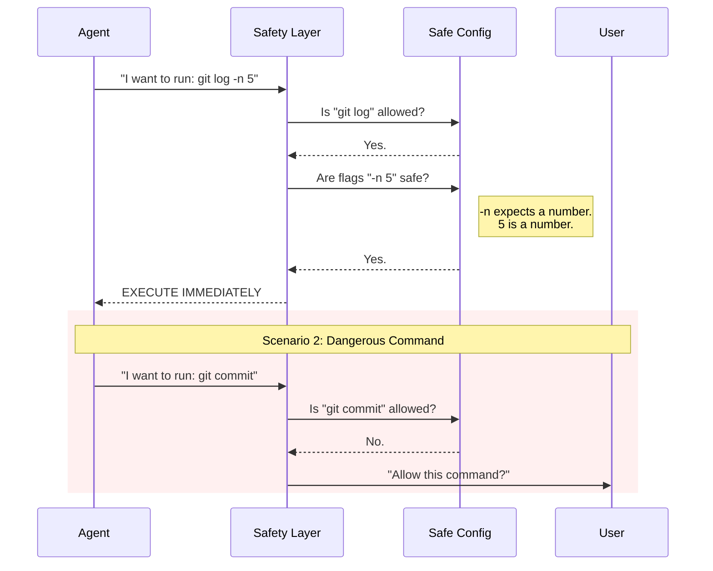

# Chapter 2: Read-Only Command Safety

Welcome back! In the previous chapter, [Shell Provider Pattern](01_shell_provider_pattern.md), we built a "universal adapter" that lets our AI agent speak fluent Bash and PowerShell.

Now that our agent *can* run commands, we face a new problem: **Trust.**

## The Problem: The "Bull in a China Shop"

Imagine you hired a very fast, very enthusiastic intern. You want them to look through your filing cabinet and find a document.
*   **Safe:** Opening a drawer and reading a folder label.
*   **Dangerous:** Shredding a document or writing on it with a permanent marker.

If the intern asks, "Can I check the filing cabinet?", you say **Yes**.
If they ask, "Can I burn this folder?", you want them to **Stop and Ask Permission** first.

Our AI agent acts the same way. We want it to freely run "Read-Only" commands (gathering info) to be fast and helpful. But if it tries to modify your code (write/delete), it must ask you first.

## The Solution: The Security Bouncer

We implement a **Read-Only Command Safety** layer. Think of this as a strict bouncer at a club.

1.  **The Guest List:** We have a list of pre-approved commands (like `git status` or `ls`).
2.  **The Pat Down:** Even if a command is on the list, the bouncer checks its pockets (flags/arguments) to make sure it isn't smuggling in something dangerous.

### The Use Case

The agent wants to check what files changed in your project.
*   **Command:** `git status`
*   **Result:** The Bouncer sees `git status` on the "Safe List." It allows the command to run automatically.

The agent wants to save those changes.
*   **Command:** `git commit -m "update"`
*   **Result:** The Bouncer looks at the list. `git commit` is **not** on the list. The system pauses and asks the User: *"The agent wants to run 'git commit'. Allow this?"*

## Key Concept 1: The Allowlist Configuration

We don't try to guess what is "bad." Instead, we explicitly define exactly what is "good." Everything else is considered dangerous by default.

In `readOnlyCommandValidation.ts`, we define large maps of allowed commands.

```typescript
// readOnlyCommandValidation.ts
export const GIT_READ_ONLY_COMMANDS = {
  'git status': {
    safeFlags: {
      '--short': 'none',  // Safe flag, no arguments needed
      '-s': 'none',       // Short version of above
      '--branch': 'none', // Show branch info
    },
  },
  // ... other commands
}
```

If the agent tries to run `git status --short`, the system checks:
1.  Is `git status` in the map? **Yes.**
2.  Is `--short` in `safeFlags`? **Yes.**
3.  **Verdict:** Safe to run.

## Key Concept 2: The "Fake Mustache" (Flag Inspection)

Hackers (or confused AIs) might try to trick the system by using a safe command in an unsafe way.

For example, `git log` is usually safe (it just reads history). But some tools allow you to write output to a file using a flag like `--output`.

To prevent this, we classify every single flag a command supports:

```typescript
export type FlagArgType =
  | 'none'    // A simple switch (e.g., --verbose)
  | 'string'  // Takes text input (e.g., --author="Jane")
  | 'number'  // Takes a number (e.g., -n 5)
```

If a command tries to use a flag that isn't in our dictionary, or passes text when we expect a number, the Bouncer stops it.

## Key Concept 3: Contextual Danger

Sometimes, a command is safe *unless* you use it a specific way.

Take `git branch`.
*   `git branch` (with no arguments) simply lists branches. **Safe.**
*   `git branch new-feature` creates a new branch. **Unsafe (Side Effect).**

To handle this, we use a special callback function called `additionalCommandIsDangerousCallback`.

```typescript
// simplified logic for 'git branch'
additionalCommandIsDangerousCallback: (rawCommand, args) => {
  // If there are arguments that AREN'T flags (like "new-feature")
  // it means we are creating a branch.
  const hasPositionalArgs = args.some(arg => !arg.startsWith('-'));
  
  if (hasPositionalArgs) {
    return true; // DANGEROUS! Creating a branch.
  }
  return false; // Safe (just listing).
}
```

## How It Works: The Safety Flow

Here is the decision process when the Agent requests a command.



## Deep Dive: Windows UNC Paths

There is a specific security risk on Windows called "UNC Paths" (e.g., `\\attacker.com\share`). If a tool blindly reads a file from a network path, it might accidentally send your Windows login credentials (hashes) to that server.

Even if a command is "Read-Only," reading from a hacker's server is dangerous. We have a specific utility to catch this.

```typescript
// readOnlyCommandValidation.ts (Simplified)

export function containsVulnerableUncPath(path: string): boolean {
  if (getPlatform() !== 'windows') return false
  
  // Detects paths starting with \\ (e.g., \\192.168.1.1\share)
  const backslashPattern = /^\\\\[^\s\\/]+/
  
  return backslashPattern.test(path)
}
```

This ensures the agent doesn't accidentally "phone home" to a malicious server just by trying to read a file.

## Implementation: The Validator

The heart of this chapter is the `validateFlags` function. It walks through the command string token by token.

```typescript
// readOnlyCommandValidation.ts (Conceptual Simplification)

export function validateFlags(tokens: string[], config: Config): boolean {
  for (let i = 0; i < tokens.length; i++) {
    const token = tokens[i]

    // 1. If it's not a flag (like a filename), it might be okay 
    // depending on the command config.
    if (!token.startsWith('-')) continue 

    // 2. Check if the flag is in our Allowed List
    const flagType = config.safeFlags[token]
    if (!flagType) return false // Unknown flag = Dangerous!

    // 3. If the flag expects an argument (like --author "Name")
    // check the next token to ensure it matches the type.
    if (flagType === 'string') {
       const nextToken = tokens[i+1]
       if (!validateFlagArgument(nextToken, 'string')) return false
       i++ // Skip next token since we consumed it
    }
  }
  return true
}
```

## Conclusion

By implementing **Read-Only Command Safety**, we allow our AI agent to be autonomous but safe. It can explore the codebase, check git status, and read logs without interrupting the user. However, as soon as it tries to *change* something, the Bouncer steps in.

But wait—before we can validate the command `git status`, we first have to know that the command *is* `git status`. What if the agent runs `sudo git status` or `/usr/bin/git status`?

In the next chapter, we'll learn how to strip away the noise to find the actual command being run.

[Next Chapter: Semantic Prefix Extraction](03_semantic_prefix_extraction.md)

---

Generated by [Code IQ](https://github.com/adityasoni99/Code-IQ)