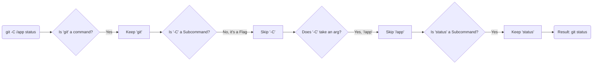
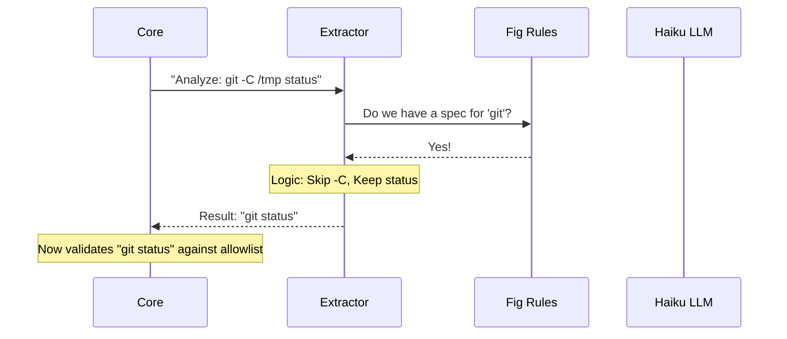
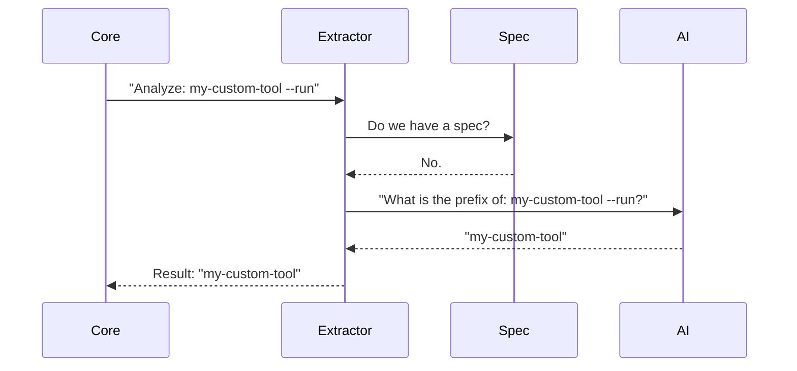

# Chapter 3: Semantic Prefix Extraction

Welcome to Chapter 3! In the previous chapter, [Read-Only Command Safety](02_read_only_command_safety.md), we built a "Bouncer" that checks a list of allowed commands to keep your computer safe.

But there is a catch. The Bouncer is very literal. If the allowed command is `git status`, but the agent tries to run `git -C /app status`, the Bouncer might say: *"Sorry, that doesn't look like 'git status' to me."*

We need a way to see through the noise to understand the **core intent** of a command. This is **Semantic Prefix Extraction**.

## The Problem: Commands Wear Disguises

Command line tools are flexible. You can put flags before subcommands, after subcommands, or mix them with file paths.

Consider these three commands. They all do the exact same fundamental thing:

1.  `git status`
2.  `git -C ./my-project status` (Run status in a specific folder)
3.  `git status --short` (Run status, but print less text)

To our safety system, the "Prefix" (the core identity) for all of these is **`git status`**. If we can extract that string, we can look it up in our Allowlist easily.

## The Solution: Two Strategies

We use a two-step system to strip away the disguise.

1.  **Strategy A: The Rulebook (Deterministic)**
    We use formal definitions (Specs) of CLI tools to parse the command mathematically. This is fast and accurate.
2.  **Strategy B: The Brain (LLM Inference)**
    If we don't have a rulebook for a specific tool, we ask a small, fast AI model to identify the command for us.

### Use Case Example

**Input:** `npm --verbose install react`

**The Goal:**
1.  Identify `npm` is the main tool.
2.  Identify `--verbose` is a flag (noise).
3.  Identify `install` is a subcommand (core intent).
4.  Identify `react` is an argument (noise).
5.  **Output:** `npm install`

Now the Bouncer checks: Is `npm install` allowed?

---

## Strategy 1: The Rulebook (Fig Specs)

We use a library called "Fig" (now Amazon CodeWhisperer CLI). It provides data structures that describe exactly how tools like `git`, `npm`, or `docker` work.

This is implemented in `specPrefix.ts`.

### How It Works

The extractor walks through the command word by word, checking the "Rulebook" to see if a word is a **Flag** (skip it) or a **Subcommand** (keep it).



### The Code: Walking the Arguments

Here is how we iterate through the arguments. We stop when we hit something that looks like a file or a final argument.

```typescript
// specPrefix.ts (Simplified)

export async function buildPrefix(command: string, args: string[], spec: CommandSpec) {
  const parts = [command] // Start with "git"

  for (let i = 0; i < args.length; i++) {
    const arg = args[i]

    // 1. If it's a flag (starts with -), skip it
    if (arg.startsWith('-')) {
      // If the spec says this flag takes an argument, skip the next word too
      if (flagTakesArg(arg, args[i + 1], spec)) i++ 
      continue
    }

    // 2. If it's a known subcommand, keep it!
    if (isKnownSubcommand(arg, spec)) {
      parts.push(arg) // Add "status" to ["git"]
    } else {
       // It's likely a filename or argument, stop here.
       break
    }
  }
  return parts.join(' ')
}
```

### Handling Depth

Some commands are deep, like `gcloud compute instances list`. Others are shallow. We calculate a `maxDepth` to know when to stop looking.

```typescript
// specPrefix.ts (Simplified)

// Specialized rules for complex CLIs
export const DEPTH_RULES: Record<string, number> = {
  'npm': 2,           // npm install (Depth 2)
  'git': 2,           // git status (Depth 2)
  'gcloud': 4,        // gcloud compute instances list (Depth 4)
  'kubectl': 3,       // kubectl get pods (Depth 3)
}
```

This ensures we extract `gcloud compute instances list` instead of just `gcloud compute`.

---

## Strategy 2: The AI Fallback

Sometimes the agent runs a tool we don't have a Rulebook for, or the command is too messy to parse strictly. In these cases, we use a lightweight LLM (Claude Haiku).

This logic lives in `prefix.ts`.

### The Concept: Intelligent Caching

Calling an AI for every single command would be slow and expensive. We use **Memoization** (caching).

1.  **Check Cache:** Have we seen `python script.py` before?
2.  **If No:** Ask Haiku.
3.  **Save Result:** Store the answer so next time it's instant.

### The Code: Asking the Oracle

We send a prompt to the LLM asking it to identify the prefix.

```typescript
// prefix.ts (Simplified)

const memoizedExtractor = memoizeWithLRU(async (command) => {
  // Ask the LLM
  const response = await queryHaiku({
    systemPrompt: `You are a command parser. Extract the core command prefix.`,
    userPrompt: `Command: ${command}`,
  })

  // Returns e.g., "npm install"
  return extractText(response) 
})
```

### Safety Check: Too Broad?

The AI might get lazy and just say "bash" is the prefix for `bash dangerous_script.sh`. That would be bad because "bash" isn't specific enough to be safe.

We explicitly forbid "Lazy" prefixes.

```typescript
// prefix.ts

const DANGEROUS_SHELL_PREFIXES = new Set([
  'bash', 'zsh', 'cmd', 'powershell', 'python', 'git'
])

if (DANGEROUS_SHELL_PREFIXES.has(prefix)) {
  return null // Reject: The prefix is too broad to be safe
}
```
*Result:* If the extraction is just "git", we reject it. We need at least "git commit" or "git status".

---

## Putting It All Together: The Flow

When the `shell` project receives a command to execute, the flow looks like this:



If the spec is missing:



## Conclusion

By using **Semantic Prefix Extraction**, we make our security system smarter. It doesn't get confused by flags, arguments, or different file paths. It finds the "True Identity" of the command so that [Chapter 2's Read-Only Safety](02_read_only_command_safety.md) can do its job effectively.

We have covered how to **Execute** commands (Chapter 1), how to **Validate** them (Chapter 2), and how to **Identify** them (Chapter 3).

In the final chapter, we will look at a specific runtime environment that requires special handling for everything we've just discussed.

[Next Chapter: PowerShell Runtime Layer](04_powershell_runtime_layer.md)

---

Generated by [Code IQ](https://github.com/adityasoni99/Code-IQ)