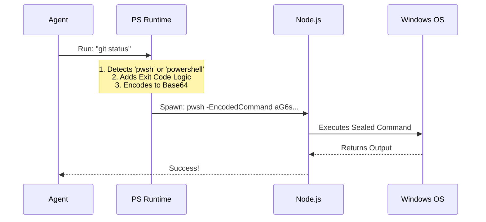

# Chapter 4: PowerShell Runtime Layer

Welcome to Chapter 4! In the previous chapter, [Semantic Prefix Extraction](03_semantic_prefix_extraction.md), we learned how to identify exactly what command the agent wants to run.

Now we face our final boss: **Windows.**

## The Problem: The High-Maintenance Shell

If Bash (Linux/macOS) is like a simple text message, **PowerShell** is like a complex legal contract. It is powerful, object-oriented, and strict.

We face three major headaches when trying to run PowerShell commands from our agent:

1.  **Identity Crisis:** There are two versions of PowerShell (`powershell.exe` vs `pwsh`). They have different features.
2.  **Quoting Hell:** If we try to run `echo "Hello 'World'"`, the quotes often get confused when passed through Node.js to the shell. The command breaks.
3.  **Mixed Signals:** Bash always gives an "Exit Code" (0 for success, 1 for fail). PowerShell has *two* ways to report success, and they conflict with each other.

The **PowerShell Runtime Layer** solves these problems so the agent doesn't have to worry about them.

## Key Concept 1: The "Sealed Envelope" (Base64 Encoding)

The biggest issue with PowerShell is passing complex strings safely.

Imagine you want to send a letter that contains secret codes. If you just hand the paper to a messenger, they might smudge the ink or misread the codes.
**Solution:** You put the letter in a **Sealed Envelope**. The messenger just delivers the envelope; they don't look inside.

In technical terms, we use **Base64 Encoding**. We take the command script, turn it into a meaningless string of letters (the envelope), and tell PowerShell: *"Run the command inside this envelope."*

### How It Works

1.  **Original Command:** `Write-Host "Hello World"`
2.  **Encoded (The Envelope):** `VwByAGkAdABlAC0ASABvAHMAdAAgACIASABlAGwAbABvACAAVwBvAHIAbABkACI=`
3.  **Execution:** `powershell -EncodedCommand VwByAG...`

This guarantees that no matter how many quotes or special characters (`$`, `&`, `|`) are in the command, it will arrive exactly as intended.

## Key Concept 2: The Double Check (Exit Codes)

When a command finishes, we need to know: **Did it succeed?**

*   **Native Programs (git, node):** Use `$LASTEXITCODE`.
*   **PowerShell Cmdlets (Copy-Item):** Use a boolean flag `$?` (True/False).

If we only check one, we might get the wrong answer.

**The Fix:** We inject a small script at the end of every command that acts like a scoreboard judge. It checks *both* places and calculates the final score.

## Implementation: Under the Hood

Let's visualize exactly what happens when the agent asks to run a command on Windows.



Let's look at the code that makes this happen.

### 1. Detecting the Binary (`powershellDetection.ts`)

First, we need to find the executable. We prefer the modern `pwsh` (PowerShell Core) over the old `powershell` (Desktop).

```typescript
// powershellDetection.ts
export async function findPowerShell(): Promise<string | null> {
  // 1. Try to find the modern 'pwsh' (Core 7+)
  const pwshPath = await which('pwsh')
  if (pwshPath) return pwshPath

  // 2. Fallback to legacy 'powershell' (v5.1)
  const powershellPath = await which('powershell')
  if (powershellPath) return powershellPath

  return null // PowerShell not found
}
```

**Explanation:**
The system asks "Where is `pwsh`?". If it exists, we use it. If not, we look for the older `powershell`. This ensures we use the most capable version available.

### 2. The Encoding Logic (`powershellProvider.ts`)

Here is how we create the "Sealed Envelope." PowerShell expects text in a specific format called `UTF-16LE`.

```typescript
// powershellProvider.ts

function encodePowerShellCommand(psCommand: string): string {
  // Convert string to Buffer using UTF-16LE encoding
  const buffer = Buffer.from(psCommand, 'utf16le')
  
  // Convert that buffer to a Base64 string
  return buffer.toString('base64')
}
```

**Explanation:**
This function takes a readable command and transforms it into that long string of random-looking characters. This string is safe to pass through any system without breaking.

### 3. Calculating the Exit Code

This is the logic we inject *inside* the envelope to make sure we capture errors correctly.

```typescript
// powershellProvider.ts (Simplified logic)

// If a native app ran ($LASTEXITCODE is set), use that.
// If not, check if the last Cmdlet worked ($?).
// If $? is true, return 0 (Success). Else return 1 (Fail).
const exitLogic = `
  if ($null -ne $LASTEXITCODE) { $LASTEXITCODE } 
  elseif ($?) { 0 } 
  else { 1 }
`
```

**Explanation:**
This script runs immediately after the agent's command. It acts as a translator, converting PowerShell's complex status signals into the simple 0 or 1 that our agent expects.

### 4. Assembling the Final Command

Finally, we put it all together in the `ShellProvider`.

```typescript
// powershellProvider.ts

// The arguments we pass to the actual process
const commandString = [
  '-NoProfile',       // Run faster (don't load user settings)
  '-NonInteractive',  // Don't wait for user input
  '-EncodedCommand',  // "Here comes the sealed envelope"
  encodePowerShellCommand(psCommand),
].join(' ')
```

**Result:**
The OS sees a clean, safe command line, while the complex logic is safely hidden inside the encoded string.

## Why This Matters

Without this layer, the agent would be incredibly fragile on Windows.
*   It would crash every time it tried to write a file with quotes in the name.
*   It would think `git status` failed even if it succeeded.
*   It would accidentally run legacy commands on modern systems.

The **PowerShell Runtime Layer** acts as a robust translation service, allowing our AI agent to work seamlessly across operating systems.

## Conclusion

Congratulations! You have completed the tutorial for the `shell` project.

You have learned:
1.  **[Shell Provider Pattern](01_shell_provider_pattern.md):** How we abstract different shells (Bash vs PowerShell).
2.  **[Read-Only Command Safety](02_read_only_command_safety.md):** How we act as a "Bouncer" to prevent dangerous commands.
3.  **[Semantic Prefix Extraction](03_semantic_prefix_extraction.md):** How we identify the true intent of a command.
4.  **PowerShell Runtime Layer:** How we handle the specific complexities of the Windows environment.

With these four pillars, we have a safe, reliable, and intelligent system for AI-driven command execution. Happy coding!

---

Generated by [Code IQ](https://github.com/adityasoni99/Code-IQ)