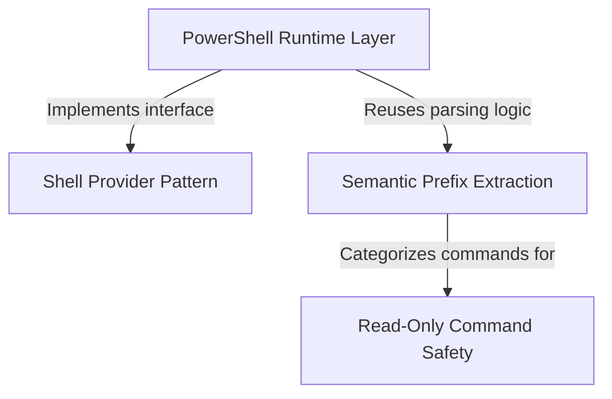

# Tutorial: shell

This project acts as a **universal adapter and security guard** that allows an AI agent to safely execute terminal commands across different environments (like **Bash** and **PowerShell**). It standardizes how commands are run, strictly enforces a **read-only policy** to prevent accidental code changes (e.g., blocking `git commit`), and intelligently **parses complex commands** to understand the user's true intent before execution.

## Chapters

1. [Shell Provider Pattern](01_shell_provider_pattern.md)
2. [Read-Only Command Safety](02_read_only_command_safety.md)
3. [Semantic Prefix Extraction](03_semantic_prefix_extraction.md)
4. [PowerShell Runtime Layer](04_powershell_runtime_layer.md)

---

Generated by [Code IQ](https://github.com/adityasoni99/Code-IQ)