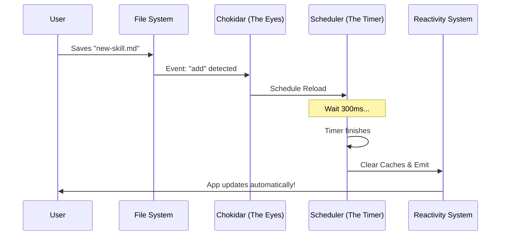

# Chapter 1: Skill Change Detection

Welcome to the **Skills** project! In this first chapter, we will explore the engine that makes the system feel "alive": **Skill Change Detection**.

## Motivation: The "Hot Reload" Experience

Imagine you are a developer building a new feature. You write a script, save the file, and want to test it immediately.

**The Old Way:**
1. Save file.
2. Close the application.
3. Restart the application so it loads the new file.
4. Test.

**The Skill Change Detection Way:**
1. Save file.
2. The application notices the change instantly.
3. You test immediately.

This concept acts like a "Hot Reloading" engine. It allows users to add, edit, or delete skills (custom commands) at runtime without ever needing to restart the application.

## Core Concepts

To achieve this, we rely on three main ideas:

1.  **Watching:** Instead of checking files only once when the app starts, we keep a permanent eye on specific folders.
2.  **Debouncing:** Computers are fast. If you paste 50 files at once, we don't want to reload the system 50 times in one second. We wait for the "dust to settle" before reloading.
3.  **Signaling:** Once changes are confirmed, we ring a bell (emit a signal) to tell the rest of the app to update.

## How to Use It

As a consumer of this module, your interaction is very simple. You generally care about two things: starting the watcher and listening for updates.

### 1. Listening for Changes
Before we start watching files, let's set up a listener. This is how the rest of the application knows to refresh its menu or clear its memory.

```typescript
import { skillChangeDetector } from './skillChangeDetector'

// Subscribe to the signal
// This function runs every time a file changes
skillChangeDetector.subscribe(() => {
  console.log("Something changed! Reloading skills...")
})
```
*Explanation:* We register a callback function. Whenever the detector triggers, this function runs.

### 2. Starting the Watcher
Once we are listening, we turn the machine on.

```typescript
// Start watching the filesystem
await skillChangeDetector.initialize()
```
*Explanation:* This kicks off the process. It finds the correct folders and attaches the "eyes" (file watchers) to them.

## Under the Hood: How It Works

What happens inside `skillChangeDetector.ts` when you modify a file? Let's visualize the flow.

### The Flow of a Change



### 1. Finding Where to Look
First, the system needs to know *which* folders to watch. It checks user settings, project settings, and additional flags. This logic is handled by a concept we will cover in depth in [Path Discovery](02_path_discovery.md).

```typescript
// Simplified logic from getWatchablePaths
async function getWatchablePaths() {
  const paths = []
  // Check user home directory
  if (await exists('~/.claude/skills')) {
    paths.push('~/.claude/skills')
  }
  // Check current project directory
  if (await exists('./.claude/skills')) {
    paths.push('./.claude/skills')
  }
  return paths
}
```

### 2. The Watcher (Chokidar)
We use a library called `chokidar` to handle the heavy lifting of filesystem events. It's more reliable than the native Node.js `fs.watch`.

```typescript
// Inside initialize()
watcher = chokidar.watch(paths, {
  persistent: true,
  ignoreInitial: true, // Don't trigger for existing files on startup
  depth: 2,            // Only look 2 folders deep
})

// Listen for specific events
watcher.on('add', handleChange)
watcher.on('change', handleChange)
watcher.on('unlink', handleChange) // 'unlink' means delete
```
*Explanation:* We configure the watcher to ignore the files that are already there (we loaded those on startup) and only report new actions.

### 3. Handling the Change (Debouncing)
This is the most critical part for performance. If you switch git branches, 100 files might change instantly. We use **Debouncing** to handle this.

The logic is: "Wait 300ms. If another change happens, reset the timer. Only run when silence lasts for 300ms."

```typescript
let reloadTimer = null
const RELOAD_DEBOUNCE_MS = 300

function scheduleReload(path) {
  // If a timer is already running, stop it!
  if (reloadTimer) clearTimeout(reloadTimer)

  // Start a new timer
  reloadTimer = setTimeout(async () => {
    performReload() // The actual heavy lifting
  }, RELOAD_DEBOUNCE_MS)
}
```
*Explanation:* This ensures that `performReload` only runs once per batch of file changes, saving the computer from freezing. This is detailed further in [Reload Debouncing](04_reload_debouncing.md).

### 4. Cleaning Up
When the timer finally fires, we need to ensure the application forgets the *old* version of the files.

```typescript
function performReload() {
  // 1. Clear the internal memory of skills
  clearSkillCaches() 
  
  // 2. Clear command definitions
  clearCommandsCache()

  // 3. Tell everyone updates are ready
  skillsChanged.emit()
}
```
*Explanation:* We clear the caches (covered in [Cache Invalidation](05_cache_invalidation.md)) and then trigger the reactive signal (covered in [Reactive Signaling](06_reactive_signaling.md)).

## Summary

In this chapter, you learned how **Skill Change Detection** brings the application to life by:
1.  **Watching** specific directories for user activity.
2.  **Debouncing** events to prevent performance issues.
3.  **Signaling** the app to reload resources dynamically.

However, a watcher is useless if it doesn't know *where* to look. In the next chapter, we will learn how the application intelligently hunts down configuration folders across your system.

[Next Chapter: Path Discovery](02_path_discovery.md)

---

Generated by [Code IQ](https://github.com/adityasoni99/Code-IQ)