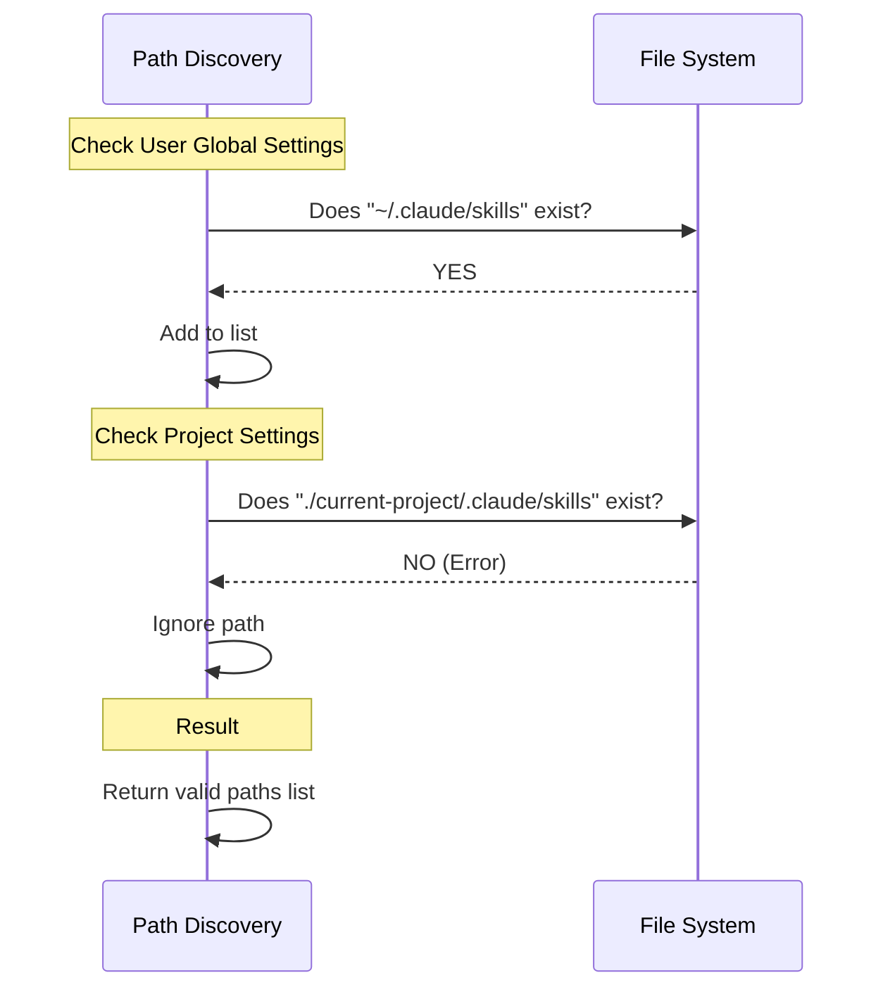

# Chapter 2: Path Discovery

Welcome back! In [Chapter 1: Skill Change Detection](01_skill_change_detection.md), we learned *why* we need to watch files to create a "Hot Reload" experience. We established that we need a surveillance system to watch for changes.

But there is a critical question we haven't answered yet: **Where exactly should we place our cameras?**

This chapter covers **Path Discovery**: the logic that intelligently hunts down the correct folders to watch, ensuring we don't waste energy looking at empty space.

## Motivation: The "Scout" Analogy

Imagine you are setting up security for a building. You wouldn't put a camera on every single brick of every single wall. That would be expensive and overwhelming. Instead, you check specific locations: the front door, the back door, and the garage.

**Path Discovery** acts like a **Scout**. Before the heavy machinery (the File Watcher) starts running, the Scout goes out and checks:
1.  "Does the user have a global skills folder?"
2.  "Does this specific project have a skills folder?"
3.  "Did the user specify any custom folders via command line?"

If the Scout finds a folder, it marks it on the map. If the folder doesn't exist, the Scout ignores it. This prevents the application from crashing or slowing down by trying to watch folders that aren't there.

## Key Concepts

To solve this, we need to combine two simple steps:

1.  **Prediction:** We generate a list of *possible* locations where skills might live (e.g., `~/.claude/skills`).
2.  **Verification:** We ask the operating system, "Does this path actually exist?"

## How to Use It

In our code, this process happens automatically inside the initialization phase. However, understanding the output is important.

### The Goal
We want to transform "Expectations" into "Reality".

**Input (Expectations):**
*   "I hope there is a folder at `~/.claude/skills`"
*   "I hope there is a folder at `./my-project/.claude/skills`"

**Output (Reality):**
*   `['/Users/alice/.claude/skills']`
*   *(Note: The project folder was missing, so it was excluded from the list.)*

## Under the Hood: The Scout's Journey

Let's look at how the system decides which paths to return. It performs a sequence of checks against the **File System (FS)**.



## Implementation Details

The core logic lives inside a function called `getWatchablePaths` within `skillChangeDetector.ts`. Let's break down how it works, piece by piece.

### 1. The Strategy
We create an empty list and try to fill it. We wrap our checks in `try...catch` blocks. If `fs.stat` (the function that checks file status) fails, it means the file likely doesn't exist, so we catch the error and do nothing.

```typescript
async function getWatchablePaths(): Promise<string[]> {
  const fs = getFsImplementation()
  const paths: string[] = []

  // ... We will add checks here ...

  return paths
}
```

### 2. Checking User Settings
First, we look for the global settings usually found in your home directory. We use a helper `getSkillsPath` to guess the location.

```typescript
// 1. Guess the path for User Skills
const userSkillsPath = getSkillsPath('userSettings', 'skills')

if (userSkillsPath) {
  try {
    // 2. Verify it exists
    await fs.stat(userSkillsPath)
    // 3. If we survived the line above, add it!
    paths.push(userSkillsPath)
  } catch {
    // Path doesn't exist, skip it quietly
  }
}
```
*Explanation:* If `fs.stat` fails, the code jumps to the `catch` block, effectively ignoring that path.

### 3. Checking Project Settings
Next, we check if the specific project you are working on has its own skills. This is important for project-specific tools.

```typescript
// 1. Guess the path for Project Skills
const projectSkillsPath = getSkillsPath('projectSettings', 'skills')

if (projectSkillsPath) {
  try {
    // 2. Convert to absolute path (e.g., C:\Projects\MyBot\...)
    const absolutePath = platformPath.resolve(projectSkillsPath)
    
    // 3. Verify and Add
    await fs.stat(absolutePath)
    paths.push(absolutePath)
  } catch {
    // Skip if missing
  }
}
```
*Explanation:* We use `platformPath.resolve` to make sure we have the full, correct address of the folder before verifying it.

### 4. Handling Custom Flags
Finally, a user might launch the app with a flag like `--add-dir /tmp/my-skills`. We loop through these custom additions.

```typescript
// Loop through directories added via CLI flags
for (const dir of getAdditionalDirectoriesForClaudeMd()) {
  const additionalSkillsPath = platformPath.join(dir, '.claude', 'skills')
  
  try {
    await fs.stat(additionalSkillsPath)
    paths.push(additionalSkillsPath)
  } catch {
    // Skip if missing
  }
}
```

## Summary

In this chapter, we learned about **Path Discovery**, the "Scout" of our system.
1.  It predicts where skill folders *might* be.
2.  It verifies if those folders *actually* exist using `fs.stat`.
3.  It produces a clean list of valid paths.

Now that we have verified the locations of our target folders, we are ready to set up the cameras. In the next chapter, we will hand this list of paths to the surveillance engine.

[Next Chapter: File System Watching](03_file_system_watching.md)

---

Generated by [Code IQ](https://github.com/adityasoni99/Code-IQ)