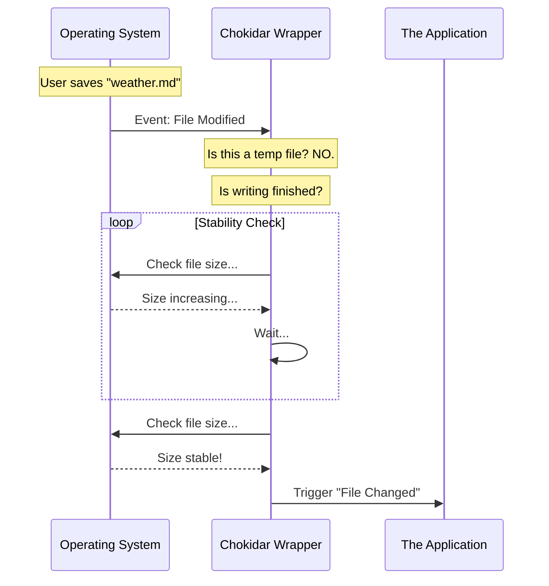

# Chapter 3: File System Watching

Welcome back! In [Chapter 2: Path Discovery](02_path_discovery.md), we built a "Scout" that hunted down the exact locations of our skill folders. We now have a list of valid paths (like `~/.claude/skills`).

However, knowing *where* to look is only half the battle. Now we need to stare at those folders and wait for something to happen.

In this chapter, we will build the **File System Watcher**.

## Motivation: The "Noisy" Reality

You might think watching a file is easy: "If file changes, run code."

But operating systems are chaotic places.
1.  **The "Half-Written" Problem:** When you save a large file, the computer writes it in chunks. If we read the file the millisecond it starts changing, we might read a broken, half-written file.
2.  **The "Infinite Loop" Risk:** On some platforms (like Bun), the standard way of watching files can cause the application to freeze (deadlock) if too many events happen at once.
3.  **The "Junk" Files:** Operating systems often create invisible temporary files (like `.DS_Store` on macOS) that we shouldn't care about.

We need a **Smart Security Camera**. It needs to ignore the wind blowing the leaves (junk files), wait for the delivery truck to fully unload (stability threshold), and work reliably without freezing the building (platform specific handling).

## Key Concepts

To build this robust watcher, we use a library called `chokidar` and wrap it with three layers of logic:

1.  **Persistence:** We keep the connection alive indefinitely until the app closes.
2.  **Stability Thresholds:** We tell the watcher, "Don't tell me about a change until the file size hasn't changed for 1 second." This ensures the save is complete.
3.  **Polling vs. Native Events:** A "Native Event" is like a motion sensor (efficient). "Polling" is like a guard walking a patrol route every 2 seconds. While motion sensors are better, on some systems (like Bun), they can jam. We switch strategies based on the environment.

## How to Use It

As a developer using this module, you generally don't touch the watcher directly. You simply ask it to start.

### Starting the Watcher
This is called once when the application boots up.

```typescript
import { skillChangeDetector } from './skillChangeDetector'

// 1. Initialize the watcher
await skillChangeDetector.initialize()
```
*Explanation:* This function grabs the paths found in the previous chapter and sets up the `chokidar` instance.

### Stopping the Watcher
If the application needs to shut down gracefully, we must unplug the cameras to prevent memory leaks.

```typescript
// 2. Clean up when done
await skillChangeDetector.dispose()
```
*Explanation:* This closes the file streams and stops any background timers.

## Under the Hood: The Watcher's Logic

Let's visualize how the watcher decides if an event is "real" or not.



### 1. Determining the Strategy
Before we watch anything, we check if we are running in a specific environment that requires special handling (like Bun).

```typescript
// Bun has a known issue with native watchers causing deadlocks.
// If we are in Bun, we switch to "Polling" mode.
const USE_POLLING = typeof Bun !== 'undefined'

// If polling, check every 2 seconds.
const POLLING_INTERVAL_MS = 2000
```
*Explanation:* This simple check prevents the "Infinite Loop" risk mentioned in the motivation. We trade a tiny bit of speed (2s delay) for guaranteed stability.

### 2. Configuring `chokidar`
We configure the library with strict rules to ignore noise.

```typescript
watcher = chokidar.watch(paths, {
  persistent: true,      // Keep running
  ignoreInitial: true,   // Don't trigger for files already there
  depth: 2,              // Only look inside skill/command subfolders
  usePolling: USE_POLLING, // Use our strategy from step 1
  interval: POLLING_INTERVAL_MS,
})
```
*Explanation:* `depth: 2` is important. It ensures we don't accidentally watch the entire hard drive if a user configures a path incorrectly.

### 3. The "Await Write Finish" Feature
This is our solution to the "Half-Written" problem. `chokidar` has a built-in feature for this.

```typescript
// Inside the configuration object above:
awaitWriteFinish: {
  // Wait until file size is stable for 1 second
  stabilityThreshold: 1000, 
  
  // Check stability every 0.5 seconds
  pollInterval: 500,
}
```
*Explanation:* The watcher will hold back the event until it is confident the file is done being written.

### 4. Hooking Up Events
Finally, we tell the watcher what to do when a valid event occurs. We care about three things: adding a file, changing a file, or deleting (`unlink`) a file.

```typescript
// Listen for standard events
watcher.on('add', handleChange)
watcher.on('change', handleChange)
watcher.on('unlink', handleChange)

function handleChange(path: string) {
  console.log(`Detected skill change: ${path}`)
  scheduleReload(path) 
}
```
*Explanation:* All three events flow into a single handler called `handleChange`. We will discuss `scheduleReload` in the next chapter.

### 5. Cleaning Up
When we are done, we must ensure we don't leave "zombie" watchers running, which keeps the process alive effectively forever.

```typescript
export async function dispose(): Promise<void> {
  if (watcher) {
    // Close the connection to the file system
    await watcher.close()
    watcher = null
  }
}
```

## Summary

In this chapter, we built the **File System Watcher**.
1.  It solves the **"Half-Written"** file problem using stability thresholds.
2.  It solves the **Platform Deadlock** problem by intelligently switching to polling on Bun.
3.  It filters out **Noise** by ignoring initial files and limiting depth.

We now have a reliable system that taps us on the shoulder and says, *"Hey, a file just changed, and I'm sure it's done writing."*

But what happens if the user saves 50 files at once? Or hits `CTRL+S` ten times in a second? If we reload the system every single time, we will crash the app. We need a way to calm things down.

[Next Chapter: Reload Debouncing](04_reload_debouncing.md)

---

Generated by [Code IQ](https://github.com/adityasoni99/Code-IQ)